# 项目打包和自动化部署


## 一. 项目部署和DevOps


### 1.1. 传统的开发模式


在传统的开发模式中，开发的整个过程是按部就班就行：


但是这种模式存在很大的弊端：


- 工作的不协调：开发人员在开发阶段，测试和运维人员其实是处于等待的状态。等到测试阶段，开发人员等待测试反馈bug，也会处于等待状态。
- 线上bug的隐患：项目准备交付时，突然出现了bug，所有人员需要加班、等待问题的处理；


### 1.2. DevOps开发模式


`DevOps` 是 `Development` 和 `Operations` 两个词的结合，将开发和运维结合起来的模式：


### 1.3. 持续集成和持续交付


伴随着 `DevOps` 一起出现的两个词就是持续集成和持续交付(部署)：


- `CI`是`Continuous Integration`（持续集成）；
- `CD`是两种翻译：`Continuous Delivery`（持续交付）或 `Continuous Deployment`（持续部署）；


## 二. 安装jenkins


**jenkins官网下载地址：**[**https://jenkins.io/download/**](https://link.zhihu.com/?target=https%3A//jenkins.io/download/) ;


`jenkins`项目有两条发布线，分别是LTS长期支持版（或稳定版）和每周更新版（最新版）。建议选择LTS长期支持版，下载通用 `java` 项目 `war` 包。


-  `dos` 命令行运行命令解压war包：`java –jar Jenkins.war --httpPort=80`　 默认端口 `8080` 
-  注意：不同版本的jenkins 使用的jdk版本也不一样 启动的时候看提示 
-  java环境变量 

```shell
vi /etc/profile
#jdk解压路径
export JAVA_HOME=/usr/local/jdk1.8.0_261
export CLASSPATH=$JAVA_HOME/lib/tools.jar:$JAVA_HOME/lib/dt.jar:$JAVA_HOME/lib
export PATH=$JAVA_HOME/bin:$PATH

source /etc/profile
java -version
```

 


## 三. 搭建服务器环境


### 3.1. jenkins自动化部署


#### 3.1.1. 安装Java环境


> `Jenkins` 本身是依赖 `Java` 的，所以我们需要先安装 `Java` 环境：


- 这里我安装了 `Java1.8` 的环境，最新的要用 `jdk11`


```shell
dnf search java-1.8
dnf install java-1.8.0-openjdk.x86_64
```


#### 3.1.2. 安装Jenkins

> 因为 `Jenkins` 本身是没有在 `dnf` 的软件仓库包中的，需要连接 `Jenkins` 仓库，也可以根据官网提示直接下载：


- `wget`是`Linux`中下载文件的一个工具，-O表示输出到某个文件夹并且命名为什么文件；
- `rpm`：全称为**The RPM Package Manage**，是 `Linux` 下一个软件包管理器；
- [官网](https://pkg.jenkins.io/redhat-stable/)：就有**下载**的方法，也可以下载历史版本和 `war` 包，自己部署。这个就是快，往下滑就有历史版本，兼容 `jdk-8` 的在下面
- 也可以下载 `rmp` 文件，下载之后，使用 `rpm -ivh` 就安装好了，比 `yum` 快
- 注意: 最好下最新的，不然插件版本对不上


```shell
#导入下载文件
  sudo wget -O /etc/yum.repos.d/jenkins.repo https://pkg.jenkins.io/redhat-stable/jenkins.repo

# 导入GPG密钥以确保您的软件合法
  sudo rpm --import https://pkg.jenkins.io/redhat-stable/jenkins.io-2023.key
  
  yum install fontconfig java-11-openjdk
  yum install jenkins
```


- 重点：安装之后查看安装路径  ` rpm -lq jenkins`


~~~shell
[root@iZ2ze29rhqm407tblzoowxZ ~]# rpm -lq jenkins
/etc/init.d/jenkins					#启动文件，里面会指定，使用java环境的路径，默认是在 、如果java安装的不对要修改
/etc/logrotate.d/jenkins			#日志分割配置，轮转文件
/etc/sysconfig/jenkins				#主配置文件
/usr/bin/jenkins					
/usr/lib/systemd/system/jenkins.service
/usr/sbin/rcjenkins
/usr/share/java/jenkins.war			#war包
/usr/share/jenkins					
/usr/share/jenkins/migrate
/var/cache/jenkins
/var/lib/jenkins					#工作目录，就是项目目录，git拉取代码的存放目录就是这个了，这个目录可以在配置文件中修改
/var/log/jenkins
~~~


- 查看配置文件 `vim /etc/sysconfig/jenkins`


~~~shell
JENKINS_HOME="/var/lib/jenkins"          #可以修改项目目录
JENKINS_JAVA_CMD=""
JENKINS_USER="jenkins"
JENKINS_JAVA_OPTIONS="-Djava.awt.headless=true"
JENKINS_PORT="8080"
JENKINS_LISTEN_ADDRESS=""
JENKINS_HTTPS_PORT=""
JENKINS_HTTPS_KEYSTORE=""
JENKINS_HTTPS_KEYSTORE_PASSWORD=""
JENKINS_HTTPS_LISTEN_ADDRESS=""
JENKINS_HTTP2_PORT=""
JENKINS_HTTP2_LISTEN_ADDRESS=""
JENKINS_DEBUG_LEVEL="5"
JENKINS_ENABLE_ACCESS_LOG="no"
JENKINS_ARGS=""
~~~


启动 `Jenkins` 的服务：


```shell
systemctl start jenkins
systemctl status jenkins
systemctl enable jenkins
```


`Jenkins` 默认使用 `8080` 端口提供服务，所以需要加入到安全组中：


#### 3.1.3. Jenkins用户


我们后面会访问 `centos` 中的某些文件夹，默认Jenkins使用的用户是 `jenkins`，可能会没有访问权限，所以我们需要修改一下它的用户：


修改文件的路径：`/etc/sysconfig/jenkins`


或者查看密码


```shell
cat /var/lib/jenkins/secrets/initialAdminPassword
```


之后需要重启一下Jenkins：


```shell
systemctl restart jenkins
```


#### 3.1.4. Jenkins配置


打开浏览器，输入：http://8.134.60.235:8080/


- 注意：你输入自己的IP地址


获取输入管理员密码：


- 在下面的地址中 `cat /var/lib/jenkins/secrets/initialAdminPassword`
- 会提示你新建一个管理员用户


选择安装推荐的插件：


#### 3.1.5. Jenkins任务


##### 1、新建任务

> 选择自定义-自由风格的

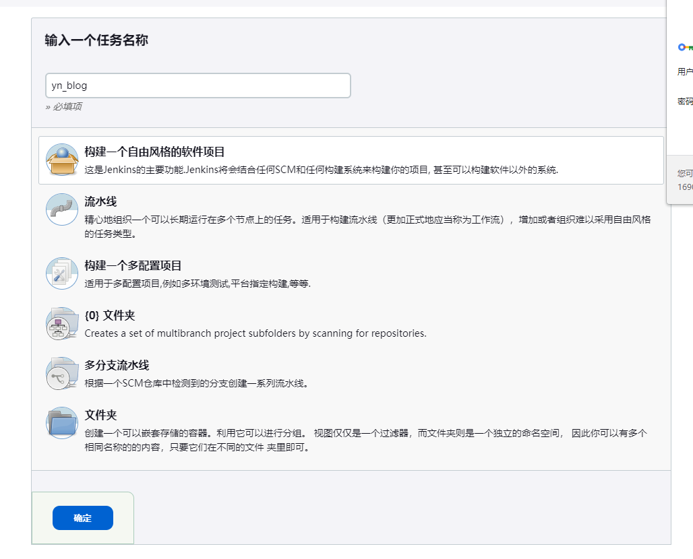


##### 2、配置 `git` ，

> 查看 `git` 执行文件的路径 `which git` 

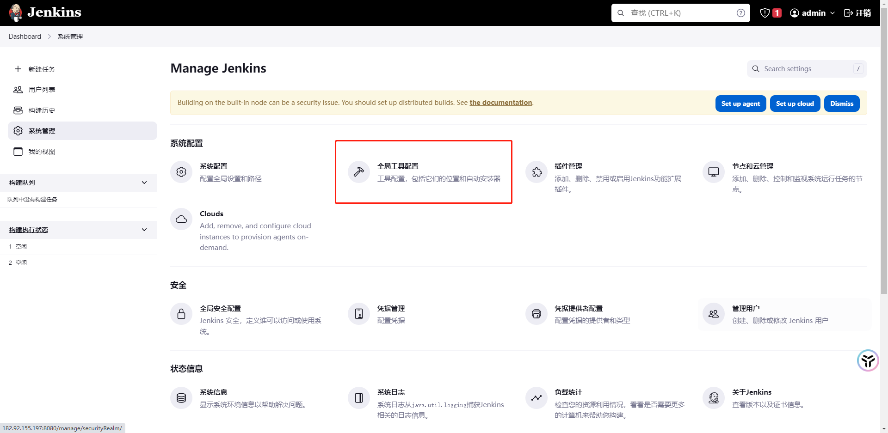 


> 配置好 `git` 执行的路径

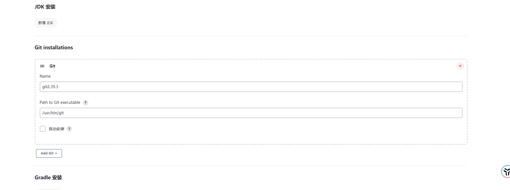


> 添加凭证

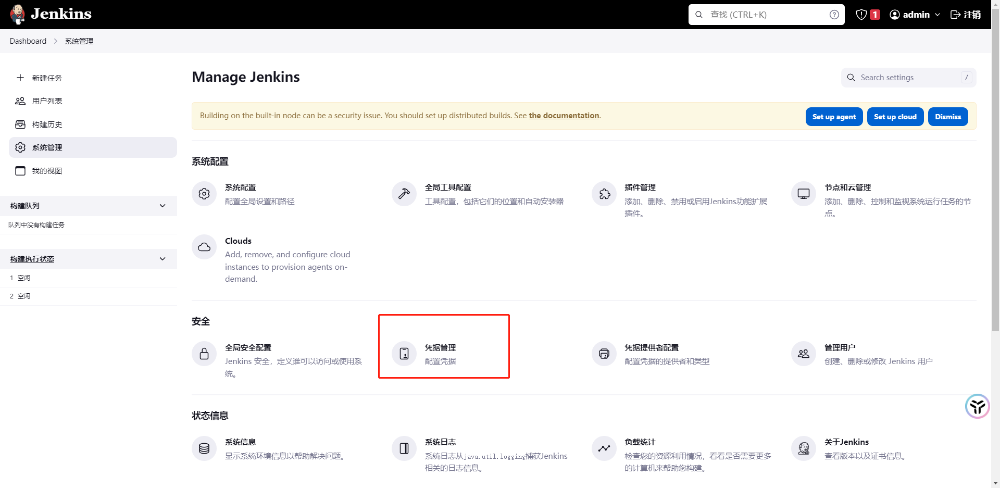


> 添加全局凭证

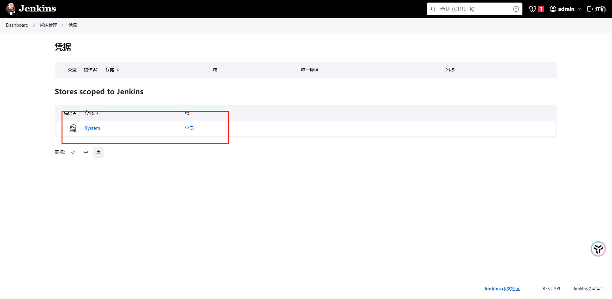

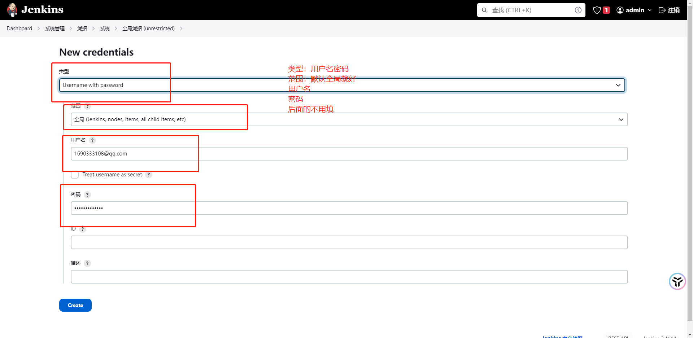


>  修改任务配置，添加 `git` 仓库和凭证

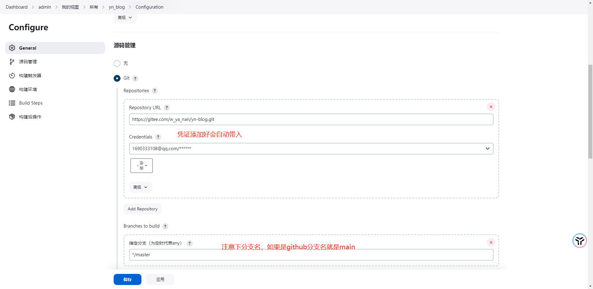


##### 3、构建触发器


```javascript
#每半小时构建一次OR每半小时检查一次远程代码分支，有更新则构建
H/30 * * * *

#每两小时构建一次OR每两小时检查一次远程代码分支，有更新则构建
H H/2 * * *

#每天凌晨两点定时构建
H 2 * * *

#每月15号执行构建
H H 15 * *

#工作日，上午9点整执行
H 9 * * 1-5

#每周1,3,5，从8:30开始，截止19:30，每4小时30分构建一次
H/30 8-20/4 * * 1,3,5
```


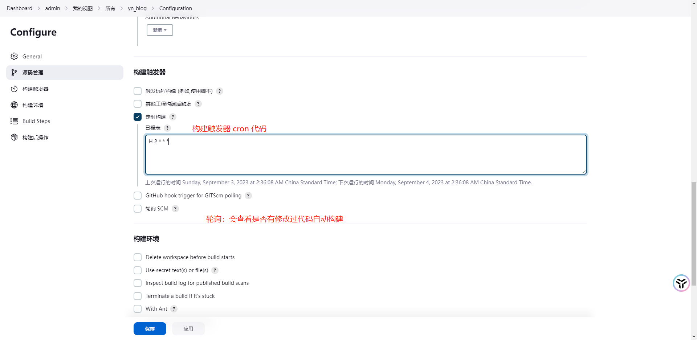


**构建环境：**推荐插件中没有node插件 需要手动下载，安装好之后重启


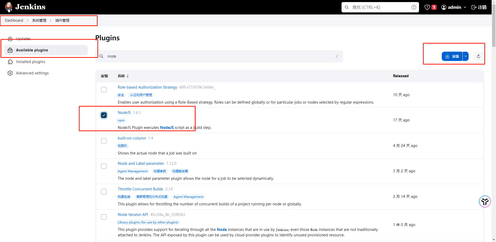


**配置`node`**

> 可以自动安装`node`环境，就算本地有也要安装，因为尝试过找不到`node`插件，别名叫`node`就行

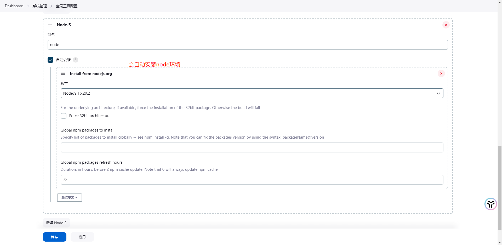


**构建执行的任务**：

~~~shell
pwd
node -v
npm -v

npm install 
npm run build

pwd

echo '构建成功'

ls

# 删除/root/mall_cms文件夹里所有的内容
rm -rf /usr/share/nginx/html/* 

cp -rf .vitepress/dist/* /usr/share/nginx/html/
~~~


##### 4、权限问题

> 构建的过程中有可能因为权限的问题会导致 jenkins 构建失败

1. 修改 `jenkins` 用户


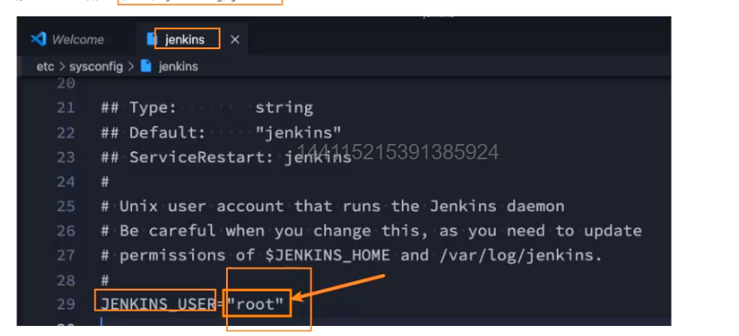


2. 如果修改配置文件还不行的话就给下文件夹操作权限 `chown 777 jenkins /xxx/xxx`


