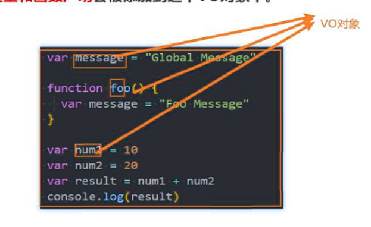
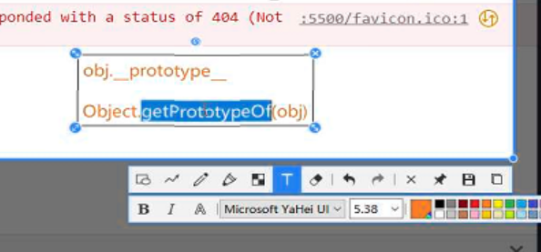
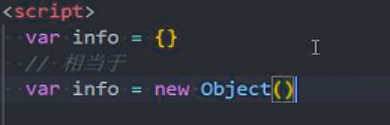
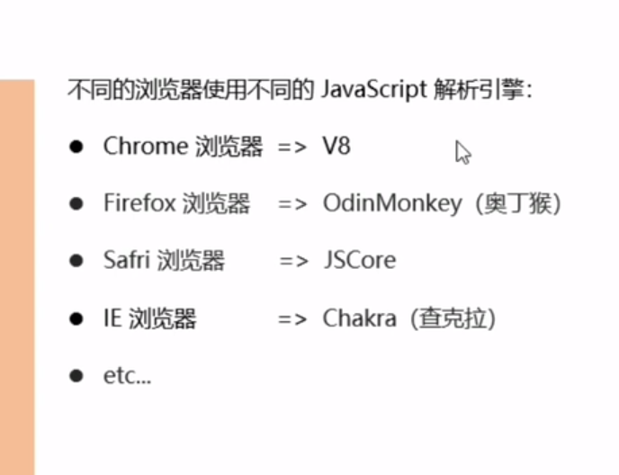
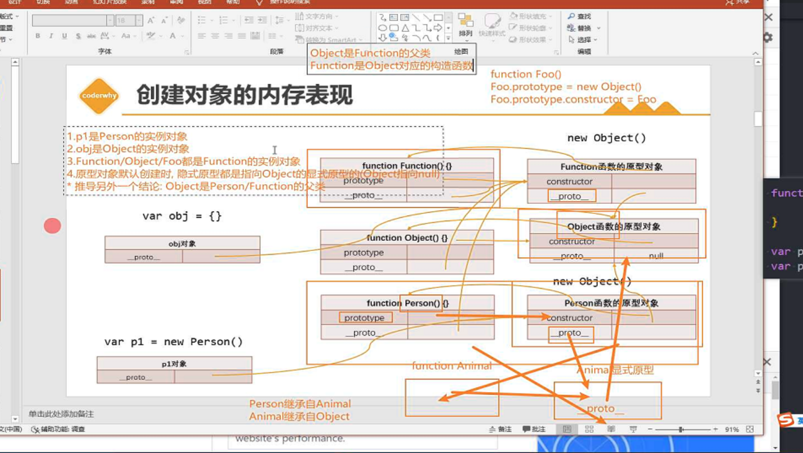
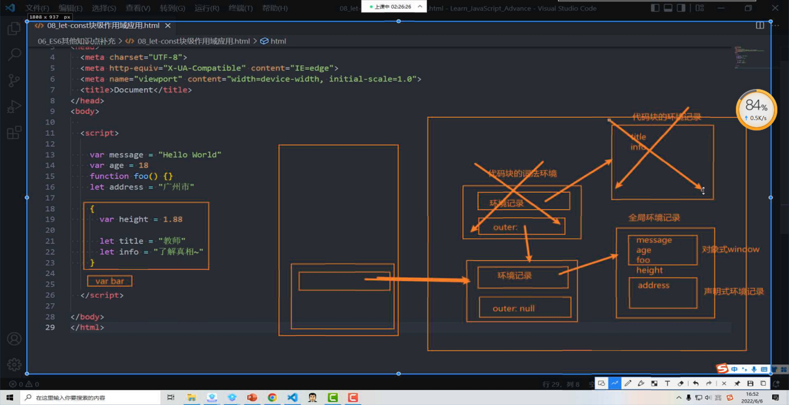
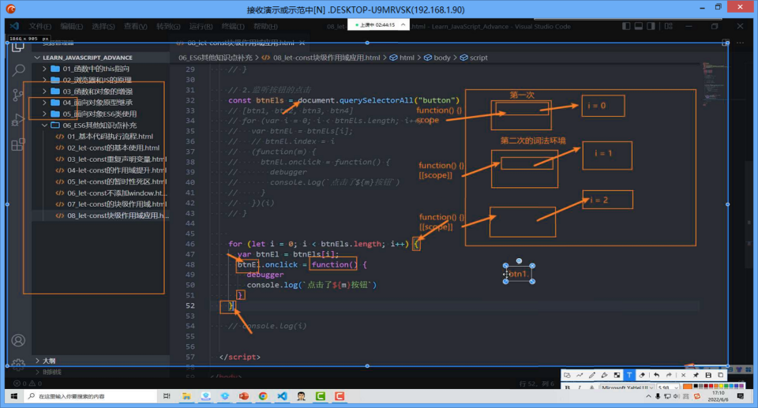
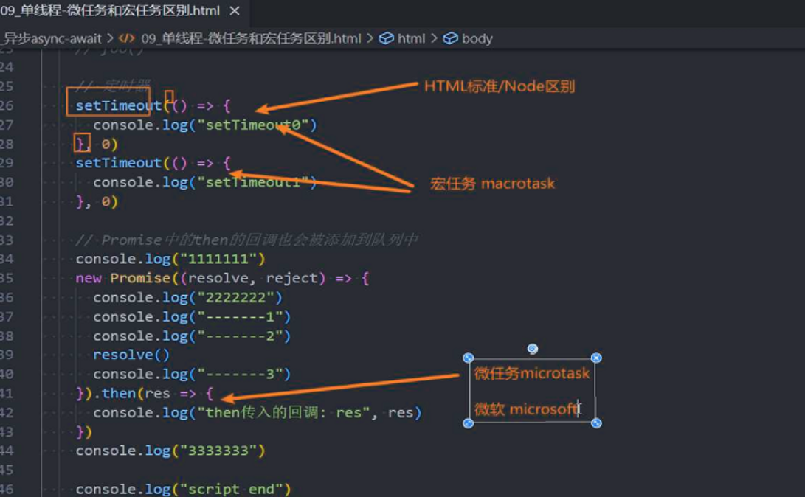
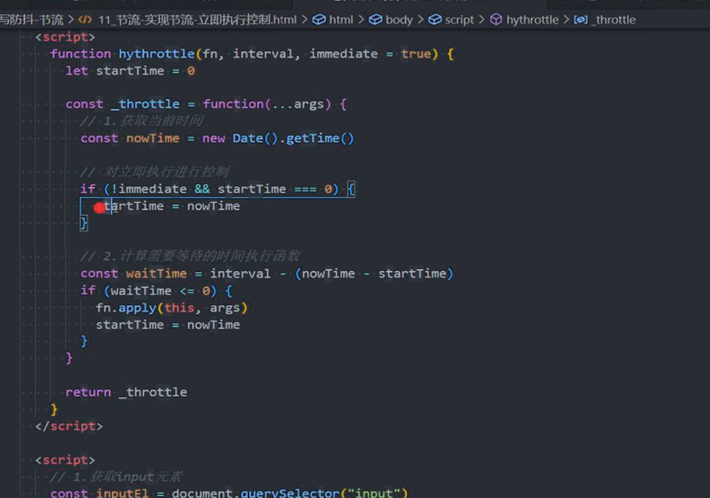

java 运行

number 类型视频看一下

定义变量的时候要初始化值：例如：null或者0或者空字符串.......

注意：javaScript中字符串"0" if判断是true的 php为false

i++ ++i

== 比较运算符 在类型不相等的情况下 出来Object类型的情况下，会将运算元

进行隐式转换，转成对应的Number类型的值 

逻辑运算||的本质

直接返回原类型数据不会进行改动

switch case穿透 使用严格模式

为变量  foo  bar baz

函数：具有特定功能一段代码的封装

函数代码块默认不会执行的，调用时才会执行

语法糖10_10000  看回放记一下

arguments 是一个类数组对象

  ...args 剩余参数写法es6

递归

作用域，由内向外的作用域找 一直到windows 变量，没找到就是undefined；

回看下递归和  斐波那契数列

day22

注意；当一行代码后面紧跟着{} ，（） 或者[] 的时候，js引擎不会将换行符转换成 ；的，会被认为是一个整体

函数使用分组运算符，表示函数的调用，将函数当作一个整体，创建及调用

第一个应用场景：立即函数的主要作用是在自己的作用域内可以控制的及的变量，防止全局变量命名冲突

普通代码 和  和立即执行函数 都会被执行

第二个应用场景：

on 在。。。。

for循环作用域

之后函数表达式才可以立即执行，使用分组运算符的时候js引擎会当作一个表达式

for执行顺序

debug函数的定义不执行

复习 递归，斐波那契数列  二分法

堆和栈 

值传递和引用传递的区别：记得看下参考

trident

Gecko

presto opera  后续使用的blink

webkit，移动端浏览器，chrom 后来使用的blink

visiblity：hidden

测试 typeof 构早函数

**整理笔记, function 是对象** 和包装类型

tofixed 默认4舍五如

number.toString(2).tofixed 返回值是string

修改数组添加移除, 描述

高阶函数this参数的使用

day08

对象模型也会形成树结构

继承的好处：父类引用指向子类

对象模型，文档 注释 换行符，元素

节点对象和document什么时候创建的

为什么document能直接获取body

节点导航，元素导航

document 对应的 Document类型

table 结构

table提示 as 技巧

document.forms(0)

formEl . elements.account【name】

多态的概念

标准属性 porperity 和setAttribute会相互影响

了解Node.contains

测试getComputedStyle获取的属性是否可以修改

deep

innerHTML

offsetTop和其他属性是否可写，相对于是定位祖先元素还是父元素,是否可读可写

scrollBy 和 scrollTo 相对于谁

事件流：当一个HTML元素产生一个事件时,该事件会在元素节点与根节点之间的路径传播，路径所通过的节点都会接收到该事件，这个传播的过程叫做DOM事件流 默认 事件冒泡 从里向外传递

向下一层一层捕获

事件发生的3个阶段

事件函数的this

排他案例

块级元素形变的时候会产生新的图层，在再行形变位移，skew 的时候 offsetLet 获取不到元素的位置

复习web API

5、23

节点导航

1. childNodes
2. parentNode
3. previousSibling
4. nextSibling
5. firstChild
6. lastChild

元素导航

1. children
2. parentElement
3. firstElementChild
4. lastElementChild
5. previousElementSibling
6. nextElementSilbling

table导航

1. thead
2. tbodies
3. rows
4. cells
5. rowsIndex
6. sectionRowIndex
7. cellIndex

form导航

- forms
- elements
- 通过子元素的name直接·

节点属性

nodetype

1、元素

3、文本

8、注释

9、document

10、文档声明

tagName

nodeName

nodeValue

data

innerHTML

outerHTML

textContent

textHTML

attribute

1. setAttribute
2. getAttribute
3. removeAttribute
4. hasAttribute

修改样式的3种方式 

setproperty

直接修改驼峰式的属性

cssText会整个替换 style的样式

className

会替换所有class

classList.add

.toggle

remove

contains

元素的操作方法

prepend

append

after

before

remove

replaceWith

替换当前元素为

appendChild

父元素最后的位置的后面插入一个

insertBefore

指定子元素的前面插入

replaceChild

替换指定子元素

removeChild

移除一个子元素

cloneNode

也可以克隆节点node.cloneNode(deep 深度克隆)

offsetHeight/width/top/left

clientHeight/

border 不包含滚动条

scrollHeight、left

srollby/to

window 的元素大小

innerwidth

包含滚动条不包含导航栏

outerwidth

包含导航栏标签

documnet.clientWidth

> 这个就是窗口的大小，不是html元素的大小，设置html的宽高会影响到offset但是不会影响到client，不包含滚动条

scrollX/Y

screenWidth

event的属性4个

target

currentTarget

eventphase

type

pageX、y

元素到页面之间的距离

offsetxy

鼠标到元素内之间的距离

clentxy和page相同

2个方法阻止默认事件还有冒泡

prevent

stoppropagetion

eventTarget类方法

dispatch

addeventlisenter

removeeventlisenter

什么是事件委托通过事件流的传播方式，监听子元素或者父元素发生的事件

鼠标事件：（10）

1. onclick
2. dbclick
3. contentmenu
4. mouseenter
5. mouseleave
6. mouseover
7. mouseout
8. mousedown
9. mouseup
10. mousemove

键盘事件

keydown

keypress

keyup

code key

滚轮事件

wheel

form表单事件

change

input

focus

blur

reset

submit

windwos

load

resize

transitionend

DOMContentLoaded和load的区别

domcontentloaded和load的区别就是，domcontetnloaded是在整个html文档被完全加载之后，而无需的等待外部样式表图像加载完成

urlsearchparam

encodeURLcompent

decode

history的5个方法

pushState

back

forward

repalceState

remove

~~~
pushState({}, "" ,"路径"})
~~~

go

属性2ge

length

state

json的两个方法

~~~js
JSON.stringify(function(key, value) {
//对象的话没有key值
})
~~~

序列化. 序列化 (Serialization)是将对象的状态信息转换为可以存储或传输的形式的过程。. 在序列化期间，对象将其当前状态写入到临时或持久性存储区。. 以后，可以通过从存储区中读取或反序列化对象的状态，重新创建该对象。. 序列化使其他代码可以查看或修改，那些不序列化便无法访问的对象实例数据。. 确切地说，代码执行序列化需要特殊的权限：即指定了 SerializationFormatter 标志的 SecurityPermission。. 在默认策略下，通过 Internet 下载的代码或 Internet 代码不会授予该权限；只有本地计算机上的代码才被授予该权限。.

创建数组的3种方式

字面量方式【

new Array

Array.of()

数组的添加

使用索引添加，长度会自动扩容

数组的属性

length 可读可写的

静态方法

at

from

of

isArray

实例方法

every

find

findindex

indexof

lastIndexof

inclodes

sort

resever

concat

slice

pop

push

unshift

shift

splice

filter

reduce

map

join

math（7）

floor

ceil

round

roudm

max

PI

abs

pow

+data

date.valueOf

date.getTime

now()

pase ref he iso de biaozhuan 

字符串，时间戳，number

hour

minutes

sceond

fullyear

month

data

day

number

tofiex 四舍五入 保留最多20 返回字符串

toString 参数可以转换进制

parseInt

创建函数的3种方式

new Object

字面俩个

构造函数

new 操作符 的作用

skew

rotate

translate

scale

defer  会造成回流和重绘吗 通过识别一些关键词进行词法分析  机器码

重新计算

async 什么时候执行结束

deawio

分词解析代码，变量提升  将标识符、参数 函数放到vo对象里  会添加到全局对象当中 这时候代码还没有执行 

，js引擎特殊处理   遇到函数对象 会提前在堆空间创建好这个对象会有一些length name

go会关联一个this

任何一段代码都会关联一个vo对象，但是什么时候关联的呢  是执行到....函数

也叫AO 创建一个AO的时候会初始化一个对象arguments

同样流程，初始化，之后parse 在js引擎执行

形成结构

会在栈内存中赋值

之后会在对应的ao赋值

在执行代码之前，函数对象被创建 的时候确认作用域链 可以在watch查看

上下文执行栈中创建ao  

执行上下文都会关联一个作用域链 是一个列表

上层作用域 foo 对应的ao对象

多次执行函数，多次创建ao

v8做了优化当前作用域没有引用上层作用域的变量时  0index的作用域为window global

GC

弊端相互引用

函数不用 之后没有释放

没有用到的参数会被释放

crumbs

pageX 和 clientX测试

测试默认值

纯函数不能使用闭包 eval 的 ec

纯函数

视频 get

柯里化

获取原型的标准方式和 不标准方式(浏览器实现的，有可能浏览器以后会移除掉)

对象只有隐式原型，没有显示原型

循环引用

补充构造函数创建对象对比字面量写法的优势

面试： 函数式编程的理解，面向对象的编程理解

原型链是js的实现机制

     回看视频他们两个的区别
     // Subtype.prototype = Supertype.prototype
    
      Object.defineProperty(Subtype.prototype, "constructor", {

​    
​      

回看视频寄生式函数 

如果按照es5实现继承的逻辑来推导那么Object就是所有类的父类

function 要放在原型上 节约内存空间，不然没创建一个对象就有多个函数对象

测试es5继承方式能不能继承 静态方法

Object（）将基础数据类型转成包装类，对象类型转完还是对象类型

词法环境 根据当前代码结构

暂时性死区

对象环境记录

变量声明记录

保留vo 闭包 立即执行函数

1. es6中环境记录  有分为 词法环境  变量环境， 这两个环境里面是否有对应的环境记录
2. es6中的内部和外部的词法环境是否相当于作用域链
3. let 声明的变量到底放在哪了
4. 声明环境记录的 内存表现， 词法环境是否相当于vo
   - 如果是的话，是否在执行全局代码的时候，也同样会新建一块内存空间，内存空间又会指向 windows
   - 就是除了vo 还有有另一个对象， 是不是可以理解 var 放在 vo 里了 而另一个对象是存放let
5. 执行具有作用域的代码块的时候，不会创建执行上下文  ,但是会创建对应的词法环境 也相当于创建了一个vo

就是一个词法环境包含作用域链(外部词法环境)， 和环境记录记录，相当于vo 叫做对象记录，但是又会存在另一个声明记录的**对象** 存放let的声明

和es3 内存描述的区别就是 多了一个声明记录的对象，在全局代码执行的时候，对象环境指的是windows，还有一个声明环境对象

local 本地 是代表当前作用域，

8.1词汇环境
词法环境是一种规范类型，用于根据ECMAScript代码的词法嵌套结构定义标识符与特定变量和函数的关联。词法环境由环境记录和对外部词法环境的可能空引用组成。通常，词法环境与ECMAScript代码的某些特定语法结构相关联，例如FunctionDeclaration、BlockStatement或TryStatement的Catch子句，并且每次评估此类代码时都会创建一个新的词法环境。
环境记录记录在其关联词法环境的范围内创建的标识符绑定。它被称为词汇环境的EnvironmentRecord。

外部环境引用用于模板词法环境值的逻辑嵌套。（内部）词汇环境的外部参照是对逻辑上围绕内部词汇环境的词汇环境的参照。当然，外部词汇环境可能有自己的外部词汇环境。一个词汇环境可以作为多个内部词汇环境的外部环境。例如，如果一个FunctionDeclaration包含两个嵌套的FunctionDeclaration，那么每个嵌套函数的词法环境都会将当前对周围函数的求值的词法环境作为其外部词法环境。
全局环境是没有外部环境的词汇环境。全局环境的外部环境引用为空。全局环境的EnvironmentRecord可以预先填充标识符绑定，并包括一个关联的全局对象，其属性提供了一些全局环境的标识符绑定。在执行ECMAScript代码时，可以向全局对象添加其他属性，并修改初始属性。
模块环境是一个词汇环境，它包含模块顶级声明的绑定。它还包含由模块显式导入的绑定。模块环境的外部环境是全局环境。
函数环境是对应于ECMAScript函数对象调用的词汇环境。函数环境可以建立新的this绑定。函数环境还捕获支持超级方法调用所需的状态。
词法环境和环境记录值纯粹是规范机制，不需要对应于ECMAScript实现的任何特定构件。ECMAScript程序不可能直接访问或操作这些值。
8.1.1环境记录
本规范中使用了两种主要的环境记录值：声明性环境记录和对象环境记录。声明性环境记录用于定义ECMAScript语言语法元素（如FunctionDeclarations、VariableDeclarations和Catch子句）的效果，这些语法元素将标识符绑定与ECMAScript语言值直接关联。对象环境记录用于定义ECMAScript元素的效果，例如将标识符绑定与某些对象的属性相关联的WithStatement。全局环境记录和函数环境记录是专门用于脚本全局声明和函数内顶级声明的专门化。
出于规范目的，环境记录值是记录规范类型的值，可以认为存在于简单的面向对象层次结构中，其中环境记录是一个抽象类，包含三个子类：声明性环境记录、对象环境记录和全局环境记录。函数环境记录和模块环境记录是声明性环境记录的子类。抽象类包括表16中定义的抽象规范方法。这些抽象方法对于每个具体子类都有不同的具体算法。

每个声明性环境记录都与一个包含变量、常量、let、类、模块、导入和/或函数声明的 ECMAScript 程序范围相关联。 声明性环境记录绑定由包含在其范围内的声明定义的标识符集。

声明性环境记录的具体规范方法的行为由以下算法定义。

weakref   deref（）不要const inforef = obj.deref()  这样又会有强引用 导致不能销毁

reflect.construct 是否只能传入构造函数	

补充 then 返回值 Promis 的 resolve的方法

包括 返回的 Promise中执行resolve 默认执行

迭代器一般的使用场景

settimeout  js 执行就是告诉浏览器其他线程 进行几时操作，到时间了 在告诉js 执行回调

会等待倒计时之后加入队列

默认 异步函数返回 promise.resolve

async 正常调用

问题 promise 中没有异步操作的话算不算异步

UI reading 是什么

alter

writ

console

prompt

正则量词不能加空格

 json  symbol 函数 循环引用报错

content-type: application/json,  会将json转换成json对象

获取到请求头

内容分发网络 内容传输网络

preview 预览

正则表达式规则

1. 修饰符 ig
2. 字符类\d\w\s
3. 词边界\d
4. 锚点 $^
5. 集合 [13213123] [1,2,3,4] [1|2|4|]
6. 范围 [1-9]
7. 量词 {0，} {1，9} +1到多个，？0到1  *0到多个
8. 分组（）
9. 命名组 `?<wyn>`
10. 开启lazy 量词后面加?

正则方法

test

exec；返回一个迭代器返回详细信息

search

replace

split

match

matchAll

