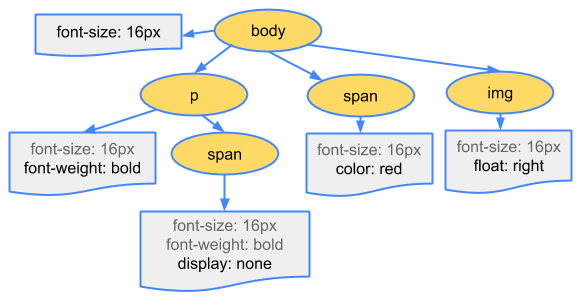

# 第一章 JavaScript函数中的this

> this的绑定和定义的位置（编写的位置）没有关系，函数在调用时，JavaScript会默认给this绑定一个值

- this是在运行时被绑定的
- <u>**this的绑定**和**调用方式**以及**调用的位置**有关系</u>（重要）

## 一、this的4种绑定规则及优先级

### 1、默认绑定

> 就是当函数默认单独调用的时候，可以理解this没有绑定到对象上面调用
>
> 这样的情况，this会绑定到windows上面，但是严格模式下this时undefined
>
> "use strict"
>
> **区分箭头函数**：严格不严格模式下指向的都是 `windows`

### 2、隐式绑定

> 是通过某个对象发起的函数调用, 这时this会指向这个对象
>
> 就是对象实例调用

### 3、显式绑定

> 通过内置函数的方式、可以直接的改变this的绑定，可以让我们不通过对象调用，就可以改变this的指向
>
> 就是通过 call，apply，bind的方式调用函数的时候改变this绑定，这个过程称为显示绑定

- 显示绑定后，this就会明确的指向绑定的对象

#### 1. call，apply

> JavaScript所有的函数都可以使用call和apply方法。

1. 可以调用一个函数、并且指定this要绑定的对象；

​	

##### call、apply的使用和区别

> 他们都是用来**调用函数**，**并且改变this的指向**的
>
> 区别的是
>
> call：在调用函数的传入的参数方式是，参数列表
>
> apply：在给调用函数传入参数的时候使用的是、数组；

- call：` foo.call(bar, "zhangsan", 17, "在吃饭")`

- apply：`foo.apply(baz, ["wangwu", 35, "看电视"])`

- <u>在提醒下</u>，要分清楚什么时候加分组运算符，这里foo不能加小括号，就是 `undefined.apply` 了

- **也可以绑定原始类型，绑定原始类型的情况下，<u>非严格模式</u>this的指向是<u>原始类型的包装类</u>，<u>严格的话指向的就是原始类型</u>**

  ~~~js
  function foo() {
    console.log(this)
  }
  foo.apply("abc")
  //output String
  ~~~

  

#### 2. bind 绑定函数

> 使用bind方法，bind() 方法创建一个新的绑定函数（bound function，BF）
>
> exotic function object（怪异函数对象，ECMAScript 2015 中的术语）

##### bind的使用和与call和apply的区别

1. var temp = foo.bind(bar,"函数的this", "1.2")

2. `bind` 和call、apply的区别就是**返回一个新的函数**，<u>第一个参数指定新函数的this</u>，但是**不会调用函数**，其余的参数是被调用函数的参数即可以是**参数列表**，**也可以是数组**

   ~~~js
    var temp = foo.bind(bar,"函数的this", "1.2")
    var temp = foo.bind(bar,["函数的this", "1.2"])
    temp()
   ~~~

   

3. 也可以通过返回新的函数传参

   ~~~js
   var temp = foo.bind(bar, 123)
   temp(1.5)
   temp("测试参数", "测试参数1.5")
   ~~~

   

4. 当调用函数和bind都有参数的时候：

   > 是 `bind` 传入的参数会排在`newFn` 的**前面**
   
   
   
5. 也可以直接调用

   ~~~js
   foo.bind(obj)()
   ~~~

### 4、new绑定

> JavaScript中的函数可以当做一个类的构造函数来使用，通过new调用，也就是使用new关键字。

#### 1. 使用new操作符调用构造函数的过程

1. 创建一个全新的对象；
2. 这个**新对象会被执行prototype连接**，将构造函数prototype对象的引用赋值给这空对象；
3. 这个**新对象会绑定到函数调用的this**上（this的绑定在这个步骤完成）；
4. 执行函数中的代码，给空对象创建属性和变量
5. 如果函数没有返回其他对象，表达式会返回这个新对象；

### 5、this绑定的优先级

1. 默认规则的优先级最低
   毫无疑问，默认规则的优先级是最低的，因为存在其他规则时，就会通过其他规则的方式来绑定this
2. 显示绑定优先级高于隐式绑定
3. new绑定优先级高于隐式绑定
4. new绑定优先级高于bind
   - <u>new绑定和call、apply是不允许同时使用的，所以不存在谁的优先级更高</u>
   - <u>new绑定可以和bind一起使用，new绑定优先级更高</u>

### 6、this规则之外

> 我们讲到的规则已经足以应付平时的开发，但是总有一些语法，超出了我们的规则之外。

#### 1.  忽略显示绑定

> 情况一：如果在显示绑定中，**我们传入一个null或者undefined**，那么这个**显示绑定会被忽略**，**使用默认规则**：
>
> use strict 下：指向的自己，null，undefined
>
> 非严格模式下：都是window

#### 2. 间接函数引用

> **情况二：创建一个函数的** **间接引用**，**这种情况使用默认绑定规则**

- 两个对象方法进行赋值的时候 使用分组运算符调用的情况下`(obj2.foo = obj1.foo)()`, 这样foo函数被直接调用，那么this的绑定就是默认绑定
- **注意这里在强调一下大括号分组运算符之间要必须要加分号**

~~~js
 var obj1 = {
      name: "obj1",
      foo: function() {
        console.log(this)
      }
    }

    var obj2 = {
      name: "obj2"
    };//很重要这里要添加分号

    (obj2.foo = obj1.foo)();
~~~

### 7、内置函数的this指向

#### setTimeOut：非箭头函数指向的是window，通过测试

~~~js
//setTimeout的调用相当于下面的例子，并不是换了箭头函数，就能决定this指向的setTimeout的上层作用域(这里不是说的函数在setTimeout调用的作用域)，而是要看setTimeout里面是怎么调用
function request(url,fn) {
  this.name = "resquest"
    var obj = {
      name: "zhagnsan"
    }
    if(url) {
      obj.fn = fn
      obj.fn([123,12,42,45,63,87])
    }
  }

request("user/", e => {
  console.log(e)
  console.log(this.name)
})
~~~

#### Array中的高级函数可以指定this，否则也是window

#### 事件中的this指向的是事件源	

#### 剩下的靠经验

#### 对象的大括号内 没有this 

## 二、ES6箭头函数 arrow function

> 箭头函数是ES6之后增加的一种编写函数的方法，并且它比函数表达式要更加简洁

### 1、特点

1. 在箭头函数中没有单独的this   mdn `this` ，**不会绑定this、没有 `arguments`  属性** 所以要使用**扩展运算符  `...rest`**
2. <u>箭头函数是没有显式原型prototype的</u>，所以不能作为构造函数，（不能和new一起来使用，会抛出错误）；
   箭头函数也不绑定`this`、`arguments`、`super`参数；
3. 鉴于 `this` 是词法层面上的，[严格模式](https://developer.mozilla.org/zh-CN/docs/Web/JavaScript/Reference/Strict_mode)中与 `this` 相关的规则都将被忽略。 **this指向的也是window**

### 2、箭头函数的简化写法(重要)

1. 如果只有一个参数()可以省略
2. 如果函数执行体中只有一行代码, 那么可以省略大括号，和`retrun`
   - 默认将这行代码当作返回值返回，
   - 但是当有 `return` 的时候就不能省略大括号了
3. 如果函数执行体只有返回一个对象, 那么需要给这个对象加上()

### 3、箭头函数中的this

> <u>箭头函数不能使用this的四种标准规则（也就是不绑定this），而是根据外层作用域来决定this。</u>

- 箭头函数的this**被强行绑定到上下文中**，上下文this是什么箭头函数this就是什么

- 箭头函数中的this，**只和 “定义” 箭头函数的位置有关系(重点理解这句话)**，

  > 即，箭头函数中的this**始终**是该箭头函数**所在作用域中的this**。相当于已经进行了对象的绑定赋值

- 普通函数的this和**“调用”的位置**有关系

  - **注意**：箭头函数会指向外层作用域的this，之后箭头函数的调用不会影响内部的this指向，但是**不代表父级作用域的this不会改变**

  - ##### 例：

  ~~~js
  class Foo {
    constructor() {
      this.state = {
        name: "zhangsan",
      }
    }
  
    trigger() {
      console.log(this)
    }
  
    fn = () => {
      console.log("fn==>", this)
    }
  
  }
  
  const foo = new Foo()
  foo.fn() //foo
  
  const bar = foo.fn
  bar() //同样是foo
  
  ~~~

#### 重点注意：

1. 箭头函数中的this是通过，**外层作用域**来决定的，**一层一层的向外找**，不用管有没有绑定因为箭头函数是不绑定this的，但是要考虑隐式绑定对象调用的情况
2. 在一个就是 **声明对象的代码块不是作用域** ，使用来创建对象的，**es5之前只有函数有作用域**

## 三、this的指向示例（重要）

##### 第一种

~~~js
var name = "zhangsan"
  var person = {
    name: "person",
    sayName: function() {
      console.log(this.name)
    }
  }
  foo ()  
  function foo () {
    var b = null
    var temp = person.sayName; 
    temp(); 											//window
    person.sayName();  									//person
    (person.sayName)();									//person
    (b = person.sayName)();  							//window
  }
~~~

##### 第二种

~~~js
  var name = "window"
  var person = {
    name: "person",
    foo1: function() {
      console.log(this.name)
    },
    foo2: () => console.log(this.name),
    foo3: function() {
      return function() {
        console.log(this.name)
      }
    },
    foo4: function() {
      return () => console.log(this.name)
    }
  }

  var person2 = {name: "person2"}

  person.foo1()  								//person
  person.foo1.call(person2) 	   				//person2
	
  person.foo2() 								//window
  person.foo2.call(person2) 					//window

  person.foo3()() 								//windows
  person.foo3.call(person2)() 					//windows
  person.foo3().call(person2) 					//person2

  person.foo4()() 								//person
  person.foo4.call(person2)() 					//person2
  person.foo4().call(person2) 					//person
~~~

##### 第三种

~~~js
  var name = "window"
  function Persion(name) {
    this.name = name
    this.foo1 = function() {
        console.log(this.name)
    }
    this.foo2 = () => console.log(this.name)

    this.foo3 = function() {
      return function() {
        console.log(this.name)
      }
    }
    this.foo4 = function() {
      return () => console.log(this.name)
    }
  }

  var person1 = new Persion("person1")
  var person2 = new Persion("person2")

  person1.foo1()							//person1
  person1.foo1.call(person2) 				//person2

  person1.foo2() 							//person1 上一层作用域是构造函数，有作用域
  person1.foo2.call(person2) 				//person1 箭头函数不会绑定this

  person1.foo3()(); 						//window 相当于函数单独调用了
  person1.foo3.call(person2)() 				//window
  person1.foo3().call(person2)  			//person2

  person1.foo4()();							//person1
  person1.foo4.call(person2)()				//peroon2 箭头函数的上层作用域可以改的
  person1.foo4().call(person2) 				//person1
~~~

##### 第四种

~~~js
 var name = "window"
 function Persion(name) {
   this.name = name;
   this.obj = {
     name: 'obj',
     foo1: function() {
       return function() {
         console.log(this.name)
       }
     },
     foo2: function() {
       return () => {
         console.log(this.name)
       }
     }
   }
 }

 var person1 = new Person("person1")
 var person2 = new Person("person2")

 person1.obj.foo1()() 											//window
 person1.obj.foo1.call(person2)() 								//window
 person1.obj.foo1().call(person2) 								//person2

 person1.obj.foo2()() 											//obj
 person1.obj.foo2.call(person2)() 								//person2
 person1.obj.foo2().call(person2) 								//obj
~~~

# 第二章 浏览器的渲染原理

## 一、网页的解析过程

1. 浏览器输入地址向静态服务器发起请求
2. 进行域名解析，到dns服务器获取到真实静态资源服务器ip
3. 找到真实服务器之后获取html文件，进行加载
4. html页面进行加载的时候遇到外部链接资源文件css，和js会先去下载相关文件
5. 下载完之后，通过浏览器内核的渲染引擎进行解析渲染，最后显示在网页上面

## 二、渲染引擎解析页面流程

### 1、页面渲染的基本流程

1. 先加载 `html` 页面，默认 `html` 文档的加载顺序从上到下进行解析
2. 遇到外部链接资源css之后会下载css文件进行解析，生成cssom，但是加载css文件的时候不会影响DOM的解析
3. 最后将样式添加到DOM tree上

### 2、页面渲染的详细流程

[塔利的文章](https://www.html5rocks.com/en/tutorials/internals/howbrowserswork
):

1. 浏览器开始解析html生成DOM树

2. 解析html的时候遇到外部链接资源，css文件会先进行下载在解析成对应的规则CSSDOM树 但不会影响dom的解析

3. 在生成DOM、CSSDOM的时候会相互等待对方加载完成，进行结合构建Render Tree ，所以css外部资源进行下载解析的过程并不会影响到DOM Tree 的生成，但是会阻塞Render Tree的构建，因为Render Tree构建需要对应得CSSOM

4. 构建Render Tree 默认情况下 渲染树生成的结构里面没有计算每个节点对应宽高尺寸，位置，布局 margin padding信息等

5. 所以构建渲染树过程中会进行 layout 布局得一个过程，会计算Render Tree 上面每个节点的大小和位置信息

   > 举例：当一个元素设置为display：none的情况下，DOM tree上面也还是会有该元素，但是在页面上不需要显示，所以在构建render Tree的时候是不需要 这个元素的，所以布局的过程要在构建Render Tree 过成中进行

   

6. 最后在绘制阶段，将元素的可见部分进行绘制，比如文本、颜色、边框、阴影、替换元素（比如img）在将**布局阶段计算的每个frame【布局结构体】**转为屏幕上实际的像素点 

7. 最后到页面的显示

#### 解析一：HTML解析过程

> 因为默认情况下服务器会给浏览器返回index.html文件，所以解析HTML是所有步骤的开始：

解析HTML，会构建DOM Tree：

#### 解析二 – 生成CSS规则

> 在解析的过程中，如果遇到CSS的link元素，那么会由浏览器负责下载对应的CSS文件：

- 注意：**下载CSS文件是不会影响DOM的解析的；**
- 浏览器**下载完CSS文件后，就会对CSS文件进行解析，解析出对应的规则树：**
- 我们可以**称之为 CSSOM**（CSS Object Model，CSS对象模型）；

#### 解析三 – 构建Render Tree

> 当有了DOM Tree和 CSSOM Tree后，就可以两个结合来构建Render Tree了

- 注意一：<u>link元素不会阻塞DOM Tree的构建过程</u>，**但是会阻塞Render Tree的构建过程**
  **这是因为Render Tree在构建时，需要对应的CSSOM Tree；**
- 注意二：**Render Tree和DOM Tree并不是一一对应的关系**，<u>比如对于display为none的元素，压根不会出现在render tree中</u>；

#### 解析四 – 布局（layout）和绘制（Paint）

- 第四步是在渲染树（Render Tree）上进行布局（Layout）以计算每个节点的几何体。

  - 渲染树**会表示显示哪些节点以及其他样式**，**但是不表示每个节点的尺寸、位置等信息**；
  - **布局是确定render tree树中所有节点的宽度、高度和位置信息；**

  

- 第五步是将每个节点绘制（Paint）到屏幕上

  1. 计算样式

  2. 在绘制阶段，<u>浏览器将布局阶段计算的每个元素对应的frame</u>（**结构体，位置和尺寸-x/y/height/width**）进行构建，有了 `frame` **就可以确定 他的位置和大小信息了**，转为屏幕上实际的像素点；

  3. 确定完位置尺寸的布局信息之后就**可以将元素的可见部分进行绘制**，比如文本、颜色、边框、阴影、替换元素（比如img）绘制到屏幕上面 
  4. 在这个阶段中会有可能会出现合成图层的过程

### 3、回流和重绘解析

dom 修改之后，渲染树也一改就会导致重新布局 重新绘制

#### 3.1、回流 reflow

> 第一次确定节点的大小和位置，称之为布局（`layout`）。
> 之后对节点的大小、位置修改重新计算称之为回流。

- 当页面第一次加载完成之后，修改了页面结构尺寸，导致了页面重新布局计算每个节点的大小，之后进行绘制重新渲染到页面上叫做回流

##### 引起回流的场景

1. 当DOM结构发生改变（添加新的节点或者移除节点）；
2. 或者（修改了width、height、padding、font-size等值）改变了布局
3. 例如（修改了窗口的尺寸等）窗口resize
4. 在就是调用getComputedStyle方法获取尺寸、位置信息；

#### 3.2、重绘

> 第一次渲染内容称之为绘制（paint）。
> 之后重新渲染称之为重绘。
>
> 在页面绘制完成之后，再次对节点样式修改导致页面渲染称之为重绘

##### 引起重绘情况

- 比如修改背景色、文字颜色、边框颜色、样式等；

#### 3.3、如何避免回流和重绘

> 回流一定会引起重绘，所以回流是一件很消耗性能的事情。

- 所以在开发中要尽量避免发生回流：

  1. 修改样式时尽量一次性修改

     > 比如通过cssText修改，比如通过添加class修改

  2. 尽量避免频繁的操作DOM

     > 我们可以在一个 DocumentFragment 或者父元素中将要操作的DOM操作完成，再一次性的操作；

  3. 尽量避免通过 getComputedStyle 获取尺寸、位置等信息；

     > 据说 使用 getComputedStyle 获取尺寸的时候页面会重新计算一下样式尺寸，有可能会引起重绘和回流

  4. 对某些元素使用position的absolute或者fixed

     > 并不是不会引起回流，而是开销相对较小，不会对其他元素造成影响。

### 4、特殊解析 – composite合成图层

> 绘制的过程，可以将布局后的元素绘制到多个合成图层中。
>
> - 这是浏览器的一种优化手段；

1. <u>默认情况下</u>，**标准流中的内容都是被绘制在同一个图层（Layer）中的**

**注意：而一些特殊的属性，会创建一个新的合成层（ CompositingLayer ），并且新的图层可以利用GPU来加速绘制**

- 因为每个合成层都是单独渲染的；

#### 4.1、形成新的合成层常见的一些属性

1. `3D transforms`
2. `video`、`canvas`、`iframe`
3. `opacity` 动画转换时；
4. `position`: `fixed`
5. `will-change`：一个实验性的属性，提前告诉浏览器元素可能发生哪些变化；
6. `animation` 或 `transition` 设置了`opacity`、`transform`；

注意：分层确实可以提高性能，但是它以**内存管理为代价，**因此**不应作为 web 性能优化策略的一部分过度使用。**

因为**图层过多的话会占用内存**

## 三、script元素和页面解析的关系

> 在页面解析、渲染的过程中加载、解析 `Script` 标签和 `js` 文件、也是页面解析的过程之一

### 1、页面加载Script标签的过程

> 事实上，浏览器在解析HTML的过程中，遇到了script元素是不能继续构建DOM树的；

1. 它会**停止继续构建**，首先**下载**JavaScript代码，**并且执行JavaScript的脚本**；
2. 只有等**到JavaScript脚本执行结束后**，才会继续解析HTML，构建DOM树；

#### 1.1、(重点) 为什么需要等待js 下载之后 <u>执行</u>  完成之后才能继续构建DOM

1. 这是**因为JavaScript的作用之一就是操作DOM，并且可以修改DOM；**

2. **如果我们等到DOM树构建完成并且渲染再执行JavaScript，会造成严重的回流和重绘，影响页面的性能；**

   > 如果等到DOM tree构建完成之后在加载js，js脚本修改了dom，这样的情况就不是第一次加载html页面了属于回流重绘
   >
   > 相反解下到Script代码的时候修改dom 生成一半的树，这样还算是第一次加载解析dom tree

3. 所以会在遇到`script`元素时，**优先下载和执行JavaScript代码，再继续构建DOM树**；

#### 1.2、但是这个也往往会带来新的问题，特别是现代页面开发中：

> 在目前的开发模式中（比如Vue、React），脚本往往比HTML页面更“重”，处理时间需要更长；
> 所以会造成页面的解析阻塞，在脚本下载、执行完成之前，用户在界面上什么都看不到；

### 2、defer和async属性

> 为了解决页面加载到js的时候会阻塞的问题，script元素给我们提供了两个属性（attribute）：defer和async

#### 2.1、defer属性

> defer 属性告诉浏览器不要等待脚本下载，而继续解析HTML，构建DOM Tree。

- 脚本会由浏览器来进行下载，但是**不会阻塞DOM Tree的**构建过程；

- 如果脚本提前下载好了，**它会等待DOM Tree构建完成**，并且在<u>DOMContentLoaded事件</u>**之前**先执行defer中的代码；

  >所以 `DOMContentLoaded` 总是会等待 `defer` 中的代码先执行完成。

**注意：**

1. 多个带 `defer` 的脚本是保持正确的 `html` 解析顺序自上而下执行的
2. **defer仅适用于外部脚本，对于script默认内容会被忽略。**
3. defer可以提高页面显示的性能，并且推荐放到head元素中。因为defer不会阻塞DOM 放到head元素中可以提前进行下载。

> <u>就是在外部脚本只要不会进行会导致页面回流重绘操作的情况下，使用defer，是会提高页面性能的</u>

#### 2.2、async属性

> async 特性与 defer 有些类似，它也能够让脚本不阻塞页面。
> async是让一个脚本完全独立的：
>
> 在加载到javaScript标签开始执行，

1. 浏览器不会因 async 脚本而阻塞（与 defer 类似）；
2. 和defer不同的是async脚本**不能保证顺序，它是独立下载、独立运行，不会等待其他脚本**；
3. async**也不能保证在DOMContentLoaded或者load之前或者之后执行 就是不能确定什么时候执行完**；

defer通常用于需要在文档解析后操作DOM的JavaScript代码，并且对多个script文件有顺序要求的

async通常用**于独立的脚本**，对其他脚本，**甚至DOM没有依赖的**

# 第三章 深入V8-JavaScript的运行原理

JavaScript代码下载好之后，是如何一步步被执行的呢？
我们知道，浏览器内核是由两部分组成的，以webkit为例：

- WebCore：负责HTML解析、布局、渲染等等相关的工作；
- JavaScriptCore：解析、执行JavaScript代码；

> 最新的chrom浏览器使用的是blink内核搭载了v8引擎

### 1、V8引擎的执行原理

> V8是用C ++编写的Google开源高性能JavaScript和WebAssembly引擎，它用于Chrome和Node.js等。
>
> - 它实现ECMAScript和WebAssembly，并在Windows 7或更高版本，macOS 10.12+和使用x64，IA-32，ARM或MIPS处理器的Linux系统上运行。

- V8可以独立运行，也可以嵌入到任何C ++应用程序中

### 2、V8引擎的架构

> V8引擎本身的源码非常复杂，大概有超过100w行C++代码

#### 2.1、Parse

- Parse模块会将**JavaScript代码转换成 AST**（抽象语法树 `abstract syntax tree`），这是因为解释器并不直接认识JavaScript代码；

  - 如果**函数没有被调用，那么是不会被转换成AST的**；因为函数会预解析，在函数执行的时候在执行parse的过程转化为AST

  - 函数中内部的代码也是一样
  
    [Parse的V8官方文档](https://v8.dev/blog/scanner)

1. 通过blink获取到js源代码，之后通过v8 的parse模块解析
2. 解析过程中进行扫描动作来执行**词法分析（分词）一些关键字，或者代码的区分确定作用域。闭包词法环境，函数等**
3. 区分好类型之后进行语法分析，最后生成AST
3. 加载全局代码的时候进行 `parse` 函数的时候在 AST 中会**存放函数对象的地址生成语法树的一部分。**
3. **当函数没有执行的话，是不创建函数对应的抽像语法树的 AST** , 只有函数执行的是后才会 parse 函数中的代码

#### 2.2、Ignition

- Ignition是一个解释器，会将AST转换成ByteCode（字节码）
  1. **同时会收集 TurboFan 优化所需要的信息**（比如函数参数的类型信息，有了类型才能进行真实的运算）；
  2. 如果函数只调用一次，Ignition会解释执行ByteCode；**多次调用的话会交给Trubofan**
  3. [Ignition的V8官方文档](https://v8.dev/blog/ignition-interpreter)

#### 2.3、TurboFan （发动机）

- TurboFan是一个编译器，可以将字节码编译为CPU可以直接执行的机器码；

  1. 如果一个函数被多次调用，那么就**会被标记为热点函数**，那么就会**经过`TurboFan`转换成优化的cpu可以直接识别机器码，提高代码的执行性能；**

     

  2. 但是，**机器码实际上在某种情况下也会被还原为ByteCode**，这是因为如果后续执行函数的过程中，**类型发生了变化**（比如sum函数原来执行的是number类型，后来执行变成了string类型），之前优化的机器码并不能正确的处理运算，就会逆向的转换成字节码进行执行 也就是反优化

     但是如果**多次执行类型发生变化的函数**，就会将之前优化后的代码在进行一次turbofan**，把变化类型的函数重新优化成机器码；**

     **这样会很耗性能**

     
  
  3. 如果参数类型改变或者影响结果的情况下、转换成字节码只有还会进入到`turboFan`，改变优化后机器码，进行执行机器码会很影响性能、所以函数定义好之后尽量不要随意的改变参数的类型
  
     
  
  4. [TurboFan的V8官方文档](https://v8.dev/blog/turbofan-jit)

### 3、V8引擎的解析图

# 第四章 JavaScript代码执行原理 

### 1、初始化全局对象

> <u>js引擎会在执行代码之前，会在堆内存中创建一个全局对象：`Global Object（GO）`</u>

1. 所有的作用域（scope）都可以访问该对象；
2. 里面会包含 Date、Array、String、Number、setTimeout、setInterval等等；
3. 其中还有一个window属性指向自己；

### 2、执行上下文栈（ Execution Context Stack ）

> js引擎内部有一个**执行上下文栈**（Execution Context Stack，简称ECS），它是**用于执行代码的<u>调用栈</u>。**
>
> 被执行的代码都会在栈空间执行，<u>执行完之后会出栈</u>
>
> **<u>这里表示的执行上下文栈就是栈内存空间</u>**

#### 执行上下文空间

- **执行上下文逻辑上形成一个栈**   （表示按照栈数据结构执行的应该）
- 在执行的过程中执行到**一个函数时或者执行一个段新的代码时或者执行相同的函数体**，就会根据函数体创建一个**函数执行上下文**
- 在执行全局代码块之前，全局的代码块为了执行会构建一个 Global Execution Context（GEC）全局上下文；
- **（重点记）**<u>代码的执行的操作（赋值、计算）会在 栈空间中的 执行上下文(可能是全局执行上下分，也有可能是函数执行上下文) 中执行</u>

### 3、VO对象（Variable Object）(重点)

**每一个执行上下文会关联一个VO（Variable Object，变量对象）**，<u>变量和函数声明会被添加到这个VO对象中。</u>

- <u>当**全局代码**被执行的时候，**VO就是   *引用*   GO对象**了 、当**函数代码**执行的时候**VO就  *引用*  的是AO**。</u>
- **VO 就是用来存放当前执行上下文的变量、和函数声明**
- 执行上下文中，**没有定义的变量**<u>不会放到对应的AO中</u>，也就是访问上层作用域的变量不会在AO中
  - AO当中会放置形参，但是如果有实参传入的话会放到初始化 `arguments` 对象里面知道执行的时候在赋值给形参
  - 还有防止一些函数，变量

### 4、执行全局的代码块执行过程(重要)

> 在执行全局代码块之前，全局的代码块为了执行会构建一个 `Global Execution Context（GEC）`全局上下文；

GEC会被放入到ECS中 执行上下文栈中-执行；

- 重点：在执行上下文中会存在**3个核心，VO  , Scope chain ，this**(重点）

- GEC被放入到ECS中里面包含两部分内容：

  

  - **第一部分**：在代码执行前，**在parser转成AST的过程中，进行分词、语法分析会将全局定义的变量、函数等加入到GlobalObject中，但是并不会赋值；**

    > 这个过程也称之为变量的作用域提升（hoisting）

    

  - **第二部分**：**在代码执行中，对变量赋值，或者执行其他的函数；**
  
  - 遇见函数的话会先创建出函数对应得函数对象
  
  - **(重点)闭包返回一个函数的时候，就会返回一个函数对象的地址值。而这个地址值指向的就是返回的函数对象**

### 5、函数如何被执行

在执行的过程中执行到**一个函数时或者执行一个段新的代码时 或者 执行相同的函数体**，就会根据函数体创建一个**函数执行上下文（Functional Execution Context，简称FEC）**，<u>并且压入到EC Stack中。</u>

因为<u>每个执行上下文</u>都会关联一个VO，那么函数执行上下文关联的VO是什么呢？

- <u>重点区分函数对象和AO</u>：**函数对象是函数对象，AO是AO**，
  - 函数对象是,  加载到函数声明的代码的时候创建的
  - **AO**则是**函数调用的时候,  根据函数对象创建的**。存储代码块中变量和函数声明的

1. <u>当进入一个函数执行上下文时</u>，会 **创建**一个**AO对象**（Activation Object）；

2. 这个AO对象会**初始化`arguments` 对象**，并且初始值是传入的实参，没有传入的话是 `undefined`；

   > 没有形参的话也会存在 `arguments` 对象。

3. 这个**AO对象会作为，执行上下文的VO，来存放函数中初始化的变量**；

 

4. js引擎在处理函数的时候   遇到函数对象 **会提前在堆空间创建好** 这个函数对象，会初始化一些 `length name`

   

5. <u>`arguments` 如果函数有参数传入，**在执行前就会将实参赋值给 arguments 里的变量**</u>，但是形参的变量保存到AO里面 还是`undefined` 的

### 6、js执行原理总结

1. 会先初始化一个全局对象，所有的作用域都会访问到这个对象，包含了dom和bom 一些webApi和一些内置类

2. 执行代码前会创建一个执行上下文栈，用于执行代码的调用栈。被执行的代码都会在栈空间执行，每执行一段代码，和函数或者重复执行同一个函数都会创建一个执行上下文，放到ECS中执行。代码执行完之后会进行出栈

3. ec 中会执行js代码 进行赋值计算，确定词法环境，闭包操作

4. 每一个 ec 都会对应一个vo变量对象，用来保存当前 ec 的变量和函数声明 和 一个作用域链对象 还有this

   - 执行全局代码的时候 glabol 对象 就是vo

   - 执行函数的时候，会根据函数对象创建出一个对应得ao，ao就对应这vo

     > 函数对象中会有初始化length、name，也会有一个指向作用域链的对象。
     >
     > 每一个AO对象创建的时候会初始化一个argument对象，如果有实参传入的话会在初始化的时候就进行赋值了。
     >
     > 之后会在AO内初始化其他的变量

### 7、作用域和作用域链（Scope Chain）重点

#### 作用域

**当前的执行上下文中**。**值**和**表达式**在   其中  "可见" 或可被访问到  的范围。如果一个变量 或者其他表达式不 "在当前的作用域中"，那么它就是不可用的。

#### 作用域链

> 作用域也可以根据代码层次分层，以便子作用域可以访问父作用域，通常是指沿着链式的作用域链查找，而不能从父作用域引用子作用域中的变量和引用。每一个执行上下文都会关联一个作用域，
>
> <u>**scope chain是一个链式结构的对象列表**执行上下文执行之前，**会先确定**作用域链对象、关联一个vo对象和this，会跟据代码类型分层给作用域链添加了一系列**存储每层变量**的(VO)对象</u>

前面有提到当进入到一个执行上下文时，执行上下文**也会关联一个作用域链**（Scope Chain）

- 作用域链在函数对象当中不在VO当中，获取的时候会去上下文栈空间内执行

- 作用域链是一个对象列表，用于变量标识符的求值；

- **函数作用域链中的作用域指向的就是 上层作用域的VO**

- 当进入一个**执行上下文时**(<u>在栈空间中</u>)，这个作用域链被创建，并且根据代码类型，添加一系列的对象；

  > 也就是当函数对象被创建的时候这个作用域链就已经被确定了
  >
  > 当执行函数的时候，执行上下文会获取到函数对象中的作用域链，因为函数对象在没有执行上下文的时候就被创建了

- <u>v8 引擎的优化</u>，如果当前作用域**没有引用上层作用域的变量时**，那么没有用到上层作用域**对应的AO对象**的时候**会在作用域链当中移除**

# 第五章JavaScript内存管理和闭包

## 一、内存管理

> 在代码的执行过程中都是需要给它分配内存的，不同的是某些编程语言需要我们自己手动的管理内存，
> 某些编程语言会可以自动帮助我们管理内存：

### 1、内存生命周期

- 不管以什么样的方式来管理内存，内存的管理都会有如下的生命周期:

  1. 第一步：分配申请你需要的内存（申请）；

  2. 第二步：使用分配的内存（存放一些东西，比如对象等）

  3. 第三步：不需要使用时，对其进行释放；

- 不同的编程语言对于第一步和第三步会有不同的实现：
  - 手动管理内存：比如C、C++，包括早期的OC，都是需要手动来管理内存的申请和释放的（malloc和free函数）；
  - 自动管理内存：比如Java、JavaScript、Python、Swift、Dart等，它们有自动帮助我们管理内存；

- javaScript 中的是自动管理内存的，对于开发者来说是无形的，

  > 我们创建的原始值、对象、函数……这一切都会占用内存；
  > 但是我们并不需要手动来对它们进行管理，JavaScript引擎会帮助我们处理好它；

### 2、javaScript分配内存的方式

- JS对于原始数据类型内存的分配**会在执行时**，直接在**栈空间进行分配**；
- JS对于复杂数据类型内存的分配会在**堆内存中开辟一块空间**，并且**将这块空间的指针会指向 该变量**；

### 3、JavaScript的垃圾回收

> 因为内存的大小是有限的，所以当内存不再需要的时候，我们需要对其进行释放，以便腾出更多的内存空间。

- 在手动管理内存的语言中，我们需要通过一些方式自己来释放不再需要的内存，比如free函数：

  - 但是这种管理的方式其实非常的低效，影响我们编写逻辑的代码的效率；

  - 并且这种方式对开发者的要求也很高，并且一不小心就会产生内存泄露；

- 所以大部分现代的编程语言都是有自己的垃圾回收机制：
  - 垃圾回收的英文是Garbage Collection，简称GC；
  - 对于那些不再使用的对象，我们都称之为是垃圾，它需要被回收，以释放更多的内存空间；
  - 而我们的语言运行环境，比如Java的运行环境JVM，JavaScript的运行环境js引擎都会内存 垃圾回收器；
  - 垃圾回收器我们也会简称为GC，所以在很多地方你看到GC其实指的是垃圾回收器；
  
  

#### 3.1、常见的GC算法 – 引用计数（Reference counting）

- 引用计数：

  1. 当一个对象有一个引用指向它时，那么这个对象的引用就+1；
  2. 当一个对象的引用为0时，这个对象就可以被销毁掉；

  - 这个算法有一个很大的弊端就是会产生循环引用；

  

#### 3.2、常见的GC算法 – 标记清除（mark-Sweep）

> JS引擎比较广泛的**采用的就是可达性中的标记清除算法**，当然类似于**V8引擎为了进行更好的优化**，<u>它在算法的实现细节上也会</u>
> <u>结合一些其他的算法。</u>

- 标记清除：
  - 标记清除的核心思路是可达性（Reachability）
  - 这个算法是设置一个根对象（root object），垃圾回收器会定期从这个根开始找所有从根开始有引用到的对象，对于哪些
    没有引用到的对象，就认为是不可用的对象；
  - 这个算法可以很好的解决循环引用的问题；

#### 3.3、V8其他算法优化

- 标记整理（Mark-Compact） 和“标记－清除”相似；

  - 不同的是，在回收期间同时会将保留的存储对象进行搬运，汇集到连续的内存空间，从而整合空闲空间，避免内存碎片化；

    > 就是垃圾回收按照特定的规律，回收内存空间，但是这样连续的内存空间就会被中就会存在空闲的空间，空闲空间由上一个对象决定，导致后续大空间的对象无法使用闲置空间，所以要及逆行搬运，整合闲置空间。

- 分代收集（Generational collection）—— 对象被分成两组：“新的”和“旧的”。

  - 许多对象出现，完成它们的工作并很快死去，它们可以很快被清理，这样的对象就存在于新的空间内；
  - 那些长期存活的对象会变得“老旧”，而且被检查的频次也会减少，这样经过几次的检查会放到检查频率相对较低的老空间内；
- 将内存中的对象分为两组 新的空间 旧的空间
  - 对于⻓期存活的对象 会将该对象从新空间移到旧空间中 同时GC检查次数减少
  
  

- 增量收集（Incremental collection）
  - 如果有许多对象，并且我们试图一次遍历并标记整个对象集，则可能需要一些时间，并在执行过程中带来明显的延迟。
  - 所以引擎试图将垃圾收集工作分成几部分来做，然后将这几部分会逐一进行处理，这样会有许多微小的延迟而不是一个大的
    延迟；

- 闲时收集（Idle-time collection）
  - 垃圾收集器只会在 CPU 空闲时尝试运行，以减少可能对代码执行的影响。

## 二、闭包

JavaScript是支持函数式编程的，那么就意味着函数的使用是非常灵活的；

函数可以作为另外一个函数的参数，也可以作为另外一个函数的返回值来使用；

### 1、在计算机科学中对闭包的定义（维基百科）：

- 闭包（英语：Closure），又称词法闭包（Lexical Closure）或函数闭包（function closures）；
- 是在支持 头等函数 的编程语言中，实现词法绑定的一种技术；
- 闭包在实现上是一个结构体，它存储了一个函数和一个关联的环境（相当于一个符号查找表）；
- 闭包跟函数最大的区别在于，当捕捉闭包的时候，它的 自由变量 会在捕捉时被确定，这样即使脱离了捕捉时的上下文，它也能照常运行；

闭包的概念出现于60年代，最早实现闭包的程序是 Scheme，那么我们就可以理解为什么JavaScript中有闭包：

- 因为JavaScript中有大量的设计是来源于Scheme的；
- javaScript 的作者 布兰登 易迟 就很喜欢Scheme

### 3、MDN对JavaScript闭包的解释

- 一个函数和对其周围状态（lexical environment，词法环境）的引用捆绑在一起（或者说函数被引用包围），这样的组合就是闭包（closure）；
- 也就是说，闭包让你可以在一个内层函数中访问到其外层函数的作用域；
- 在 JavaScript 中，每当创建一个函数，闭包就会在函数创建的同时被创建出来；

### 理解总结(重点)

<u>闭包在实现上是一个结构体，它存储了一个函数和一个与之关联的环境，一个普通的函数function，如果它可以访问外层作用域的自由变量，那么这个函数和周围环境就是一个闭包；</u>

<u>也可以说一个函数和对其周围状态（lexical environment，词法环境）的引用捆绑在一起（或者说函数被引用包围），这样的组合就是闭包</u>

- 从广义的角度来说：JavaScript中的函数都是闭包；

- 从狭义的角度来说：JavaScript中一个函数，**如果访问了外层作用域的变量，那么它是一个闭包；**

  

### 4、闭包的内存泄漏

> 是在 计算机科学 中，由于疏忽或错误造成程序未能释放已经不再使用的 内存 。. 内存泄漏并非指内存在物理上的消失，而是应用程序分配某段内存后，由于设计错误，导致在释放该段内存之前就失去了对该段内存的控制，从而造成了内存的浪费。

- 在javaScript中如果一个函数执行完之后就在也不用的情况下，因为可达性导致一直占用内存

  也算是一种内存浪费，内存浪费也算是内存泄漏，这个时候就需要手动释放

- 闭包为什么会造成内存泄漏

  > 当一个函数在执行的之前会对周围的词法环境引用或者捆绑，这样就行成了闭包，但是函数导致引用链中的所有对象都是无法释放的；
  
- 问题 let 和 const 的的根对象是什么 var obj 是不是一直都不能不会销毁

### 5、AO不使用的属性优化

> 当函数重复调用的时候产生的AO，没有实现可达性标记清除规则的话。 **执行完会直接回收，**同样AO中存放的变量，也会因为AO的回收而被释放

所以就可以里解下下面代码中的的现象

我们来研究一个问题：AO对象不会被销毁时，是否里面的所有属性都不会被释放？

- 下面这段代码中num属于闭包的父作用域里面的变量；
- 我们知道形成闭包之后count一定不会被销毁掉，那么name是否会被销毁掉呢？
- 这里我打上了断点，我们可以在浏览器上看看结果；

浏览器的优化层面，没有用到的话不会出现在闭包当中会被删掉

# 第六章 JavaScript函数的Advanced

## 一、函数属性和arguments

> 在 `javaScript` 当中函数也是一个对象、所以也会存在一些方法属性

**属性name**：一个函数的名词我们可以通过name来访问；

> 用来获取函数名

**属性length**：属性length用于返回函数参数的个数；

- 剩余参数(rest) 是不参与参数的个数的，
- 剩余参数(rest)  只能放在参数列表的最后面，否则会报错
- 当形参**有默认值的时候**，也不算在length内
- **使用场景(重点)：实现自动柯里化函数的时候要计算传入的参数是否和函数的参数相等**

### arguments

> arguments 是一个 对应于 传递给函数的参数 的 类数组(array-like)对象。
>
> array-like意味着它不是一个数组类型，而是一个对象类型：

- 但是它却拥有数组的一些特性，比如说length，比如可以通过index索引来访问；
- 但是它却没有数组的一些方法，比如filter、map等；
- arguments 是一个可迭代对象

**注意_箭头函数不绑定arguments：** <u>箭头函数中不能使用arguments 可以使用rest 扩展运算符，代表剩余参数使用</u>

#### arguments转Array的方法

1. 使用for循环，和arr.push 逐一添加到新得数组里的方式转换成Array

2. Array.from 

3. 使用扩展运算符将 可迭代对象进行展开

   ~~~js
   let arr = [...arguments] //这样也可以转换成数组
   ~~~

4. 通过改变 `slice` 的this指向来进行截断整个数组，进行浅拷贝 

   ~~~js
   let arr = [].slice.apply(arguments)
   let arr2 = Array.prototypt.slice.apply(arguments)
   ~~~

### rest 扩展运算符

> ES6中引用了rest parameter，可以将不定数量的参数放入到一个数组中：

1. 如果最后一个参数是 ... 为前缀的，那么它会将剩余的参数放到该参数中，并且作为一个数组；
2. rest 不同于 arguments 的是 **arguments对象不是一个真正的数组**，而**rest参数是一个真正的数组**，可以进行数组的所有操作，arguments是一个 arrly-like 类型性的，类似数组需要转换为数组才可以使用数组中内置的一些函数和方法
3. <u>rest参数是不参与参数的个数的，</u>
4. <u>rest 只能放在参数列表的最后面，否则会报错</u>

**补充：**arguments 是早期的ECMAScript中为了方便去获取所有的参数提供的一个数据结构，而rest参数是ES6中提供并且希望以此来替代arguments的；

## 二、JavaScript PURE(纯)函数

> 函数式编程中有一个非常重要的概念叫纯函数，JavaScript符合函数式编程的范式，所以也有纯函数的概念
>
> 补充：在react中组件就被要求像是一个纯函数（为什么是像，因为还有class组件），redux中有一个reducer的概念，也是要求必须是一个纯函数

#### PURE(纯)函数的定义和理解

> 一个函数的返回结果只依赖于它的参数，并且在执行过程里面没有副作用，我们就把这个函数叫做纯函数。

- **函数的返回结果只依赖于它的参数，**确定的输入，一定会产生确定的输出；

- 函数在执行过程中，不能产生副作用， **一定不能使用闭包的**

- 也和由I/O设备产生的外部输出无关。

  > 例如：我们在监听input事件的时候获取到 target.value 并且参与计算了 这样就算是IO设备产生的外部输出

- 副作用：表示在执行一个函数时，除了返回函数值之外，还对调用函数产生了附加的影响，比如**修改了全局变量**，**修改参数值**或者**改变外部的存储**（就像是修改外部的对象变量）
  - **修改实参**，或者外部的变量
  - <u>如果一定要修改参数的话可以拷贝对象，但是不能直接修改参数对象</u>

>  纯函数在执行的过程中就是不能产生这样的副作用，副作用的情况下容易产生bug

#### 案例

> slice就是一个纯函数，不会修改数组本身，而splice函数不是一个纯函数；

- slice：slice截取数组时不会对原数组进行任何操作,而是生成一个新的数组；
- splice：splice修改数组, 会返回一个被操作的元素生成的新数组, 也会对原数组进行修改；

#### PURE(纯)函数的作用和优势

1. 只需要关心自己的的逻辑就好了，不用担心对别的地方产生影响 ， 不需要关心传入的内容是如何获得的或者依赖其他的外部变量是否已经发生了修改；

   > 就是纯函数的执行不会产生副作用

2. **用的时候**，你确定你的输入内容不会被任意篡改，**并且自己确定的输入，一定会有确定的输出；**

## 三、函数的柯里化(currying)

> 柯里化也是属于函数式编程里面一个非常重要的概念, 是一种关于函数的高阶技术,  它不仅被用于 JavaScript，还被用于其他编程语言；

### 维基百科Currying

> 在计算机科学中，柯里化（英语：Currying），又译为卡瑞化或加里化
>
> Currying翻译之后：局部套用

定义：接收多个参数的函数，变成接受一个单一参数（最初函数的第一个参数）的函数，并且**返回的函数会接收下一个参数**，返回新的函数，会根据参数的数量持续执行。

### Currying定义总结

柯里化（currying）指的是将一个多参数的函数拆分成一系列函数，每个拆分后的函数都只接受一个参数

> 将一个多参的函数，转换成只接受一个参数的函数，使用返回的函数来接受下一个参数。实现了职责单一参数复用

### 柯里化的优势（重要）

1. 函数的**职责单一**：可以将每次传入的参数在单一的函数中进行处理，处理完后在下一个函数中再使用处理后的结果；

2. 函数的**参数复用**：柯里化可以帮助我们可以**复用参数逻辑**

   ~~~js
   //例：
     //打印日志案例
     function foo(time, state, detail) {
       console.log(`时间：${time}->状态: ${state}->详情：${detail}`)
     }
   
     var fooCurrying = time => state => detail => console.log(`时间：${time}->状态: ${state}->详情：		     ${detail}`)
     //这里可以提前初始化好事件和状态
     var printTime = fooCurrying(new Date().toISOString())
     var printState = printTime("debugger")
     //初始化好一些参数的时候可以直接调用
     printState("开始打印")
     printState("正在打印")
   
   
   ~~~

   

### 自动柯里化函数

~~~js
  function foo(x, y, z) {
    console.log(x + y + z)
  }
  //自动柯里化函数
  function autoCurrying(fn) {
     function bar (...argus) {
      // debugger
      // console.log(this)
      if(argus.length >= fn.length) {
       fn.apply(this, [argus])
      } else {
        return function(...rest) {
            //（注意这里调用的不是autoCurrying 是返回的bar函数）
         return bar.apply(this, [argus.concat(rest)])
        }
      }
    }
    return bar
  } 

    var baz = autoCurrying.apply("abc",[foo]);
    baz(123, 123, 123)
~~~

### with语句 和 eval函数

#### with语句

> with语句 扩展一个语句的作用域链。

~~~js
    var obj = {
      message: "Hello World"
    }
	
    with (obj) {
        //这里将传入的对象，放到当前作用域链，每细看应该是相当于一个vo 放在了当前代码块的scopes chain里面
      console.log(message)
    }
~~~

> 不建议使用with语句，**因为它可能是混淆错误和兼容性问题的根源。**

#### eval函数

> eval 会有自己的EC (execute context) 后续有时间看一下

- window内建函数 eval 可以执行一个字符串类型的js代码。

  > 就是将一段字符串转换成js代码之后，进行执行

- 不建议在开发中使用eval：
  1. eval代码的可读性非常的差（代码的可读性是高质量代码的重要原则）；
  2. eval是一个字符串，那么有可能在执行的过程中被刻意篡改，那么可能会造成被攻击的风险；
  3. eval的执行必须经过JavaScript解释器，不能被JavaScript引擎优化；

## 四、组合函数

> 组合（Compose）函数是在JavaScript开发过程中一种对函数的使用技巧、模式

将函数返回的值作为参数依次执行的函数组合，就是组合函数

~~~js
  //第一版
  function groupExecute(...args) {
    return function(val) {

      args.reduce((previousVal, currentVal, index, arr) => {
        //currentVal会从一个函数还是执行，但是初始化已经执行一次了
        if(index === 0) return previousVal
        return currentVal(previousVal)
      }, args[0](val))
    }
  }
  var fun = groupExecute(num1, num2, console.log)
  fun(2)

  //第二版
  function groupExecute(...args) {
    return function(value) {
      var result = value
      args.forEach((val, index, arr) => {
        result = val(result)
      })
     return result
    }
  }
  var fun = groupExecute(num1, num2, console.log)
  fun(2)
 
~~~

优势：<u>组合函数可以简化代码的调用过程，减少重复调用的过程</u>

​			减少重复代码的编写，提高代码的复用性，便于开发

> 这样场景重复调用的话很方便的

## 五、严格模式

#### 1、JavaScript历史的局限性

> 长久以来，JavaScript 不断向前发展且并未带来任何兼容性问题；
> 新的特性被加入，旧的功能也没有改变，这么做有利于兼容旧代码；
> 但缺点是 JavaScript 创造者的任何错误或不完善的决定也将永远被保留在 JavaScript 语言中

- 在ECMAScript5标准中，JavaScript提出了严格模式的概念（Strict Mode）

  - 严格模式很好理解，是一种具有**限制性的JavaScript模式**，从而使代码隐式的脱离了 ”懒散（sloppy）模式“；
  - 支持严格模式的浏览器在检测到代码中有严格模式时，会以更加严格的方式对代码进行检测和执行；

  

- 严格模式对正常的JavaScript语言进行了一些限制

  1. 严格模式通过 抛**出错误 来消除一些原有的 静默（silent）错误**；

     >  就是对于非严格模式下 应该抛出的错误 选择的静默，在严格模式下都会抛出

  2. 严格模式<u>让JS引擎在执行代码时可以进行更多的优化</u>（**因为不在需要对一些特殊的语法进行处理**）；

  3. <u>严格模式禁用了在ECMAScript未来版本中可能会定义的一些语法</u>；

- 总结：严格模式就是在es6添加的一个具有限制性的模式，会使代码隐式的脱离懒散模式。
  - 通过抛出错误的方式来消除javascript中的静默错误
  - 也会javascript执行代码时进行了优化，因为不需要在对一些特殊的语法进行处理

#### 2、开启严格模式

> 严格模式通过在 **文件** 或者 **函数开头**  使用 use strict 来开启。

- 可以支持在js文件中开启严格模式；
- 也支持对某一个函数开启严格模式；

#### 3、严格模式限制(重要) 7个

> JavaScript被设计为新手开发者更容易上手，所以有时候本来错误语法，被认为也是可以正常被解析的；
> 但是这种方式可能给带来留下来安全隐患；
> 在严格模式下，这种失误就会被当做错误，以便可以快速的发现和修正；

1. 无法意外的创建全局变量

   > 意外创建全局变量就是 不使用var 创建的变量无论在什么位置创建的都是全局变量，这是一个错误语法

2. 严格模式会使引起静默失败(silently fail,注:不报错也没有任何效果)的赋值操作抛出异常

   1. 当设置某个属性 configurable： false 的时候删除该元素，非严格模式下不会报错
   2. 严格模式下试图删除不可删除的属性

  > 就是当一个属性设置了属性描述符，当前状态为不可删除的的Configurable： false的情况下删除 会报错

3. 严格模式不允许函数参数有相同的名称

  ~~~js
  //这样是不允许的
  var foo = (val, val) => {}
  ~~~

  

4. 不允许0的八进制语法

> 因为在之前 0开都得Number类型的都会被认为是 8 进制的

~~~js
0o123123
~~~

5. 在严格模式下，不允许使用with

6. 在严格模式下，eval函数不能创建变量

~~~js
//严格模式下会报错   
eval('var message = "Hello World" ')
    console.log(message)
~~~

7. 严格模式下，`this`显式绑定了一个基础数据类型的话不会默认转成对应的包装类对象

8. 严格模式下 `proxy` 的 `set` 捕获器 要有返回值

补充：没有类似于 "no use strict" 这样的指令可以使程序返回默认模式。
<u>现代 JavaScript 支持 “**class**” 和 “**module**” ，它们会自动启用 use strict</u>；

## 六、函数中的形参

> 函数的形参，默认是let 定义的

- 这里第二个**x并不是指向的 windows **，因为形参中有x的变量，所以在**当前上下文中有 x变量**，因此**当前作用域有x变量**

  > 说明：设置默认值的时候只有x定义了才能使用，x = x 一定是x没有定义便重新赋值了，在定义之前都是暂时性死区因此都会报错。

  ~~~js
  const f = (x = x) => {x}
  f()
  ~~~

  

# 第七章 JavaScript对象的Advanced

### 一、Object.defineProperty ES6

> Object.defineProperty() 方法会直接在一个对象上定义一个新属性，或者修改一个对象的现有属性和定义该属性的描述符，并返回此对象。

**可接收三个参数**

1. 参数一：obj要定义属性的对象；
2. 参数二：prop要定义或修改的属性的名称或 Symbol； **类型要是String 或者 是Symbol 类型**
3. 参数三：descriptor要定义或修改的属性描述符；
4. 返回值： 被传递给函数的对象

注意：传入的描述操作符的对象当中，**描述符之外多余不相关的属性不会进行读取**，也没有影响

~~~js
  var obj = {
    name: "zhangsan"
  }
  var desc =  {
    key: "desc",
    test: "fsjdlf",
    value: function() {
      console.log("first")
    }
  }

  desc.configurable = true
  desc.writable = true
  desc.enumerable = false
	//传入的描述操作符，多余的属性不会读取，也没有影响
  Object.defineProperty(obj, desc.key, desc)
  console.log(desc)
  console.log(obj)
~~~

### 二、属性描述符分类

> 属性描述符的类型有两种

- 数据属性（Data Properties）描述符（Descriptor）；
- 存取属性（Accessor访问器 Properties）描述符（Descriptor）；

|            | configurable | enumerable | value  | writable | get    | set    |
| ---------- | ------------ | ---------- | ------ | -------- | ------ | ------ |
| 数据描述符 | 可以         | 可以       | 可以   | 可以     | 不可以 | 不可以 |
| 存取描述符 | 可以         | 可以       | 不可以 | 不可以   | 可以   | 可以   |

### 三、数据属性描述符(4个)

> 数据数据描述符有如下四个特性：

1. `Configurable`：表示属性是否可以通过**delete删除属性**，是否可以修改它的特性，或者**是否可以将它修改为存取属性描述符**；
   当我们直接在一个对象上定义某个属性时，这个属性的[[`Configurable`]]为true；

   > 就是对象中默认的属性的`Configurable` 都是 true

   当我们通过属性描述符定义一个属性时，这个属性的[[Configurable]]默认为false；

   > 就是当我们使用 `Object.Object.defineProperty(obj, attribute, {})` 给对象新建一个属性的时候 `Configurable`属性操作符默认是为false的

   

2. `Enumerable`：表示属性**是否可以通过for-in或者Object.keys()返回该属性**；

   > 也可以理解为该属性是否是一个可迭代对象

   当我们直接在一个对象上定义某个属性时，这个属性的[[Enumerable]]为true；

   > 就是对象中默认的属性的`Enumerable` 都是 true

   当我们通过属性描述符定义一个属性时，这个属性的[[Enumerable]]默认为false；

   > 就是当我们使用 `Object.Object.defineProperty(obj, attribute, {})` 给对象新建一个属性的时候 `Enumerable`属性操作符默认是为false的

3. `Writable`：表示**是否可以修改属性的值**；

   当我们直接在一个对象上定义某个属性时，这个属性的[[Writable]]为true；

   > 就是对象中默认的属性的`Writable` 都是 true

   当我们通过属性描述符定义一个属性时，这个属性的[[Writable]]默认为false；

   > 就是当我们使用 `Object.Object.defineProperty(obj, attribute, {})` 给对象新建一个属性的时候 `Enumerable`属性操作符默认是为false的

4. `value`：表示**该属性的value值**，可修改，修改之后**读取属性时会返回该值。**

   > 如果使用`Object.defineProperty` 给对象新添加属性的时候 `value` 值<u>默认是 `undefined`</u>，需要设置value，之后读取该属性的时候会返回该值；

### 四、存取属性描述符(4个)

> 数据数据描述符有如下四个特性

1. `Configurable`：表示属性是否可以通过**delete删除属性**，是否可以修改它的特性，或者**是否可以将它修改为存取属性描述符**；
   
   - 当我们直接在一个对象上定义某个属性时，这个属性的[[`Configurable`]]为true；
   
   > 就是对象中默认的属性的`Configurable` 都是 true
   
   - 当我们通过属性描述符定义一个属性时，这个属性的[[Configurable]]默认为false；
   
   > 就是当我们使用 `Object.Object.defineProperty(obj, attribute, {})` 给对象新建一个属性的时候 `Configurable`属性操作符默认是为false的

2. `Enumerable`：表示属性**是否可以通过for-in或者Object.keys()返回该属性**；

   > 也可以理解为该属性是否是一个可迭代对象

   - 当我们直接在一个对象上定义某个属性时，这个属性的[[Enumerable]]为true；

   > 就是对象中默认的属性的`Enumerable` 都是 true

   - 当我们通过属性描述符定义一个属性时，这个属性的[[Enumerable]]默认为false；

   > 就是当我们使用 `Object.Object.defineProperty(obj, attribute, {})` 给对象新建一个属性的时候 `Enumerable`属性操作符默认是为false的

3. `get`：获取属性时会执行的函数。默认为undefined

   > 当我们 `obj.arrtibute` 获取一个属性的时候 会触发get方法，因为存取属性操作符没有value，不能直接返回 `obj.arrtibute`  这样会造成死循环。
   >
   > 需要借助于外部变量 

   ~~~js
    //定义一个外部变量 默认应该是undefined
    var _name = ""
       Object.defineProperty(obj, "name", {
         configurable: true,
         enumerable: false,
         set: function(value) {
           console.log("set方法被调用了", value)
           //在修改的时候赋值
           _name = value
         },
         get: function() {
           console.log("get方法被调用了")
           //这样就可以获取到了
           return _name
         }
       })
   ~~~

   

4. `set`：设置属性时会执行的函数。默认为undefined

   > 当修改一个对象属性的时候就会调用这个函数

#### set方法注意事项

- 当使用`defineProperty` 给对象添加属性的时候 set 方法不要直接修改要添加的属性，这样会**造成死循环**

~~~js
let _detail = obj.detail;  
Object.defineProperty(obj, "detail", {
    enumerable: true,
    configurable: true,
    get() {
      // this._detail = `姓名：${this.name} 年龄：${this.age} 地址：${this.address}`
      return this._detail
      
    },
    set(val) {

      this._detail = val

    }
  })
~~~

### 五、Object.defineProperties() 同时定义多个属性描述符

> Object.defineProperties() 方法直接在一个对象上定义 多个 新的属性或修改现有属性、现有属性的额描述符，并且返回该对象

- ***注意 ：添加属性的时候要保证属性名是 String 或者 Symbol 类型的***

~~~js
// 新增的方法 应该也是es6的 
    Object.defineProperties(obj, {
      "name": {
        configurable: true,
        enumerable: true,
        writable: false
      },
      "age": {
      },
      "height": {
      }
    })
~~~

### 六、操作对象属性描述 对象静态方法(4个)

1. 获取对象的属性描述符：

   - getOwnPropertyDescriptor

     ~~~js
     //获取单个属性的描述符对象
     //获取对象中所有属性的描述符对象
     console.log(Object.getOwnPropertyDescriptor(obj, "name"))
     console.log(Object.getOwnPropertyDescriptors(obj))
     ~~~
     
   - getOwnPropertyDescriptor

2. 禁止对象扩展新属性：`Object.preventExtensions(obj)`

   > 就是**阻止对象扩展**给一个对象添加新的属性会失败（在严格模式下会报错）；

3. 密封对象，不允许配置和删除属性：`Object.seal(obj)`

   <u>实际是调用`preventExtensions`</u> 

   并且将现有属性的`configurable:false`

   > 就是在**不允许对象扩展属性的同时**，目标对象的**所有属性都不可以被配置和删除**
   >
   > 相当于全部设置了 configurable： false

4. 冻结对象，不允许修改现有属性： `Object.freeze(obj)`
   <u>实际上是调用`seal`</u>
   并且将现有属性的`writable: false`

   > 就是在**不允许  <u>对象扩展</u> 属性 和  <u>删除属性</u>  同时**，目标对象的**所有属性都是只读的，还不能修改**
   >
   > 相当于全部设置了 writable： false

# 第八章 原型

> JavaScript当中**每个对象都有一个特殊的内置属性 [[prototype]]**，这个特殊的对象可以指向另外一个对象。

- 当我们通过引用对象的属性key来获取一个value时，它会触发 [[Get]] 的操作；
- 这个操作会首先检查该对象是否有对应的属性，如果有的话就使用它；
- 如果对象中没有改属性，那么会访问对象**[[ prototype ]] 内置属性** 指向的对象上的属性； 

## 一、原型的定义

原型 是 javaScript 的一种机制，每一个对象都会有自己的原型对象，对象以自己的原型为模板，从原型当中继承属性和方法。

- 对象的原型都会指向自己构造构造函数的 `prototype` 属性

- **注意**：每个实例对象的会在自己的隐式原型中获取属性和方法 **显示原型是函数的一个属性而已。**

#### 1.1、原型链

> 从一个对象上获取属性，如果在当前对象中没有获取到就会去它的原型上面获取

每一个对象的隐式原型对象都会指向其构造函数的prototype，而函数的原型对象也是一个对象，也会拥有原型，并从中继承方法和属性。这种**结构关系常被称为原型链**

javaScript中每个对象被创建的时候，隐式原型都会指向当前对象构造函数的prototype，而prototype也是一个对象其隐式原型有会指向 Object的prototype，这样的结构关系就是原型链，object在往上就是null了

**总结：**每个实例对象的原型都会指向当前构造函数的prototype，而prototype是一个对象类型的属性也会有自己的原型，其隐式原型也会执行自己构造函数Object中的prototype，这样存放原型对象的链式结构就是原型链。

#### 1.2、原型链的尽头

> 原型链的顶层是Object 的 prototype属性，在往上就是null了

- 字面量创建对象方式的本质就是 使用 new Object() 构造函数创建的
- 在 JavaScript 中，**几乎所有的对象都是 `Object` 类型的实例**，它们都会从 `Object.prototype` 继承属性和方法
- **原型链的尽头就是 `Object.prototype` 所有对象的隐式原型最终都会指向 `Object.prototype`**
- 根据javaScript中继承的实现来说，可以理解为Object是所有类的父类

#### 1.3、原型的使用

> 根据原型属性的特点，当获取一个属性的value获取不到的时候会到原型中去找

1. 我们可以将，所有该函数创建出来的对象所需要的方法放在原型对象当中
   1. 这样可以提高代码的复用性
   2. 节约内存空间，不用没创建一个对象，就会有多个函数对象

2. 因为 所有的使用构造函数创建的对象的隐式原型，都会指向构造函数的隐式原型这样就可以实现代码的复用

## 二、对象中的原型

> 对象中的原型称为隐式原型，不能直接获取，可以使用`__proto__`获取但是这个属性是浏览器添加的，需要通过Object.getPortoTypeOf方法进行获取

### 方式一：通过对象的 `__proto__` 属性获取原型对象

> 这个是早期浏览器自己添加的，存在一定的兼容性问题 也不确定

### 方式二：通过 Object 静态方法获取原型对象

#### 获取：Object.getPrototypeOf(obj)

~~~js
Object.getPrototypeOf(obj) //获取到原型对象
~~~

#### 修改：Object.setPrototypeOf(obj, portoObj) 

参数

1. obj：要设置其原型的对象。

2. prototype：该对象的新原型 (一个对象 或 [`null`](https://developer.mozilla.org/zh-CN/docs/Web/JavaScript/Reference/Global_Objects/null)).

~~~js
Object.setPrototypeOf(obj, prototype) //修改原型对象
~~~

## 三、函数的原型ProtoType

> 所有的函数都有一个prototype的属性（注意：不是__proto__）,对象中的`__proto__`是浏览器添加的

- <u>在函数中 prototype称为显示原型，**是一个对象类型的属性**</u>

### 3.1、new操作符执行的过程

1. 在堆内存中创建一个空对新象

2. 这个对象内部的`[[prototype]]`属性会 **被赋值** 为该构造函数的prototype属性；

   > 就是将构造函数中的 prototype 属性值，赋值给拆给创建空对象的隐式原型

3. 这个函数的this会指向这个空对象

4. 之后执行 函数中的代码，给这个空对象添加属性和方法

5. 最后默认返回这个空对象，省略return

### 3.2、constructor构造器 属性

> 事实上原型对象上面是有一个属性的：constructor

- 认情况下原型上都会添加一个属性叫做constructor，这个**constructor指向当前的函数对象**；

  - 函数的显示原型prototype的属性也会有构造器，**`prototpye`中的构造器属性指向的就是当前函数**
  
  > 和当前的函数是相互引用的关系
  >
  > 根据gc的标记清除算法可以解决这种问题

- 作用

  1. **当创建了多个对象的时候，可以获取构造函数的name**

     > 相当于每个使用构造函数创建出来的函数对象都能获取到自己的构造函数

  2. **在使用instanceof的判断对象类型的时候，**
  
     > 判断构造函数 `constructor` 是否在当前对象的原型链中
     
  3. 在es6中每个类都可以有一个自己的构造函数（方法），这个方法的名称是固定的`constructor` 

**（注意）**： <u>浏览器和node中打印的对象的时候，就是**该对象构造函数的 `prototype` 中构造器 `constructor` 的名字**</u>，所以当前对象的**构造函数的 `prototype` 属性重写了或者 修改了** ，<u>可能会导致改变打印对象名字</u>，也会有浏览器的原因出现奇怪的现象，名字不变

~~~js
  function Foo() {}
  Object.defineProperties(Foo, {
    "name": {
      writable: true
    }
  })
  Foo.name = "bar"

  console.log(Foo.name)
~~~

### 3.3、重写函数的原型对象

> 如果我们需要在原型上添加过多的属性，通常我们会重写整个原型对象：

- 每创建一个函数, 就会同时创建它的prototype对象, 这个对象也会自动获取constructor属性；
- 所以也需要重写下构造函数

- 默认情况下, **原生的constructor属性是不可枚举的.**

  > 如果希望解决这个问题, 就可以使用我们前面介绍的Object.defineProperty() 后者使用Object.deinePorperties函数了. 

~~~js
  foo.prototype = {
    name: "zhangsan"
    ,age: 34,
    runing: function() {
      console.log(first)
    }
  }
//完成写法 ， 给原型中添加构造函数
  Object.defineProperties(foo.prototype, {
    "constructor": {
      configruable: true,
      enumerable: false,
      writable: true,
      value: foo
    }
  })
~~~

## 四、原型的继承关系(重点) 4个

> 按照 实例对象，Object 对象，function实例对象，和Function对象的顺序记忆

1. 每个实例对象的隐式原型都指向，自己构造函数的显示原型

2. `Object()` 构造函数的**显示原型对象 的 隐式原型**则指向null

   `Object.prototype.__proto__ = null`

3. **所有构造函数包括Object()** 的 **隐式原型__proto__** 都指向的是 **Function的显示原型 prototype**

4. `Function` 的构造函数的显示原型和隐式原型都是 自己的 `prototype`

- Function/Object都是Function的实例对象，**Object的隐式原型**指向**Function的显示原型**
- 原型对象也是对象 同样指向自己构造函数的 prototype 就是Object
- <u>Foo构造函数对象的隐式原型指向 Function 的 prototype</u>

> 在js中，当对象的隐式原型对象指向，另一个对象 显示原型prototype属性，那么称这两个对象是继承关系
>
> 所以说Object是所有对象的父类

函数中可以直接获取到自己

~~~js
function _setPrototypeOf(o, p) {
  //这里代表的自己
  _setPrototypeOf = Object.setPrototypeOf
    ? Object.setPrototypeOf.bind()
    : function _setPrototypeOf(o, p) {
        o.__proto__ = p;
        return o;
      };
  return _setPrototypeOf(o, p);
}
~~~

# 第九章 JavaScript中实现继承

> 面向对象有三大特性：封装、继承、多态

- 封装：我们前面将**重复需要使用的属性和方法封装到一个类中**，可以称之为封装的过程；

  > 是一种提高代码复用性的做法，将一段可重复执行的一段代码用类或者函数的方式来实现。这个就是代码的封装

- 继承：继承是面向对象中非常重要的，不仅仅可以**减少重复代码的数量，也是多态前提**（纯面向对象中）；

  - 4中 javascript 中可以继承的情况下**实现重载**，**参数和返回值**，**参数不需要进行类型的判断**

  > 子类可以**继承**父类的非私有方法和属性，实现代码的复用性，**子类的类型也包括父类**，这也是多态的表现
  >
  > 可以实现**重写**，--也是一种多态的表现
  >
  > **不需要重载**因为javaScript中函数本身就是参数和返回值都是不确定的，不存在参数和返回值的区分。存在多个相同名称的函数会直接覆盖  --也是一种多态的表现。
  >
  > **参数不用进行类型判断**  --也是一种多态的表现

- 多态：**不同的对象在执行时表现出不同的形态；**

### javaScript中的继承概念

> **重点理解**：当一个**函数对象的隐式原型**可以**访问父类对象的 `prototype`**中的非私有化方法和属性

- 便于理解的说法：说白了，**当一个对象可以访问其他对象中的属性和方法就是继承关系**，这个是核心思想

- **注意：继承关系不是，创建实例和类的关系。**

## 一、ES5中实现继承方案

**实现继承的最终方法总结**： 其实就是满足原型式中的3点，创建一个对象，作为父类和子类的链接，原型引用父类的原型，自身又作为子类的隐式原型

1. 必须创建出来一个对象

2. 这个对象的隐式原型必须指向父类的显式原型

3. 将这个对象赋值给子类的显式原型

### 方案一 使用原型链继承

> 父类的原型直接赋值给子类的原型

- 缺点： 
  1. 父类和子类共享通一个原型对象, 修改了任意一个, 另外一个也被修改
  2. 并没有解决属性重复声明的问题

- 解决方案

  > 使用父类的实例对象当作子类的原型对象，可以解决这个问题

### 方案二 组合借用继承

> 即使用了原型链 也使用借用构造函数 ， 所以叫做组合借用继承

#### 1、解决父类子类共享原型的是时候相互影响

> 创建一个父类的实例对象(new Person()), 用这个实例对象来作为子类的原型对象

- 这样可以把父类的vo当作 子类的原型可以避免这种问题

#### 2、 借用构造函数继承

> 为了解决原型链继承中存在的问题，开发人员提供了一种新的技术: `constructor stealing`(有很多名称: 借用构造函数或者称之
> 为经典继承或者称之为伪造对象)
>
> <u>steal是偷窃、剽窃的意思，但是这里可以翻译成借用</u>

-  用它来解决属性不能复用的问题

- 借用继承的做法非常简单：在子类型构造函数的内部调用父类型构造函数.

- **通过apply()和call()方法也可以在新创建的对象上执行构造函数**；

  ~~~js
   function Student(name, age, score, rank) {
      //借用构造函数
      Person.call(this, name, age)
      this.rank = rank;
      this.score = score;
    }
  ~~~

#### 实现和优缺点

- 优点：

  1. 这样可以避免，修改子类原型的时候，影响到父类的原型对象
  2. 也可以很好的解决复用属性的问题

- 缺点：

  1. 组合继承**最大的问题**就是无论在什么情况下，都会**调用两次父类构造函数** 

     1. 一次在**创建子类原型的时候**， 
     2. 另一次在子类构造函数内部 (也就是每次创建子类实例的时候)

  2. 所有的子类实例事实上会拥有两份父类的属性

     1. 一份在当前的实例自己里面(也就是person本身的)

     2. 另一份在子类对应的原型对象中(也就是person.__proto__里面)

        > 值默认都是undefined

- 示例：

  ~~~js
    //创建对象
    function Person(name, age) {
      this.name = name
      this.age = age;
    }
  
    function Student(name, age, score, rank) {
      //借用构造函数
      Person.call(this, name, age)
      this.rank = rank;
      this.score = score;
    }
  
    //修改原型对象
    var p = new Person()
    Student.prototype = p; 
  
   // 修改运行对象的时候不会相互影响
    Student.prototype.runing = function() {
      console.log(this.name, this.age, this.score, this.rank ,"eating")
    }
    
    Person.prototype.runing = function() {
      console.log(this.name, "runing")
    };
    
    var student = new Student("wangwu", 67, 12, "倒数第一")
    var person = new Person("lisi", 78)
  
    student.runing()
    person.runing()
  ~~~

  

### 方案三 寄生组合式继承(最终解决方案)

#### 1、原型式继承函数 

作用： 实际上是为了 构造函数和构造函数之间的继承

> 原型式继承的渊源
>
> 这种模式要从道格拉斯·克罗克福德（Douglas Crockford，著名的前端大师，JSON的创立者）在2006年写的一篇文章说起:
> Prototypal Inheritance in JavaScript(在JavaScript中使用原型式继承)

- 在这篇文章中，它介绍了一种继承方法，而且这种继承方法不是通过构造函数来实现的.
- 最终的目的：student对象的原型指向了person对象；
- 优点： 这样子类会在父类中继承属性和方法，同时子类也拥有自己的原型

##### *实现继承的核心条件

> 核心就是，道格拉斯·克罗克福德（Douglas Crockford，著名的前端大师，JSON的创立者）提出的实现继承的三个条件

1. 必须创建出来一个对象

2. 这个对象的隐式原型必须指向父类的显式原型

3. 将这个对象赋值给子类的显式原型

4. （社区附加）借用父级构造函数

   

##### 实现原型式继承函数 （构造函数之间的继承）

###### 方式一：兼容性最好

~~~js
  function createExtends(o) {
      function E(){}
       //这样子类会在父类中继承属性和方法，同时子类也拥有自己的原型
        E.prototype = o.prototype
      return new E()
    } 
~~~

###### 方式二：ES5新增方法

~~~js
childrenClass.prototype = Object.create(parentClass.prototype)
~~~

###### 方式三：ES6新增方法

~~~
 function createExtends(o) {
      var obj = {}
      Object.setPrototypeOf(obj, o.prototype)
      return obj
    } 

~~~

#### 2、寄生式继承函数

##### 2.1、 构造函数类型对象之间继承

###### 第一种：兼容性比较好

~~~js
  // 方案一: 兼容性比较好
//这个叫原型式继承函数
  function createExtends(o) {
      function E(){}
       //这样子类会在父类中继承属性和方法，同时子类也拥有自己的原型
        E.prototype = o
      return new E()
    } 
    

	//这里封装了一下就就叫寄生组合函数了
  function inherit(childrenClass, parentClass) {
      
        childrenClass.prototype = createExtends(parentClass.prototype)

      //定义构造函数
      Object.defineProperty(childrenClass, "constructor", {
        configable: true,
        enumerable: false,
        writable: true,
        value: childrenClass
      })
      
      
      //实现静态方法继承  不过自己实现的话一般不用
      Object.setPrototypeOf(childrenClass, parentClass)
  }
~~~

###### 第二种（ 补充ES5的 `Object.create()` 方法）

> **`Object.create()`** 方法创建一个新对象，使用现有的对象来提供新创建的对象的 `__proto__`。
>
> **就是将参对象当作  返回值新对象的**  <u>隐式原型</u>

-  也可以直接设置属性描述符

  ~~~js
   subClass.prototype = Object.create(superClass && superClass.prototype, {
      constructor: { value: subClass, writable: true, configurable: true }
    });
  ~~~

  

~~~js
   
// 也是是叫寄生组合函数
function inherit(childrenClass, parentClass) {
        // childrenClass.prototype = createExtends(parentClass)
        //使用Object.create() 方法
        
		//其实只实现构造函数之间的继承这一行代码就可以
       childrenClass.prototype = Object.create(parentClass.prototype)
      
      //定义构造函数
      Object.defineProperty(childrenClass, "constructor", {
        configable: true,
        enumerable: false,
        writable: true,
        value: childrenClass
      })
  }
~~~

###### 第三种：也是可用的 就是在早年的浏览器还没有（ES6 新增）`setPrototypeOf` 剩下没区别

~~~js
 function createExtends(o) {
      var obj = {}
      Object.setPrototypeOf(obj, o.prototype)
      return obj
    } 

	//这里封装了一下就就叫寄生组合函数了
  function inherit(childrenClass, parentClass) {
      
        childrenClass.prototype = createExtends(parentClass.prototype)

      //定义构造函数
      Object.defineProperty(childrenClass, "constructor", {
        configable: true,
        enumerable: false,
        writable: true,
        value: childrenClass
      })
  }
~~~

作用：是为了对象之间的继承

> 寄生式(Parasitic)继承是与原型式继承紧密相关的一种思想, 并且同样由道格拉斯·克罗克福德(Douglas Crockford)提出和推
> 广的
>
> 寄生式继承的思路是**结合原型类继承和工厂模式的一种方式**；
> 

- 寄生式继承函数就是：创建一个封装继承过程的函数, 该函数在内部以某种方式来增强对象，最后再将这个对象返回
- 理解： <u>就是通过结合原型式继承函数，来封装一个可以更加方便实现继承，并且定义对象和对象属性的函数</u>

- 优点：更加方便 实现继承，创建对象添加属性
- **就是封装一个函数，可以直接定义和创建子类对象**

##### 2.2、字面量对象之间的寄生组合继承

~~~js
  //定义父类
   Person = {
    sex: "男",
    address: "中国"
  }

  //定义原型是继承函数
  function createExtends(o) {
    function E(){}
    E.prototype = o;
    return new E()
  }

  //定义寄生式继承函数 一
  function createChild(o, name, age, adder) {
   var obj = createExtends(o);
   obj.name = name;
   obj.age = age;
   obj.adder = adder;
   return obj
  }

 //使用寄生式函数的方法定义子类继承父类
  function Student(o, name, age, adder) {
    this.age = age;
    this.name = name;
    this.adder = adder;
    var obj = createExtends(o)
    Object.setPrototypeOf(this, obj)
  }

  var student = new Student(Person, "zhangsan", 12, "tianjin")
  console.log(student)
~~~

## 二、Es6中实现继承

### 1、class定义类

> 在ES6（ECMAScript2015）新的标准中使用了class关键字来直接定义类；

- 但是类**本质上依然是前面所讲的构造函数**、原型链的语法糖而已

类声明: `class Person {}`

类表达式: `var Person = class {}`

1. 当定义类的时候，**会默认创建一个空的构造函数**
2. 每个类都可以有一个自己的构造函数（方法），这个方法的名称是固定的 `constructor`；
3. 当我们通过**`new` 操作符**，操作一个类的时候**会调用**这个类的**构造函数 `constructor`**；
4. 每个类只能有一个构造函数，**如果包含多个构造函数，那么会抛出异常；**
4. <u>需要实现类方法的话，使用 `static` 修饰符定义</u>

~~~js
   class Student extends Person {
    constructor(name, age, address, score, rank, sex) {
      super(name, age, address)
      this.score = score;
      this.rank = rank;
      this.sex = sex
    }
	//声明实例方法
    runing() {
      console.log("runing")
    }
    //声明类方法
    static overiteFn() {
      console.log("开始lase-》first")
      super.full()
    }
  }
~~~

#### class 和构造函数的异同

> 类和构造函数的**特性是一致的**，在javaScript中的构造函数充当了类的角色

#### 注意事项

1. 子类实例方法不能调用父类的静态方法，如果要调用的话需要添加 `static` 关键字，因为静态方法是实现了继承的,  同时静态方法中 也不能调用实例方法

   > 这个了解源码之后就可以知道，**静态方法是放在类对象中的，实例方法是放在原型中的，所以相互不能访问**
   >
   > 至于，静态方法可以访问静态方法的话是因为 子类函数对象的隐式原型指向的是父类对象

2. 父类是没有办法访问子类方法，和属性的、

3. <u>es6 中的实例方法是都是</u>**放在 原型对象当中的**  这样可以**节约内存空间**。

   > 就是构造函数的语法糖。函数中的创建的函数就可以放到实例对象中了。构造函数就是es6之前的普通函数

4. es6中的实现类的方法使用的PURE函数，这样可以在打包的时候没有时候到的类可以排除掉

### 2、属性访问器方法

> 对象的属性描述符可以添加setter和getter函数的，在es6的class中也可以定义 使用 set  、get 关键字修饰

- 实际上就是存取属性描述符

  > set 和get 方法既可以直接修饰属性，也可以象 defineProperty()  新添加一个属性同时设置属性描述符

  

- getter访问器

  - 使用：使用 `get` 修饰符
  - 调用：使用**获取实例对象属性**的方法进行调用
  - 返回值：返回的就是 get 方法内定义的值

  

- setter 访问器

  - 使用： 使用 `set` 修饰符

  - 调用：实例对象**获取属性**的方法进行调用

  - 参数： value 就是 set 调用时赋的值

  - 注意：**不要在set方法中修改添加的访问器属性，会造成死循环**

    

~~~js
  class Person{
    constructor(name, age, sex) {
      this.name = name;
      this.age = age;
      this.sex = sex;
    }
    
    //setter
    set detail(val) {
      this.name = val
    }

    //getter
    get detail() {
      return `姓名:${this.name} 年龄：${this.age} 性别：${this.sex}`
    }
  }
  const person = new Person("zhangsan", 12, "男")
  console.log(person.detail)
  person.detail = "lisi"
  console.log(person.detail)
~~~

### 3、实现静态方法static

> 静态方法通常用于定义直接使用类来执行的方法，不需要有类的实例，使用static关键字来定义

1. 静态方法是类级别的，静态方法就时类方法
2. 在一个函数代码块中要调用静态方法，那么该函数代码块需要使用static修饰

### 4、ES6类的继承 - extends

> 在ES6中新增了使用extends关键字，来实现类之间的继承

#### 继承内置类

> 也可以让派生类作为 内置类的扩展 ，继承自一些内置类，Array 、Function、Object、。。。

使用场景：用于内置类的扩展，但是一般都直接添加到内置类的原型中，了解下即可

~~~js
  class YnArray extends Array{
    constructor(...args){
      super(...args)
    }
    get FirstEl() {
      return this[0]
    }

    get LastEl() {
      return this[this.length - 1]
    }
  }

  var arr = new YnArray(123, 312, 455, 66)
  console.log(arr.LastEl)
  console.log(arr.FirstEl)
~~~

#### super的使用

> 在class 中 super 代表了父级

**注意：在子（派生）类的构造函数中使用this或者返回默认对象之前，必须先通过super调用父类的构造函数！**

- 就是super 的声明在this之前，在第一行的位置

- super的使用位置有三个：**子类的构造函数**、**实例方法**、**静态方法**；

### 5、类的混入(mixin)

>  为什么使用混入,JavaScript的类只支持单继承：也就是只能有一个父类 这个时候我们**可以使用混入的方式实现多继承**

- 实现这种效果有很多种这只时其中一种方案

#### 第一种：自定义混入函数

> 定义一个函数 返回一个**继承参数类**的子类

~~~js
  class Student extends PersonMixin(BaseMixin(Base)) {

  }
  
  function BaseMixin(Class) {
      return class extends Class {
        bax() {
          console.log("basemixin")
        }

      }
  }

  function PersonMixin(Class) {
    return class extends Class {
        per() {
          console.log("per")
        }
    }
  }
~~~

#### 第二种：使用Object.assign

> 可以使用 Object.assign 将两个对象融合到一起 ，具体使用方法看mdn

- 实现过程：其实就是把被一个想要实现复用方法属性的对象，塞入到被继承的对象，应该能懂

  ~~~js
  Object.assign(Person.prototype, {})
  ~~~

  

### 6、(重点) es6中实现继承的过程

> 使用babeljs.io 来讲es6 的继承代码转换成es5 的继承代码

#### es6继承

~~~js
  class Base {
    constructor(name) {
      this.name = name
    }
    runing() {
      console.log("runing")
    }

    static fn() {
      console.log("fn")
    }
  }

  class Student extends Base {

      constructor(name, address) {
        super(name)
        this.address = address
      }
      
      stuFn() {
        console.log("stuFn")
      }
      static staticFn() {
        console.log("staticFn")
      }

  }
~~~

#### es6继承转es5

~~~js
"use strict";

function _typeof(obj) {
  "@babel/helpers - typeof";
  return (
    (_typeof =
      "function" == typeof Symbol && "symbol" == typeof Symbol.iterator
        ? function (obj) {
            return typeof obj;
          }
        : function (obj) {
            return obj &&
              "function" == typeof Symbol &&
              obj.constructor === Symbol &&
              obj !== Symbol.prototype
              ? "symbol"
              : typeof obj;
          }),
    _typeof(obj)
  );
}

function _inherits(subClass, superClass) {
  //限定必须要是构造函数之间的继承关系
  if (typeof superClass !== "function" && superClass !== null) {
    throw new TypeError("Super expression must either be null or a function");
  }
  //创建对象的时候直接设置描述符
  subClass.prototype = Object.create(superClass && superClass.prototype, {
    constructor: { value: subClass, writable: true, configurable: true }
  });
  //给子类原型设置属性描述符
  Object.defineProperty(subClass, "prototype", { writable: false });
  if (superClass) _setPrototypeOf(subClass, superClass);
}
//这里设置子类的隐式原型指向父类的函数对象
function _setPrototypeOf(o, p) {
  _setPrototypeOf = Object.setPrototypeOf
    ? Object.setPrototypeOf.bind()
    : function _setPrototypeOf(o, p) {
        o.__proto__ = p;
        return o;
      };
  return _setPrototypeOf(o, p);
}

//传入派生类
function _createSuper(Derived) {
  //判断是否支持refect 和 proxy
  var hasNativeReflectConstruct = _isNativeReflectConstruct();
  return function _createSuperInternal() {
    //获取子类的隐式原型
    var Super = _getPrototypeOf(Derived),
      result;
    if (hasNativeReflectConstruct) {
      var NewTarget = _getPrototypeOf(this).constructor;
      result = Reflect.construct(Super, arguments, NewTarget);
    } else {
      //实现继承关系之后 调用构造方法，因为实现继承之后子类的原型指向的就是 父类构造函数对象
      //this指向的就是 Student
      result = Super.apply(this, arguments);
    }
    return _possibleConstructorReturn(this, result);
  };
}

function _possibleConstructorReturn(self, call) {
  if (call && (_typeof(call) === "object" || typeof call === "function")) {
    return call;
  } else if (call !== void 0) {
    throw new TypeError(
      "Derived constructors may only return object or undefined"
    );
  }
  return _assertThisInitialized(self);
}

function _assertThisInitialized(self) {
  if (self === void 0) {
    throw new ReferenceError(
      "this hasn't been initialised - super() hasn't been called"
    );
  }
  return self;
}

function _isNativeReflectConstruct() {
  if (typeof Reflect === "undefined" || !Reflect.construct) return false;
  if (Reflect.construct.sham) return false;
  if (typeof Proxy === "function") return true;
  try {
    Boolean.prototype.valueOf.call(
      Reflect.construct(Boolean, [], function () {})
    );
    return true;
  } catch (e) {
    return false;
  }
}

function _getPrototypeOf(o) {
  _getPrototypeOf = Object.setPrototypeOf
    ? Object.getPrototypeOf.bind()
    : function _getPrototypeOf(o) {
        return o.__proto__ || Object.getPrototypeOf(o);
      };
  return _getPrototypeOf(o);
}

function _classCallCheck(instance, Constructor) {
  if (!(instance instanceof Constructor)) {
    throw new TypeError("Cannot call a class as a function");
  }
}

function _defineProperties(target, props) {
  for (var i = 0; i < props.length; i++) {
    var descriptor = props[i];
    descriptor.enumerable = descriptor.enumerable || false;
    descriptor.configurable = true;
    if ("value" in descriptor) descriptor.writable = true;
    Object.defineProperty(target, descriptor.key, descriptor);
  }
}

function _createClass(Constructor, protoProps, staticProps) {
  if (protoProps) _defineProperties(Constructor.prototype, protoProps);
  if (staticProps) _defineProperties(Constructor, staticProps);
  Object.defineProperty(Constructor, "prototype", { writable: false });
  return Constructor;
}

var Base = /*#__PURE__*/ (function () {
  function Base(name) {
    _classCallCheck(this, Base);

    this.name = name;
  }

  _createClass(
    Base,
    [
      {
        key: "runing",
        value: function runing() {
          console.log("runing");
        }
      }
    ],
    [
      {
        key: "fn",
        value: function fn() {
          console.log("fn");
        }
      }
    ]
  );

  return Base;
})();

var Student = /*#__PURE__*/ (function (_Base) {
  //实现继承关系
  _inherits(Student, _Base);
  //创建super()函数 来实现借用构造函数的模式
  var _super = _createSuper(Student);

  function Student(name, address) {
    var _this;

    _classCallCheck(this, Student);

    _this = _super.call(this, name);
    _this.address = address;
    return _this;
  }

  _createClass(
    Student,
    [
      {
        //这里添加描述符的时候不用管
        key: "stuFn",
        value: function stuFn() {
          console.log("stuFn");
        }
      }
    ],
    [
      {
        key: "staticFn",
        value: function staticFn() {
          console.log("staticFn");
        }
      }
    ]
  );

  return Student;
})(Base);

~~~

### 7、多态定义

> 相同的操作，表现出不同的行为，就是多态的体现。
>
> 当对不同的数据类型执行同一个操作时, 如果表现出来的行为(形态)不一样, 那么就是多态的体现	

- 维基百科对多态的定义：**多态**（英语：polymorphism）指为不同数据类型的实体提供统一的接口，或使用一个单一的符号来表示多个不同的类型。
- js 中的多态
- js中有 重写，但是**没有重载**，重复的函数会进行**覆盖**

~~~js
var num = 1;
var num2 = 2;
var str = "zhangsan";
var str2 = "lisi"

foo(num, num2)
foo(str, str2)

function foo(val1, val2) {
    return val1 + val2
}
~~~

## 三、对象的方法补充

### 操作符

#### in  / for in操作符

1. in 操作符用来判断 **目标对象**或者目标对象的**原型链中** ，是否有和**该值相等**的 **key**

   > 该值要是 **字符串类型或者Symbol类型**，因为js **只允许这两种类型用作对象中的key**

2. for in 遍历的也是目标对象原型链中的 **可枚举属性**

> 解决方法：
>
> 第一种：可以将不想遍历的，对象属性设置为不可枚举的属性
>
> 第二种：使用普通for循环
>
> 第三种：直接for循环 Object.entries 转换后 `[[key, value], [] ....]`的数组，在**使用解构获取**
>
> 第四种：在for...in循环中使用 `obj.hasOwnProperty()` , 进行判断。

#### instanceof 操作符

- 参数

  1. `instanceof ` 对象
  2. `constructor` 构造函数

  

Mdn：<u>当前对象的**隐式原型链(proto)上是否存在**，目标对象的**显示原型(prototype)**</u>

> 翻译：就是查看自己的原型链上，有没有目标对象(构造函数|class|函数)

1. 找到要判断构造函数的 constructor
2. 在判断当前对象的原型链上有没有这个 constructor
2. **判断自己原型链当中有没有该构造函数。**

# 第十章、事件循环

## 一、进程和线程

> 线程和进程是操作系统中的两个概念

- 进程（process）：**计算机已经运行的程序**，是操作系统管理程序的一种方式

  > 我们可以认为，启动一个应用程序，就会默认启动一个进程（也可能是多个进程）

  

- 线程（thread）：**操作系统能够运行运算调度的最小单位**，通常情况下它被包含在进程中；

  > 每一个进程中，都会启动至少一个线程用来执行程序中的代码，这个线程被称之为主线程；
  >
  > - 也可以理解当前执行的线程就是主线程

  

- <u>可以说进程是线程的容器；</u>

- 总结：进程就是计算机正在运行的程序，一个应用程序的运行就是一个进程，而线程则是计算机能够调度运行的最小单位，通常包含在进程中，每一个进程至少会启动一个进程来执行程序中的代码 ，可以说进程就是线程的容器。

### 操作系统的工作方式

- 操作系统可以同时运行多个进程
  1. 是因为CPU的运算速度非常快，它可以快速的在多个进程之间迅速的切换；
  2. 当我们进程中的线程，CPU 分配到时间片时，就可以快速执行我们编写的代码；
  3. 对于用户来说是感受不到这种快速的切换的；

### 浏览器中的JavaScript线程

> **JavaScript是单线程（可以开启workers）的**，<u>但是JavaScript的线程应该有自己的容器进程：浏览器或者Node。</u>

- 目前多数的浏览器其实都是多进程的，当我们打开一个tab页面时就会开启一个新的进程，这是为了防止一个页面卡死而造成所有页面无法响应，整个浏览器需要强制退出；

  

- 每个进程中又有很多的线程，其中包括执行JavaScript代码的线程；

#### JavaScript 在浏览器中的执行

> <u>JavaScript的代码执行是在一个单独的线程中执行的</u>

- 这就意味着JavaScript的代码，**在同一个时刻只能做一件事；**
- <u>如果这件事是非常耗时的，就意味着当前的线程就会被阻塞；</u>

- 真正耗时的操作，实际上并不是由JavaScript线程在执行的：

  1. 浏览器的每个进程是多线程的，那么其他线程可以来完成这个耗时的操作；

  2. 比如**网络请求、定时器**，我们只需要在<u>特定的时候执行应该有的回调即可；</u>

     > 监听定时的操作，或者异步都会有浏览器的其他线程来解决

## 二、浏览器的事件循环

### 1、宏任务 和 微任务

- 个人觉得 微任务和宏任务 的执行时机是由浏览器的其他线程来控制了，**到一定的状态或者时间的时候**，告诉主线程**要执行 微任务或者宏任务了。**

- 宿主发起的异步任务就是宏任务，有js发起的异步任务就是微任务

#### 1.1、概念2：宿主

> ES6 规范中，microtask 称为 `jobs`，macrotask 称为 `task` **`宏任务` 是由宿主发起的**，**而 `微任务` 由JavaScript自身发起。**
>
> 在**ES3以及以前的版本**中，JavaScript本身**没有发起异步请求的能力**，也就没有**微任务的存在**。在ES5之后，JavaScript引入了Promise，这样，不需要浏览器，JavaScript引擎自身也能够发起异步任务了。

**JS运行的环境**。一般为浏览器或者Node。

##### 1.1.1、事件循环中并非只维护着一个队列，事实上是有两个队列

- 宏任务队列（`macrotask queue`）：`ajax`、`setTimeout`、`setInterval`、**DOM监听**、`UI Rendering`(<u>就是浏览器绘制的那一步</u>)等
  - 会触发新一轮的 tick(循环回调)，后运行
- 微任务队列（microtask queue）：`Promise的then回调`、 `Mutation Observer API`、`queueMicrotask()`等
  - 在代码**执行到微任务函数的时候就会添加到微任务队列**

#### 1.2、事件循环对于两个队列的优先级

> 队列 queue 是一种数据结构，**特点先进先出**

1. <u>`main script`中的代码优先执行（编写的顶层script代码）；</u>
2. 在<u>执行任何一个宏任务之前</u>（不是队列，是一个宏任务），<u>都会先查看微任务队列中是否有任务需要执行</u>
   - 也就是**宏任务执行之前，必须保证微任务队列是空的(将微任务执行结束，微任务执行期间加入的微任务也需要执行)；**
   - **如果不为空，那么就优先执行微任务队列中的任务（回调）；**

​	

**注意**：<u>只要是微任务或者是宏任务</u>，**就算立刻执行也要先到队列当中排队，之后在出来执行，等待main script中的代码优先执行**

- 主要的 js 执行顺序还是**从上到下**

#### 1.3、创建微任务 queueMicrotask

~~~js
    queueMicrotask(() => {
      console.log("queueMicrotask1")
    });
~~~

### 2、异步函数的执行过程

- 当执行 javaScript 代码的时候遇到了 setTimeout 异步操作的话

- 这个函数被放到入调用栈中，执行会立即结束，并不会阻塞后续代码的执行，**交由浏览器来监听异步函数的状态**

  1. 先将异步代码放到 事件队列 当中
  2. 会由浏览器的其他线程来监听，定时的操作
  3. 最后监听结束，队列中的异步代码会**交给 js 线程进行执行**

  > 要等到<u>当前执行上下文栈中的，执行上下文执行完之后</u>，**才会执行队列中的异步代码**

Event Loop中，每一次循环称为tick，每一次tick的任务如下：

**总结**：**异步代码**到浏览器**线程到队列** 最后**又回到主线程**当中**执行异步代码**，这个就叫做事件循环

> JS引擎常驻于内存中，等待宿主将JS代码或函数传递给它。
> 也就是等待**宿主环境分配宏观任务，反复等待 - 执行**即为事件循环。

### 3、面试题

#### 面试题一
~~~html
<!DOCTYPE html>
<html lang="en">
<head>
  <meta charset="UTF-8">
  <meta http-equiv="X-UA-Compatible" content="IE=edge">
  <meta name="viewport" content="width=device-width, initial-scale=1.0">
  <title>Document</title>
</head>
<body>
  
  

</body>
</html>
~~~

#### 面试题二

~~~html
<!DOCTYPE html>
<html lang="en">
<head>
  <meta charset="UTF-8">
  <meta http-equiv="X-UA-Compatible" content="IE=edge">
  <meta name="viewport" content="width=device-width, initial-scale=1.0">
  <title>Document</title>
</head>
<body>

  

</body>
</html>
~~~

#### 面试题三

~~~html
<!DOCTYPE html>
<html lang="en">
<head>
  <meta charset="UTF-8">
  <meta http-equiv="X-UA-Compatible" content="IE=edge">
  <meta name="viewport" content="width=device-width, initial-scale=1.0">
  <title>Document</title>
</head>
<body>
  
  

</body>
</html>
~~~

## 三、异常处理

### throw关键字

> throw语句用于抛出一个用户自定义的异常；

- 特点： <u>当遇到throw语句时</u>，**当前的函数执行会被停止**（**throw后面所有的语句也不会执行）**

- 使用：throw表达式就是<u>在throw后面可以跟上一个表达式来表示具体的异常信息：</u>

  > 通常情况下使用的是 JavaScript 提供的 Error类，我们可以直接创建这个对象

#### throw 关键字支持的数据类型

1. 基本数据类型：比如number、string、Boolean
2. 对象类型：对象类型可以包含更多的信息

#### Error类：

> 使用的时候通常只会使用 message

- Error包含三个属性：

  1. `messsage`：创建Error对象时传入的message；

  2. `name`：Error的名称，通常和类的名称一致；

  3. `stack`：整个Error的错误信息，包括函数的调用栈，当我们直接打印Error对象时，打印的就是stack；

     > 就是异常从内层到外层的传递过程

- Error的子类：
  1. `RangeError`：下标值越界时使用的错误类型；
  2. `SyntaxError`：解析语法错误时使用的错误类型；
  3. `TypeError`：出现类型错误时，使用的错误类型；

- ~~自定义 error中的错误信息~~

  > ~~捕获错误然后抛出一个新的错误，并在新的错误中给出更加具体的错误消息。~~

  - ~~cauer 存放的式原始错误信息：确保了原始的错误和堆栈追踪信息在上层的 try/catch 块中可用。~~

  ~~~js
  throw new Error('Failed in some way', { cause: err });
  ~~~

  

### 错误处理方案

> 在很多的场景下，验证到不希望的结果的时候，就会直接 `return`

- 但是return存在很大的弊端：<u>调用者不知道是因为函数内部没有正常执行，还是执行结果就是一个undefined；</u>

  > 正确的做法应该是如果没有通过某些验证，那么应该让外界知道函数内部报错了；

- <u>通过throw关键字，抛出一个异常, 告诉外界在当前执行的代码出现了错误</u>

### 异常的抛出

> 一个函数抛出了异常，调用它的时候程序会被强制终止：

- 如果我们在调用一个函数时，这个**函数抛出了异常**，但是我们**并没有对这个异常进行处理**，那么这个<u>异常会继续传递到上一个函数调用中；</u>

- 而<u>如果到了最顶层（全局）的代码中依然没有对这个异常的处理代码</u>，**这个时候就会报错并且终止程序的运行；**

  > 就是如果到最顶层的代码还没有处理异常的话，就会报错停止程序的运行

### 异常的捕获

> 很多情况下都会出现异常，我们并不希望程序直接推出的异常，而是希望可以正确的处理异常。

- **<u>*当代码出现异常的时候 就会执行 catch语句里的代码*</u>**

- 处理异常 try catch

  > 当想要处理不希望抛出异常的时候，可以使用 try catch 处理

  ~~~js
      try {
        console.log(box);
        let box
      } catch (e) {
        // console.log(e);
        // throw new Error("在变量声明前定义")
      }
  ~~~

  

- `ES10（ES2019）`中，<u>catch 后面绑定的 error 变量可以省略不写</u>。

  > 就是可以不写，不是说不写还能使用 error， 用的话写不用的话可以不写

- **finally 语句**: finally表示<u>最终一定会被执行的代码结构；</u>

  > **用来处理一些发生异常也要必须执行的代码，我们可以使用finally来执行：**
  >
  > 简单说：当try-catch 捕获了一个异常之后，因为某些原因，又在catch抛出了，这种情况下后面的代码是不会执行的，但finally一定会执行
  
  

**注意**：如果在函数内部中的 `try` 和 `finally` 有 `return`，那么会使用 `finally` 当中的 `return`；

~~~js
  function foo() {
    try {
      let str  = "123";
      return "error"
      str.filter(() => {})
    } catch(error) {
      console.log(error)
      throw new Error("抛出异常")

    } finally {
      console.log("一定会执行的代码")
      return "finally"
    }
  }
  console.log(foo())
  //output finally
~~~

# 第十一章、WebStorage

> WebStorage主要提供了一种机制，使用HTML5可以在本地存储用户的浏览数据(**浏览器数据的本地存储方式**)，**它也可以存储大量的数据（5M）**，<u>而不影响网站的性能</u>。可以让浏览器提供一种比cookie更直观的**key、value存储方式（总是以字符串的形式存储。）**, web网页的数据只允许该网页访问使用。

存储类型

- Storage 中的键值对**总是以字符串的形式存储。**

Storage的两个子类

- localStorage：本地存储，提供的是一种**永久性的存储方法**，在关闭掉网页重新打开时，存储的内容依然保留；

  > 除非手动删除，否则一直会在，**同源页面跳转也会保留**

- sessionStorage：会话存储，提供的是本次会话的存储，在关闭掉会话时，存储的内容会被清除；

  > 只会保存在当前会话(**打开新跳转的页面不属于当前会话**)，但是在当前会话跳转页面就不会

- 最大存储都是 5M

### localStorage和sessionStorage的区别

- 验证一：关闭网页后重新打开，localStorage会保留，而sessionStorage会被删除；
- 验证二：在页面内实现跳转，localStorage会保留，sessionStorage也会保留；
- 验证三：**在页面外实现跳转（打开新的网页），localStorage会保留，sessionStorage不会被保留；**

- 总结：
  - `loacalStorage`，除非手动删除，否则会一致在
  - `sessionStroage`, 只有在页面内跳转会保留，其余都会被删除

### cookie/webStorage/IndexedDB特性和生命周期

- 作用域：<u>`Local Storage`、`Session Storage` 和 Cookie **都遵循同源策略**。</u>但 Session Storage 在遵循同源策略的前提下，还需要在同一窗口。只要**它们不在同一个浏览器窗口中打开，那么它们的 Session Storage 内容便无法共享**。
- <u>sessionStorage 只能在当前页面访问， 所以肯定是同源的</u>

|     特性     |                  cookie                  |       locaStorage        |                        SessionStorage                        |         indexDB          |
| :----------: | :--------------------------------------: | :----------------------: | :----------------------------------------------------------: | :----------------------: |
| 数据声明周期 |    一般由浏览器生成，可以设置过期时间    | 除非被清理否则会一直存在 | 只保存当前会话， 页面关闭的话就会被清理(像是cookie的升级版) | 除非被清理否则会一直存在 |
| 数据存储大小 |                    4k                    |            5M            |                              5M                              |           无限           |
| 与服务器通信 | 每次都会携带在header中，对于请求性能影响 |          不参与          |                            不参与                            |          不参与          |

### Storage常用方法

- 属性：（1）

  1. Storage.length：只读属性

     > 返回一个整数，表示存储在Storage对象中的数据项数量；

- 方法：（5）

  1. Storage.key(index)：

     > 该方法接受一个数值n作为参数，返回存储中的第n个 **key名称；**

  2. Storage.getItem()：

     > 该方法接受一个key作为参数，并且返回key对应的value；

  3. Storage.setItem()：

     > 该方法接受一个key和value，并且将会把key和value添加到存储中。
     > 如果key存储，则更新其对应的值；

  4. Storage.removeItem()：

     > 该方法接受一个key作为参数，并把该key从存储中删除；

  5. Storage.clear()：

     > 该方法的作用是清空存储中的所有key；

### 知识点及注意事项

1. `Storage` **只能存储基本数据类型**，复杂数类型会被转换成 `[object Object]` 字符串

   > 保存对象数据的话要使用 JSON.stringity转换成字符串

2. **key 也只能是基本数据类型**，因为传入的 `key` **都会被转换成字符串**

##### 使用场景

1. 存放用户基本信息，userinfo

   > LocalStorage只能存储字符串格式 如果你存储的是对象,你需要用JSON.stringify(包裹)

2. 存放token，jwt， 通常情況下，vue-ruoyi和lims 都是放在cookie裏面 js-cookie

   > 为什么需要存放，因为之有登录验证完用户密码之后才会派发token，所以要客户端保存

3. 存放一些配置信息，位置信息，比如tabbar的高度

# 第十二章、debounce，throttle，deepCopy，event-bus

## 1、深拷贝、deepCopy

- 实现深拷贝的方式
  1.  可以使用 JSON 的序列化和反序列化
  2. 使用第三方库 `underscore.js`: https://cdn.jsdelivr.net/npm/underscore@1.13.4/underscore-umd-min.js
  3. 自己实现

### 1. 深拷贝 JSON

> 在js中可以使用 JSON 的序列化和反序列化 来进行对象的深拷贝

~~~js
const obj = {
name: "zhangsan",
age: "13",
addr: "北京市"
}

const temp = JSON.parse(JSON.stringify(obj))
~~~

#### 1.1 使用JSON实现深拷贝的缺点

1. JSON 不能处理 function 的 拷贝

   - 直接移除掉 function

   > 一般情况下是不会对函数进行深拷贝的，这样产生或多的函数，会占用过多的内存

2. 如果对象当中存在循环引用的话 `JSON` 也是不能解析
   - 就是自己引用自己 像 `window.window`

~~~js
  const obj = {
  name: "zhangsan",
  age: "13",
  addr: "北京市",
}
//属性的自身引用
obj.friend = obj
console.log(obj)
//这里会报错
const temp = JSON.parse(JSON.stringify(obj))
console.log(temp)
~~~

3. JSON 也不能处理 Symbol 类型的数据

~~~js
const obj = {
  name: "zhangsan",
  age: "13",
  addr: "北京市",
  [Symbol()]: "symbol",
  fn: function() {
    console.log("first")
  }
}
console.log(obj)
//{name: 'zhangsan', age: '13', addr: '北京市', Symbol(): 'symbol', fn: ƒ}
const temp = JSON.parse(JSON.stringify(obj))
console.log(temp)
//{name: 'zhangsan', age: '13', addr: '北京市'}
~~~

### 2. 自定义深拷贝函数

~~~js
 const key = Symbol()
  const obj = {
    name: "zhangsan",
    set: new Set(["进击的巨人"], {description: "详情"}),
    arr: [123, 123],
    symbol: Symbol(),
    [key]: "above"
  }

  function deep(obj, map = new WeakMap()) {
    //处理value 为symbol
    if(typeof obj === "symbol") {
      return Symbol()
    }

    //处理原始类型
    if(obj !==null && typeof obj !== "object") {
      return obj
    }

    //处理set集合
    if(obj instanceof Set) {
      const set = new Set()
      for (const item of obj) {
        set.add(item)
      }
      return set;
    }

    //处理循环引用
    if(map.get(obj)) {
      return map.get(obj)
    }
    
    //处理数组
    const newObj = Array.isArray(obj) ? [] : {};

    //处理循环引用
    map.set(obj, newObj)
    
    for (const key in obj) {
      if (Object.hasOwnProperty.call(obj, key)) {
        const el = obj[key];
        newObj[key] = deep(el)
      }
    }

    //处理 Symbol key
    const temp = Object.getOwnPropertySymbols(obj)
    for (const key of temp) {
      newObj[key] = deep(obj[key])      
    }

  }

~~~

### 3. 深拷贝和浅拷贝的区别

- 浅拷贝：将一个对象的**所有属性复制一份到一个新的对象里**，入果有**引用对象的话会复制一份地址值**进行赋值，

- 深拷贝：将对象里面**所有属性，都重新的创建一份相同数据**，<u>放到一个新的对象里</u>，两个对象相互不会影响

### 4. 函数序列化

~~~js
//序列化
stringify: function(obj: any, space: number | string, error: (err: Error | unknown) => {}) {
        try {
            return JSON.stringify(obj, (k, v) => {
                if(typeof v === 'function') {
                    //添加前缀，将函数转成字符串
                    //这里最好使用正则的方式进行反序列化，使用前缀的话，不好修改json
                    return `${this.FUNC_PREFIX}${v}`
                }
                return v
            }, space)
        } catch(err) {
            error && error(err)
        }
}

//反序列化
parse: function(jsonStr: string, error: (err: Error | unknown) => {}) {
        try {
            return JSON.parse(jsonStr, (key, value) => {
                if(value && typeof value === 'string') {
                    return value.indexOf(this.FUNC_PREFIX) > -1 ? new Function(`return ${value.replace(this.FUNC_PREFIX, '')}`)() : value
                }
                return value
            })
        } catch(err) {
            error && error(err)
        }
    }

//之所以要 return 是为了把原函数原封不动的还原, 大家也可以用 eval , 但是出于舆论还是谨慎使用.
~~~

## 2、throttle 节流

**概念：在指定的时间内，只允许触发一次代码执行**，取阻止请求的频繁调用，减轻服务器的压力

- 使用场景
  1. 鼠标点击事件
  2. **滚动加载更多事件**

- 功能实现

  1. this指向
2. 返回值
  3. 立即执行
4. 尾部执行(防抖一样)

~~~js
  function throttle(fn, delay, immeddate = true, ending = false) {
    let timer = null;
    let startTime = 0
    function _throttle(...args) {
     return new Promise((resolve, reject) => {
          let nowTime = new Date().valueOf()
          //设置立即执行
          if(!immeddate && startTime ===0){
            startTime = nowTime
          }
          //基本实现 倒计时
          const waitTime = delay - (nowTime - startTime)
          if(waitTime <=0 ) {
            resolve(fn.apply(this, ...args))
            //后置执行进入的时候直接清除确保只执行一次，会有这种概率到时间了又一直在点，就会同时进入
            clearTimeout(timer)
            startTime = new Date().valueOf()
            timer = null;
            return
          }
          //后置实现
          if(ending && !timer) {
            timer = setTimeout(() => {
              resolve(fn.apply(this, args))
              startTime = new Date().valueOf()
              timer = null;
            }, waitTime);
          }
     })

    }
    //取消
    _throttle.cancel = function() {
      clearTimeout(timer)
      //不立即执行的情况下生效
      startTime = 0;
      timer = null;
    }

    return _throttle
  }
~~~

## 3、debounce 防抖

**概念：延迟执行，到操作结束之后指定的时间内执行代码，只在执行的操作不允许执行**

> 操作执行完后延迟一段时间执行代码

- 使用场景
  1. 搜索提示 input，联想提示，
  2. 鼠标移动事件
  3. 键盘事件
  4. resize

- 功能实现；

  1. this

  2. 返回值

  3. 基本实现

  4. 立即执行

  5. 取消

~~~js
  function debounce(fn, delay, immediate = true) {
    let timer = null;
    let isInVoke = true
    function _debounce(...args) {
      //promise 返回值实现。
      return new Promise((resolve, rejecet) => {
        try {
          //立即执行实现
          if(isInVoke && immediate) {
            resolve(fn.apply(this, args))
            isInVoke = false
            return
         }
         //防抖基本实现
          timer && clearTimeout(timer)
          timer = setTimeout(() => {
            resolve(fn.apply(this, args))
            timer = null;
            isInVoke = true
          }, delay);
          
        } catch (error) {
          rejecet(error)
        }
      })
    }
    //取消事件实现
    _debounce.cancel = function() {
      clearTimeout(timer)
      isInVoke = true
    }

    return _debounce;
  }
~~~

## 4、事件总线

概念: 创建一个事件中心，通过订阅，发布，来添加事件和监听调用事件，**它是一种集中式事件处理机制，允许不同的组件之间进行彼此通信而又不需要相互依赖，达到一种解耦的目的。**

功能实现：实现的不够严谨。

1. 发布
2. 订阅
3. 取消
4. 全部取消

~~~js
  class YnEventBus{
  //创建事件中心
  constructor() {
    this.events = {}
  }

  emit(eventName, ...args) {
    if(this.events[eventName]){
      for (const fn of  this.events[eventName]) {
       return fn(...args)
     }
    } else {
      throw new Error("该事件没有监听")
    }

  }
//同时闯将多个对象
  on(eventName, ...fns){
    // debugger
    if(!this.events[eventName]){
      this.events[eventName] = fns;
    } else {
      this.events[eventName].push(...fns)
    }
    // debugger
   }
      
 //取消事件对象中的，指定的函数
   off(eventName, fn) {
      for (let i = 0; i < this.events[eventName].length; i++) {
        if(target === this.events[eventName][i]) {
          this.events[eventName].splice(i, 1)
        }
      }

      if(this.events[eventName].length === 0) {
        delete this.events[eventName]
      }
   }

   // 移除该事件
   offAll(eventName) {
    delete this.events[eventName]
   }
  }
~~~

## 5、自定义store

- 功能点

  1. state保存数据状态

     > 要是实时更新响应式的。思路：要在其修改的时候进行监听，更新所有在使用的数据。

  2. action

     > 发送异步请求更新 store 状态

  3. dispatch

     > 发送action 异常请求

  4. setState

     > 修改值

  5. onState

     > 监听指定属性的状态修改了的话，回调指定的函数

- 实现依据，根据js模块化原理加载一个模块。最终只会调用一次

## 6、时间hooks

~~~js
// 格式： 当前时间：2020年3月17-0时54分14秒

~~~

# 第十三章、特点总结

## 1、字符串转html

~~~js
//第一种    
var parser = new DOMParser();
var doc=parser.parseFromString(str, "text/xml");
console.log(doc.getElementById("div1"). innerHTML);

//第二种
var stringToHTML = function (str) {
	var dom = document.createElement('div');
    dom.innerHTML = str;
    return dom.children[0];
};
console.log(stringToHTML('<h1>Hello world!</h1>
How are you today?
'));
~~~

## 2、动态执行js的4种方式

~~~js

//1. eval() 严格模式下不能创建变量，但是 eval 可以引用当前作用域的变量
//2. setTimeout() 声明的只能引用全局作用域中的变量,node 环境下不能使用
const temp = 0;
function foo() {
  const temp = 2;
  setTimeout("console.log('zhangsan', temp)",0)
  //output 0
}

//3. script 标签
//4. new Function 
const bar = new Function("return console.log('lisi', temp)")
~~~

