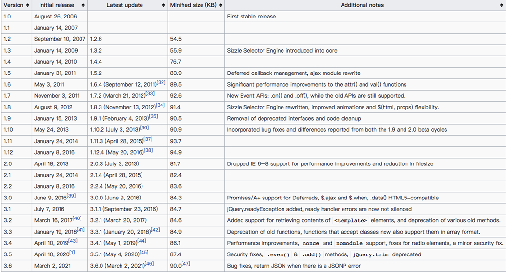

# 第一章、jQuery.js

## 一、认识jquery

> jQuery 读音为：/ˈdʒeɪkwɪəri/ （ 简称：jQ），jQuery是一个快速、小型且功能丰富的 JavaScript 库，它使HTML文档遍历和操作、事件处理、动画和 Ajax 之类的事情变得更加简单。当时jQuery库不但简化了代码，而且提供出色的跨浏览器支持，其极大的提高了 Web 开发人员的工作效率。

- 使HTML文档遍历、操作、事件处理、动画和 Ajax 之类的事情变得更加简单。
- 具有易于使用的 API，可在多种浏览器中使用。
- 对 ie 有这一定的兼容性
- **主要功能：该库包含了：DOM操作、选择器、事件处理、动画和 Ajax 等核心功能。**

## 二、库(library)和框架(framework)的概念

> 随着JavaScript的普及，以及越来越多人使用JavaScript来构建网站和应用程序,社区中很多的人觉得原生js代码有非常多是逻辑复用的。

- 所以有人就开始对于js相同的逻辑的代码封装到一个JavaScript文件中，这个时候就出现了前端的`库(library-后端也有依赖的说法)`和`框架(frameWork)的概念`

### 1、库(library)

- JavaScript库是一个<u>预先编写好并实现了一些特定功能的**代码片段的集合**。</u>
- 一个库中会包含许多的函数、变量等，可根据需求引入到项目中使用。
- 一些常见的库有jQuery、Day.js、Lodash和React等

### 2、框架（framework）

- JavaScript框架是一个**完整的工具集**，可帮助塑造和组织您的网站或应用程序。
- 提供一个结构来构建整个应用程序，开发人员可以在结构的规则内更安全、更高效地工作。
- 一些更常见的框架有：Bootstrap、Angular、Vue、Next.js等。

### 3、插件

> 给某个依赖扩展，或者应用、框架扩展新的功能

## 三、jQuery优点与缺点

### 1. jQuery的优点

1. 易于学习：相对于其它的前端框架，**jQuery 更易于学习**，<u>它支持 JavaScript 的编码风格。</u>
2. 少写多做（Write less, do more）
   - jQuery提供了丰富的功能(DOM操作、过滤器、事件、动画、Ajax等)。
   - 可以编写更少可读的代码来提高开发人员的工作效率。

3. 优秀的 API 文档：jQuery 提供了优秀的在线 API 文档。
4. 跨浏览器支持：提供出色的跨浏览器支持 (IE9+)，无需编写额外代码。

### 2. jQuery的缺点

1. **jQuery代码库一直在增长（自 jQuery 1.5 起非压缩版超过 200KB）**，压缩版3.6.0 -88kb应该
2. 不支持组件化开发
3. jQuery 更适合DOM操作，当涉及到开发复杂的项目时，jQuery能力有限。

# 第二章、jQuery起源和历史

> 早在2005年8月22日 `John Resig` 首次提出支持CSS选择器的JavaScript库，其语法比现有库（例如：`Behaviour` ）更简洁。

- 在2006年之前，John Resig（一名从事自己项目的Web开发人员）对编写跨浏览器的JavaScript感到非常繁琐。

  > 2006年1月16日，John Resig在BarCamp的演讲中介绍了他的新库( jQuery )。
  >
  > 最后，我宣布了今晚发布的第二个新版本:jQuery: New Wave Javascript。简而言之，
  > 这段代码彻底改变了Javascript与HTML交互的方式——它确实是一组令人惊叹的代码，
  > 我已经投入了大量的时间和精力来实现它。我现在正在为网站编写文档，应该会在接下来的几天内准备好。

  

- 之后John Resig又花了 8 个月的时间完善jQuery库，直到2006-8-26才发布了 1.0 版本。
  原本打算使用 JSelect（JavaScript Selectors）命名该库，但域名都已被占用。

### jQuery的历史版本

### 为什么学习jQuery

1. jQuery是一个非常受欢迎的JavaScript库，被全球约 7000 万个网站使用。它优秀的设计和架构思想非常值得我们去学习。
2. jQuery 的座右铭是“Write less , do more”，它易于学习， **非常适合JavaScript 开发人员学习的第一个库。**
3. 前端JavaScript库非常多，学习jQuery有利于我们学习和理解其它的JavaScript库（例如：Day.js、Lodash.js等）
4. 许多大型科技公司，虽然他们现在不会直接使用jQuery来做项目，但在项目中仍然会借鉴很多jQuery设计思想。
   因此，了解 jQuery 依然是一个好主意。

# 第三章、jQuery的安装和使用

## 一、元素导航

### 1. closest()

1. 从当前 `span` 元素开始
2. 沿 DOM 树向上遍历，并返回匹配所传递的表达式的**第一个出现的 ”单一“ **祖先(ul 元素)

~~~html
<body class="ancestors">body (曾曾祖先节点)
	
div (曾祖先节点)
		<ul>ul (第二祖先 - 第二祖先节点) 
			<ul>ul (第一祖先 - 第一祖先节点)
				<li>li (直接父节点)
					span
				</li>
			</ul>
		</ul>   
	

</body>
    

~~~

### 2. parents()

返回 `` 的所有 ”祖先“ 元素

- 这个是从 `span` 的父元素开始

~~~js
$(document).ready(function(){
	$("span").parents().css({"({"color":"red","border":"2px solid red"});
});
~~~

### 3. parent()

> `parents()` 获取指定的所有父级元素, `parent()` 获取指定的

### 4. [siblings()](https://www.jquery123.com/siblings/) 

获取当前元素的所有兄弟节点 - 其他元素导航方法查看  `jQuery中文文档：遍历》树遍历`

### 5. children()

> 获取所有子节点，也支持参数

~~~js
 activeTreeview.children(":first")
~~~

### 6. next() nextAll() nextUntil() 

### 7. prev() prevAll() nextUntil()

### 安装

1. 方式一：在页面中，直接通过CDN的方式引入。``
2. 方式二：下载jQuery的源文件，并在页面中手动引入。
   - 官网下载：https://jquery.com/download/
   - CDN连接地址下载： https://releases.jquery.com/jquery/
   - GitHub仓库中下载：https://github.com/jquery/jquery
3. 方式三：使用npm包管理工具安装到项目中

#### CDN

> CDN称之为内容分发网络（Content Delivery Network或Content Distribution Network，缩写：CDN）

特点：

- CDN它是一组分布在不同地理位置的服务器相互连接形成的网络系统。
- 通过这个网络系统，将Web内容存放在距离用户最近的服务器。
- 可以更快、更可靠地将Web内容(文件、图片、音乐、视频等)发送给用户。
- CDN不但可以提高资源的访问速度，还可以分担源站的压力。

简单理解：

1. CDN会将资源缓存到遍布全球的网站，用户请求获取资源时；
2. 可就近获取CDN上缓存的资源，提高资源访问速度，同时分担源站压力

结论：

- CDN本质上是一个分布式缓存系统，每个服务节点上都缓存了源站的一部分数据，也就是用户最近经常访问的数据

> CDN是一种加速数据库访问的分发策略。其中存储的静态资源完美契合了对象存储的应用场景，所以CDN底层数据多采用对象存储服务器来存储。**CDN的典型应用案例是网页的动静态资源分离以及、图片视频的加速加载。**

- 就是作为前台资源缓存的一种分布式缓存的做法

#### 常用的CDN服务

1. 自己购买的CDN服务：需要购买开通CDN服务（会分配一个域名）。

   > 目前阿里、腾讯、亚马逊、Google等都可以购买CDN服务。 

   

2. 开源的CDN服务

   > 国际上使用比较多的是unpkg、JSDelivr、cdnjs、BootCDN等。

## 二、jquery的使用

### 1. DOMContentLoaded 事件

#### 方式一 ready事件

~~~js
  $(document).ready(function() {
    //dom tree 构建完成之后调用
  })

  $().ready(function() {
    //dom tree 构建完成之后调用
  })
~~~

#### 方式二：常用

~~~js
 $(function() {
  })
~~~

### 2. load事件

~~~js
  //推荐写法 3.0之后的 .load(handle) 方法已经被弃用了
  $(window).on("load", function() {
    console.log("first")
  })
~~~

### 3. noConflict 让出控制权

> 解决对于其他库的对于 $ 和 jQuery 的冲突

~~~js

  //使用let 就会不会有这个问题，因为let 是放在声明式的环境(script)记录里，jquery的$ 是放在window 全局对象的里面
  //只让出$变量的控制权
  $.noConflict()
  //完全让出控制权 $ 和 jQuery
  $.noConflict(true)
  console.log($)
  console.log(jQuery)

~~~

#### 恢复控制全的方法

~~~js
jQuery.noConflict();

(function($) { 
  $(function() {
    // 使用 $ 作为 jQuery 别名的代码
  });
})(jQuery);

... // 其他用 $ 作为别名的库的代码
~~~

#### 或者赋给一个新的命名空间

~~~js
var dom = {};
dom.query = jQuery.noConflict(true);
~~~

### 4. jQuery 函数

> jQuery是一个工厂函数( 别名$ )，调用该函数，**会根据传入参数类型来返回匹配到元素的集合**，**一般把该集合称为jQuery对象**。

#### 4.1、jQuery对象

> jQuery对象是一个包含所匹配到元素的集合，该集合是类数组(array-like)对象。

- jQuery对象是通过调用jQuery函数来创建的。
- jQuery对象中会包含N（>=0）个匹配到的元素。
- jQuery 对象原型中包含了很多已封装好的方法。例如：DOM操作、事件处理、动画等方法。

#### 4.2、jQuery对象 与 DOM Element的区别

- 获取的方式不同
  - DOM Element 是通过原生方式获取，例如：document.querySelector()
  - jQuery对象是通过调用jQuery函数获取，例如：jQuery(' ')
- jQuery对象是一个类数组对象，该对象中会包含所选中的DOM Element的集合。
- **jQuery对象的原型上扩展非常多实用的方法**，DOM Element 则是W3C规范中定义的属性和方法。

#### 4.3、jQuery对象 与 DOM Element的转换

- jQuery对象转成DOM Element
  - .get(index)： 获取 jQuery 对象中某个索引中的 DOM 元素。index一个从零开始的整数，指示要检索的元素的索引。
  - .get() : 没有参数，**将返回jQuery对象中所有DOM元素的数组。**
  - jqueryObject[index] 也能获取
  
  
  
- DOM Element转成jQuery对象
  - 调用jQuery函数或者$函数
  
  

#### 4.4、 jquery的参数

1. 如果传入**假值**：返回一个**空的集合**。
1. 当传入字符串是**选择器**的时候，<u>会返回一个jquery包含改元素的类对象</u>
2. 当传入的是**标签字符串**的时候,  <u>会创建jquery包含创建元素的对象的类数组</u>
3. 当传入的是一个**html元素对象**的时候，<u>会返回包含新创建元素的集合</u>，也就是**被转换jQuery对象**
4. 当传入的是一个函数的时候，会当作DOMContentLoaded 事件的回调函数

## 三、jQuery的选择器(Selectors)

> jQuery函数支持大部分的CSS选择器，语法：jQuery（'字符串格式的选择器'）

### 1、基本选择器

> 注意：不支持状态伪类

1. 通配选择器

2. 基本选择器 id., class选择器

3. 属性选择器[name], [name = "zhangsan"], [name ^= "zhangsan"]

4. 后代选择器 > 和 空格

5. 兄弟选择器 ~  + 

6. 交集和群组选择器

7. 伪类选择器，nth-child, nth-of-type, not()
   - 但是不支持状态伪类选择器，hover, active, visited, focus,
   - 内容伪类 :empty, :has
   - 可见伪类:visible, hidden
   
   

### 2、jQuery 扩展选择器

~~~js
$("li:first")    //第一个li
$("li:last")     //最后一个li
$("li:not(#runoob)") //挑选除 id="runoob" 以外的所有li
$("li:even")     //挑选下标为偶数的li
$("li:odd")      //挑选下标为奇数的li
$("li:eq(4)")    //下标等于 4 的li(第五个 li 元素)
$("li:gt(2)")    //下标大于 2 的li
$("li:lt(2)")    //下标小于 2 的li
$(":header")     //选择所有的标题元素
$(":animated")   //选择当前正在执行动画的所有元素
$("div:contains('Runob')")    // 包含 Runob文本的div元素
~~~

### 3、选择器工具类

#### 3.1、find

#### 3.2、is

实例方法，判断当前  `Jquery` 元素是否匹配传入的参数(选择器)

返回值：boolean

参数：string 

~~~js

$("ul").click(function(event) {
  var $target = $(event.target);
  if ( $target.is("li") ) {
    $target.css("background-color", "red");
  }
});

//或者

const checked = $(this).is(":checked");
~~~

## 四 VSCode生成代码片段

1. 在线生成代码片段地址：https://snippet-generator.app/

2. 添加表述和关键字

3. 将代码复制到 html.json 内

   > file> preferences(首选项)> configure user snippets> html

4. `$1` 光标默认所在位置

## 五、jQuery过滤器(Filtering) API

> jquery, 原型上面的方法，实例方法

1. `eq(index)`:  从匹配元素的集合中，取索引处的元素， eq全称(equal 等于)，返回jQuery对象。

   > `eq` 和 `get` 的区别就是get获取的是w3c标准的html，eq是过滤器获取之后还是 `jquery` 对象

2. `first()` : 从匹配元素的集合中，取第一个元素，返回jQuery对象。

3. `last()`: 从匹配元素的集合中，取最后一个元素，返回jQuery对象。

4. `not(selector)`:  从匹配元素的集合中，**排除掉匹配的元素**，返回jQuery对象。

5. `filter(selector)`: 从匹配元素的集合中，**找到和该选择器匹配的元素**，返回jQuery对象。

6. `find(selector)`: 从匹配元素集合中，**找到匹配的后代元素**，返回jQuery对象。

   > 想当于 `document.querySelector("body").querySelector(".box")`  在body 里在通过选择器获取

7. `is(selector|element| . )`: 根据选择器、元素等检查当前匹配到元素的集合。集**合中至少有一个与给定参数匹配则返回true。**

   > 判断jquery集合中**是否存在**传入的**元素或者选择器匹配的元素**

8. `odd()` :将匹配到元素的集合减少为集合中的奇数，从零开始编号，返回jQuery对象。

9. `even()`：将匹配到元素的集合减少到集合中的偶数，从零开始编号，返回jQuery对象。

   1. <u>支持链式调用</u>

## 六、jQuery对元素的操作

### 6.1、文本操作（3）

- `text()`
  - **无参**：获取匹配到**元素集合中每个元素组合的文本内容**，
  - **有参**：的话会修改**元素集合中每个元素组合的文本内容**

- `.html()`

  - **无参**：获取匹配到元素集合中**第一个元素的HTML内容**，

  - **有参**：设置**每个匹配元素**的 HTML 内容。

  - **相当与原生元素的innerHTML属性。**

- `.val()`
  - **无参**：获取匹配到元素集合中第一个元素的当前值 
  - **有参**：设置每个匹配到元素的value属性。
  - 一般用于表单

### 6.2、jQuery对style属性的操作

实例方法

1. .width()、.width(value)
   无参：获取匹配到元素集合中**第一个元素的宽度**

   有参：设置**每个匹配到元素的宽度。**

   

2. .height()、height(value)
   无参：获取匹配到元素集合中**第一个元素的高度**

   有参：设置每**个匹配到元素的高度。**

   

2. poistion(), 获取当前定位元素的位置信息
   
   ~~~js
   //例：返回的是对象
   {top: 0, left: 84px}
   ~~~

   
   
3. .css(propertyName)

   > <u>获取匹配到元素集中第一个元素样式属性的值</u>，底层是调用 `getComputedStyle` 函数获取。

   - .css( "width" )和.width()之间的区别:
     - `width()`返回一个**无单位的像素值**（例如，400），而`css()`返回一个具有**完整单位的值**（例如，400px）

   

4. .css(propertyName, value)
   为每个匹配到元素设置一个 或 多个 CSS 属性。
   **调用css方法添加样式会直接把样式添加到元素的style属性上。**

   ~~~js
   $(".box").css({
     width: 300,
     height: 300,
     border: "solid 3px red"
   })
   
   $(".box").css("border", "solid 1px red").css("width", "300px").css("height", "300px")
   ~~~

   

### 6.3、Class属性的操作

- **简单记：就是element 中 classList 属性对应的方法，只不过添加了批量处理和函数**

1. .addClass(className)、.addClass(classNames)、.addClass(funcntion) **批量**

   > 将指定的类添加到**匹配元素集合中的每个元素**，每次都是追加class。

   - 底层调用的是setAttribute( "class", finalValue )方法添加class。

   - <u>`classList`属性中的 `add()`</u>

   

2. .hasClass(className)

   > **查看jquery对象集合中是否存在该class样式**，是否给任意匹配到的元素分配了该类

   - 底层是通过getAttribute( "class" ).indexOf()来判断是否存在。

   - <u>`classList`属性中的 `contains()`</u>

   

3. .removeClass()、.removeClass(className)、.removeClass(classNames)、.removeClass(function) **批量**

   > 给匹配元素集中的每个元素**删除单个类**、**多个类**或**所有类**。

   - 底层调用的是`setAttribute( "class", finalValue )`方法。

   - <u>`classList`属性中的 remove()</u>

   

4. .toggleClass()、.toggleClass(className[,state])、.toggleClass(classNames[,state])
   根据类的存在或状态参数的值，在匹配到元素的集合中，给每个元素添加或删除一个或多个类。

   <u>`classList`属性中的 `toggle()`</u>

### 6.4、attributes和property属性的操作

#### attributes修改w3c标准属性

> 底层就是 setAttribute ，用来操作 W3C 的 html 标准元素标签属性。

- 同js的 attributes 一样**会将自定义属性添加到html标签元素的上面**

1. .attr(attributeName)
   获取匹配元素集和中第一个元素的属性值，**底层调用了原生的 getAttribute() API**

   

2. .attr(attributeName, value)
   为每个匹配元素设置一个或多个属性，**底层调用了原生的 setAttribute() API**

   

3. .removeAttr(attributeName)
   在匹配到元素的集中，给每个元素删除一个属性。
   底层调用了原生的 **removeAttribute() API**

~~~js
  $(".btn").click(function() {
    //添加属性
    $(".box").attr("style", "color: red")
    //添加多个属性
    $(".box").attr({
      "id": "btn",
      "name": "zhangsan",
      title: "box"
    })
  })
  //移除该属性
  $(".clean").click(function() {
    console.log("first")
    $(".box").removeAttr("title")
  })
~~~

#### property 属性

> property 是创建dom的时候附加的一些内置属性，顺便将标准属性也添加了进来，所以会和 attriabute 相互影响 例如：style，className，nodeType，data，nodeName。

- 同js的 property一样**会将自定义属性添加到dom元素的上面**

1. .prop(propertyName)
   获取匹配到元素集合中**第一个元素的属性值**

   

2. .prop(propertyName，value)
   为每个匹配元素**设置一个或多个属性。**

   

3. removeProp(propertyName)
   删除匹配元素集的属性,( **只能删除用户自定义添加的prop，不能删除标准属性** )。

~~~js
$(".btn").click(function() {
  console.log(this)
  //  添加一个标准属性
  // $(this).prop("title", "zhangsan")
  //添加一个自定义属性
  // this.zhangsan = "zhangsan"
  //定义多个属性，自定义和标准
  $(this).prop({
    title: "zhangsan",
    firend: "lisi"
  })
})

$(".del").click(function() {
    //删除自定义属性
  $(".btn").removeProp("firend")
})
~~~

### 6.5、自定义data-xx属性的操作

> 底层用的是event.target.dataset.xxxx

- 特点：`jQuery` 的 `data()` 方法会有缓存机制	
  - 第一次会添加缓存之后的修改都是修改缓存里的内容
  - 缓存会被放到原生的 `dom` 对象里，打印出来就可以看见
  - 使用 `jquery` 的 `clone`，也会克隆缓存的数据

1.  .data(key)
   获取匹配元素集中第一个元素的自定义属性的值

   
   
2.  .data(key, value) 
   为每个匹配元素设置一个或多个自定义属性

   
   
3. .removeData([name])
   
   > data函数添加的自定义属性会被移除，但是如果属性同时在签上定义了就不会被移除。

~~~js
  $(".add").click(function() {
    //添加一个dataset
    $(".box").data("firend", "zhangsan")
  })

  $(".obtain").click(function() {
    console.log($(".box").data())
  })

  $(".del").click(function() {
    //指定删除jquery 定义的dataset， 标签上的不能删除
    $(".box").removeData("firend")
  })

  $(".addList").click(function() {
    //批量添加dataset
    $(".box").data({
      addr: "天津市",
      orgin: "内蒙古",
      age: 46
    })
  })
~~~

### 6.6、jQuery的DOM操作

> content 内容如果是  **标签字符串**  的话 会解析成  **元素渲染到页面上**   , 参数如果是  **页面现有的html元素**  的话会进行  **剪切**

举例：这里使用append举例

~~~js
$(".btn").click(function() {
  //添加字符串
  // $(".box").append("zhangsan")
  //添加标签元素会 解析成html元素
  // $(".box").append(`
lisi
`)
  //添加的如果是 原生dom元素或者 jquery元素的话，都进行剪切移动到指定的位置
 // 
~~~

#### 第一类  插入内容

> 该类方法，都是 **对目标元素 ** <u>进行添加</u>

- content  内容可以是 : `DOM element`,  `text node`,  `array of elements and text nodes`,  `HTML string`, or `jQuery object`

1. target.append(content  )
   - 将  **参数**  的内容插入 到匹配  **目标元素/集**  每个元素**内**的末尾  。

2. target.prepend(content) 
   - 将  **参数**  的内容插入  到匹配  **目标元素/集**  每个元素**内**的开头  。

3. target.after(content) 
   - 在  **元素/集**  中的  **后面**，插入由参数指定的内容。

4. target.before(content)
   - 在  **元素/集**  中的  **前面**，插入由参数指定的内容。

#### 第二类 插入内容

> 该类方法，都是**对参数匹配的元素**<u>进行添加</u>

- target 类型可以是  `selector`, `element`, `HTML string`,   `array of elements`,   `jQuery object`。

1. target.appendTo(content )

   - 将**目标元素集**中的每个元素**插入到参数元素**的末尾。

   

2. target.prependTo(content )

   - 将**目标元素集**中的每个元素**插入到参数元素**的开头。

   

3. target.insertAfter(content )

   - 在**参数元素**之后，**插入目标元素集**中的每个元素。

   

4. target.insertBefore(content )

   - 在**参数元素**之前，**插入目标元素集**中的每个元素。

#### 第三类 移除替换克隆

1. .empty():  

   - 删除匹配元素集的所有子节点，自身不会删除。

     

2. .remove( ) 、.remove( [selector] )

   - 删除匹配的元素集，自身也会删除。
   - **selector参数**：使用选择器选中jquery 集合中的一个元素删除

   

3. .replaceAll(content):  将目标元素替换掉参数元素

   - **同第二类方法**

     

4. .replaceWidth(newContent) ：当前元素节点替换为 新的内容

   - **同第一类方法**

5. .clone()、.clone( withDataAndEvents )

   - 无参对匹配的元素集执行**深度复制**，底层是调用了elem.cloneNode( true )来复制元素。
   - withDataAndEvents参数 : 布尔值，是否复制该元素的**事件处理程序**和**数据**，默认值为false。

#### 四、清空元素内容

内容清空：`$("#charCity").empty()`;

## 七、jQuery事件

- **重点：**事件中的**this 指向的是 javaScript 的DOM 对象**，需要jquery对象的方法可以使用 工厂函数进行转化

- **注意**：默认事件流的方式是冒泡，需要使用捕获的话，只能使用原生的事件监听

### 7.1、设置监听事件的两种方式

> 两种方式都支持事件委托，底层使用的是 `addEventListener` 默认冒泡

- `on` 可以监听动态渲染的事件，但是 `.click` 不行

1. `jQuery`对象中的事件处理函数

   > 支持定义多个相同事件，都会执行

   ~~~js
   $(".btn").click(function() {
     console.log("事件处理函数的方法")
   })
   ~~~

   

2. `jQuery`对象中的`on`函数来监听

   ~~~js
   $(".btn").on("click", function() {
     console.log("on 函数的方法")
   })
   ~~~

3. `on` 函数可以给<u>**指定后代元素**添加该事件</u>， 

   ~~~js
   //给.box 元素下的所有li 添加点击事件
   $(".box").on("click.custom", "li", function() {
     this.style.color = "red";
   })
   ~~~

4. 给事件传参

   ~~~js
   //第三个参数传入的参数 会添加到jquery 事件对象的data属性当中
   $(".box").on("click.custom", "li", "zhangsan", function(event) {
     console.log(event.data)
   })  
   ~~~

   

### 7.2、on/off 添加事件、取消事件

> on 函数可以使用 <u>off 函数可以移除</u>  **添加命名空间**  的监听事件

~~~js
  //给该事件添加命名空间
  $(".btn").on("click.zhangsan", function() {
    console.log("on 函数")
  })

  $(".btn").click(function() {
    console.log("简化的事件函数")
  })

  $(".clean").click(function() {
    //取消指定的名字的事件
  	$(".btn").off("click.zhangsan")
  })

//移除所有事件后添加
  $(".clean").off("click").on("click", function() {})
~~~

### 7.3、事件对象

> jQuery事件系统的规范是根据W3C的标准来制定jQuery事件对象。

- **原始事件对象**的<u>大多数属性</u>都被**复制到新的jQuery事件对象上**

  

- jQuery事件对象通用的属性（<u>以下属性已实现跨浏览器的兼容</u>）：

  - `target、relatedTarget、pageX、pageY、which、metaKey`

  

- jQuery事件对象常用的方法：

  - `preventDefault()` :  取消事件的默认行为（例如，a标签、表单事件等）。
  - `stopPropagation()` :  阻止事件的进一步传递（例如，事件冒泡）

  

- 访问其它事件的属性，可以使用 `event.originalEvent` **获取原生对象。**

### 7.4、其他事件监听

#### 1. hover 事件

> 底层使用了 mouseenter、mouseleave ，不支持冒泡

- <u>只能使用简化写法</u>

~~~js
 $(".container").hover(function() {
    console.log("这里是鼠标移入", "mouseEnter")
  }, function() {
    console.log("这里是鼠标移出", "mouseLeave")
  })
~~~

#### 2、自定义事件 trigger 事件触发-事件总线

> 类似于 js 中dispatch，事件总线的实现

~~~js
 //自定义事件
 $(".btn").on("coustom", function() {
    console.log("coustom")
  })

  $(".btn").click(function() {
      //触发自定义的事件
    $(".btn").trigger("coustom")
  })
~~~

#### 3. 其他事件

- 鼠标事件（Mouse Events）
  .click() 、.dblclick()、.hover()、.mousedown() 、.mouseup()
  .mouseenter()、.mouseleave()、.mousemove()
  .mouseover()、.mouseout() 、.contextmenu()、

- 键盘事件（Keyboard Events）
  .keydown() 、.keypress()、.keyup()

- 文档事件（Document Loading Events）
  load、ready()、.unload

- 表单事件（Form Events）
  .blur() 、.focus()、.change()、.submit()、.select()

- 浏览器事件（Browser Events）
  .resize()、.scroll()

## 八、jQuery 动画操作-animate

- .animate()： 执行一组 CSS属性的自定义动画，**仅允许数字的CSS属性上创建动画。**

### animate参数：4个

1. properties：css属性对象

2. (可选)duration：持续时间，单位毫秒 可以使用关键字，<u>支持数值类型的字符串</u> **百分比、 em 、相对值：+= 、 -=  **

   - slow：600
   - fast：400开始 200结束

3. (可选)ease：缓冲效果，只支持两种

   - linear 匀速
   - swing

4. (可选) 动画监听

   > 动画结束的时候会触发该 回调

### jQuery元素中的动画队列

> jQuery匹配元素中的animate 函数会放在对列中进行维护

- .queue()：查看当前选中元素中的动画队列。

- .stop( [clearQueue ] [, jumpToEnd ] )：默认都是 false

  - clearQueue 布尔类型

  - 无参的效果和  clearQueue 为 true 的时候相同

    > **清除序列中的所有动画**

  - jumpToEnd ：跳过当店

    > **立即执行完当前动画，清空序列中的所有动画**

### jQuery常见动画函数

#### 显示隐藏(3个)

1. .hide() 、.hide( [duration ] [, complete ] )、.hide( options )  -  隐藏元素
2. .show() 、.show( [duration ] [, complete ] )、.show( options ) - 显示元素
3. .toggle() 、.toggle( [duration ] [, complete ] )、.toggle( options ) -显示或者隐藏元素

#### 淡入淡出(4个) 多了个透明度渐变

> 延时时间默认400

1. .fadeIn()、.fadeIn( [duration ] [, callback] )、  - 淡入动画

2. .fadeOut()、.fadeOut( [duration ] [, callback] )、  -淡出动画

3. .fadeToggle()、.fadeToggle( [duration ] [, callback] ) -  淡入淡出的切换

4. .fadeTo( duration, opacity [, callback] )   -  **透明度渐变**

   > 只是透明度的渐变，**元素还是在当前位置**，<u>还是可以被点击的</u>

### jQuery中的遍历

> jQuery对象是可迭代对象，也可以使用for...of

- 注意：这里  `for...of`  和 `each` 函数遍历的都是**原生的 `dom` 元素**

  

1. `.each()`： 遍历一个 jQuery 对象，为每个匹配的元素执行一个回调函数。

   > 这里的 `each(index, el)` 和 <u>`forEach(el, index, array,  thisArgs)` 参数顺序有区别</u>, **each的第一个参数是 index**

   

2. jQuery.each( array | object , callback ) : 一个通用的迭代器函数，**可以用来无缝地迭代对象和数组。**
   
   ~~~js
   $(".productPriceList").each((idx, val) => {
               console.log(val.textContent);
           })
   ~~~
   
   
   
3. .each() 和 jQuery.each(）函数的区别：

   - 区别第一个参数是索引，第二个是值
   - .each()是jQuery对象上的方法，用于遍历 jQuery对象。
   - 可以遍历对象、数组、类数组等，它是**一个通用的工具函数**。

## 九、Ajax

> 说明: 执行一个异步的HTTP（Ajax）的请求。

### 常见的config信息 11个

> Ajax的参数一，就是一个配置对象， 参数二、默认异步 true

- `processData`:  `data` 当传入的数据**不需要转换为** `queryString` 的话修改为flase。<u>例：文件传输，树结构</u>
- **参数为`formData`类型的时候，必须要使用`processData: false`,否则会语法错误**

~~~js
{
    
    url //指定发送请求的 URL。
    method // type - 用于指定请求的类型 (e.g. "POST", "GET", "PUT")，默认为GET
    data // 指定要发送到服务器的数据（PlainObject or String or Array）
    
    processData (默认: true)
    /*
    类型: Boolean
    默认情况下，通过data选项传递进来的数据，如果是一个对象(技术上讲只要不是字符串)，都会处理转化成一个查询字符串，以配合默认内容	 类型 "application/x-www-form-urlencoded"。如果要发送 DOM 树信息或其它不希望转换的信息，请设置为 false。
    */
    
    header // 请求头的内容（PlainObject）
    contentType 
    /*
    向服务器发送数据时指定内容类型。
    默认值：application/x-www-form-urlencoded; charset=UTF-8，
    application/json; charset=UTF-8
    当contentType：false时contentType是 multipart/form-data 表单类型一般用来上传文件
    */
    timeout // 请求的本地超时时间。它以毫秒为单位。
    beforeSend // 这是一个在发送请求之前运行的函数，返回false会取消网路请求。
    success // 请求成功回调的函数
    error // 请求失败回调的函数
    dataType //返回值的类型默认String，但是会自动的识别返回值类型进行转换
    //返回值的类型默认String，但是会自动的识别返回值类型进行转换
    
    //(重点)默认值是为true，但是设置为true的时候，jquery 会将数据序列化，
    //所以使用ajax上传文件时或者(参数为formData类型的时候)，必须要使用processData: false,否则会语法错误
    processData : false,

}
~~~

### 取消事件请求

> 事件取消的话会触发，`error`、`catch`方法 

~~~js
  const delayUrl = "http://httpbin.org/delay/7"

  const promise = $.ajax({
    url: delayUrl,
    method: "post",
    timeout: 4000
  })
  
  promise.then(data => {console.log(data)}).catch(err => console.log("err", err))

  //取消事件 会触发catch 或者 error回调函数
  $(".cancel").click(function() {
    promise.abort()
  })
~~~

