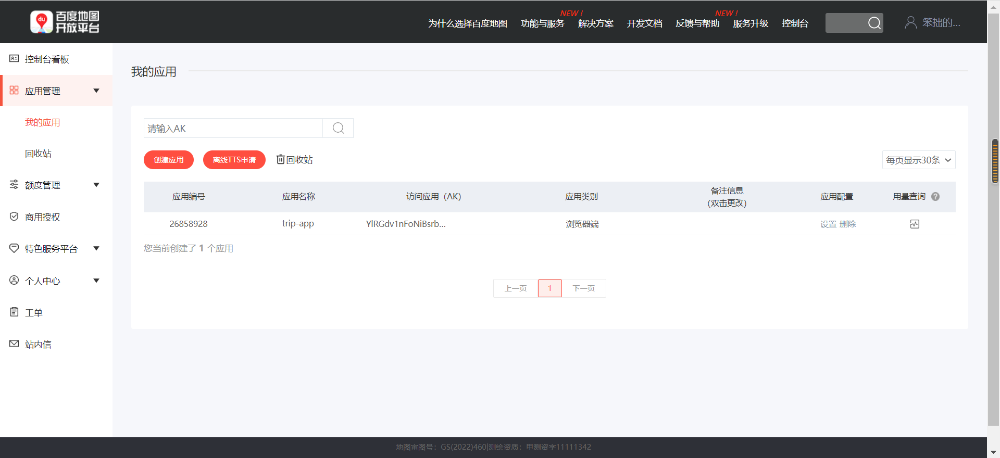
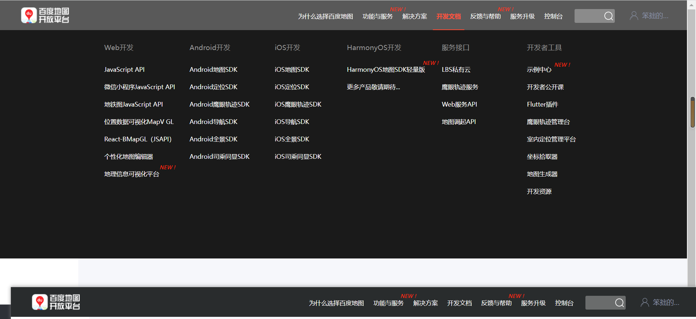

## 1、放大镜和滚动条公式(重点)

> **放大镜移动的公式： 小图片移动的距离/小图片最大移动距离  =  大图片移动的距离/ 大图片最大移动距离**

- 大图片减去窗口的距离，就是大图片的最大移动距离


1. `console.log` 以对象的方式打印函数  

   ~~~js
   console.log(%O", foo) //这里的O要大写
   ~~~


## 2、 void 0

> void其实是javascript中的一个函数，接受一个参数，返回值永远是undefined。可以说，使用void目的就是为了得到javascript中的undefined
>
> - （个人理解）就是为了避免当前代码，在当时的结构环境内 undefined 会产生副作用 就使用  void 0 来


## 3、 筛选查询到的数据


#### 3.1、多选筛选

> 将选中元素的后台数据字段，放到一个数组里面，之后for遍历元素是否是是该类型的


#### 3.2、单选排序

> 获取到要比较的字段 `key`，根据索引顺序排列最好有一致性生成一个数组，之后获取点击元素对应的索引就好了


## 4、同样的排他思想(重点)

~~~js
    <li :class="{active: currentIndex === index}" @click="btn(index)" v-for="(item,index) of movies">{{item}}</li>
~~~


5、根据代码执行时机来判断变量(重点)

```html
<script>

  let flag = null;
  let flagStr = "none";
  const arr = [
    {
      big: "../image/banner0.png",
      samll: "../image/banner0_sm.png"
    },
    {
      big: "../image/banner1.png",
      samll: "../image/banner1_sm.png"
    },
    {
      big: "../image/banner2.png",
      samll: "../image/banner2_sm.png"
    }
  ]
 
  //触发boxEl的点击事件，其他事件查看 MDN 文档

  window.addEventListener("resize", function() {
    $('.carousel').carousel('dispose')
      let slideStr = ``
      flag = document.documentElement.clientWidth < 768 
      if(flag && flagStr === "big" || !flag && flagStr === "small" || flagStr === "none") {

            arr.forEach((el, index) => {
                      const imgUrl = flag ? el.samll : el.big
                      const active = index===0 ? "active" : "";
                      slideStr += `<div class="carousel-item ${active}">
                                  
                                  </div>`
                  })
              $(".carousel-inner").empty().append(slideStr)
            flagStr = document.documentElement.clientWidth < 768 ? "small" : "big";

      }
      $(".carousel").carousel('cycle')
  })

  //这里要写在声明事件的后面
  var event = new Event('resize')
  window.dispatchEvent(event)
    

</script>
```

## 6、获取当前地区

> coords.GeolocationCoordinates.latitude: 23.129: 纬度
> coords.GeolocationCoordinates.longitude: 113.2643：经度

- 之后通过 纬度和经度 从阿里或者百度高德来获取位置信息

~~~js
  //获取位置信息
  function getPositon() {
    // console.log("zhangsan");
      navigator.geolocation.getCurrentPosition((res) => {
        console.log("请求成功", res);
      }, (err) => {
        console.log("请求失败", err);
      },{
            enableHighAccuracy: true,
            timeout: 5000,
            maximumAge: 0
          })

  }
~~~

### 6.1、使用百度地图

1. 注册申请开发者

2. 创建自己的应用，获取AK[就是密码后面会用]

   

3. 查看开发文档

   

4. 根据文档展示地图，**在主页index.html引入 官方js**

   ~~~js
   <!--将api修改为 getscript 消除警告-->
   <script type="text/javascript" src="https://api.map.baidu.com/api?v=3.0&type=webgl&ak=v2YcidGrBd9UTuowYgQQMFNP6GG3Lc7o"></script>
       <script type="text/javascript" src="https://api.map.baidu.com/getscript?v=3.0&type=webgl&ak=v2YcidGrBd9UTuowYgQQMFNP6GG3Lc7o"></script>
    
   ~~~

   

5. 注意：Compostion Api 要将代码 写在  onMounted 里面，因为created 阶段获取不到元素节点

   ~~~js
    const mapRef = ref()
     onMounted(() => {
        //这里传的是元素
        const map = new BMapGL.Map(mapRef.value); // 创建地图实例
        const point = new BMapGL.Point(Props.data.longitude, Props.data.latitude);  // 创建点坐标
        map.centerAndZoom(point, 15); // 初始化地图，设置中心点坐标和地图级别
        const marker = new BMapGL.Marker(point);
        map.addOverlay(marker)
        var zoomCtrl = new BMapGL.ZoomControl();  // 添加缩放控件
        map.addControl(zoomCtrl);
      })
   ~~~

   

## 7、滚动索引回显算法

> 需求的关键就是，整理每一个需**要做标记元素的 `offsetTop` ，整合为数组**，和与之关联的元素集一一对应例：导航栏，

1. 整理 `offsetTop` 数组

2. for 循环进行判断，由于是滚动，只能用大于做判断。

   - **获取到**对应的**`index`**行后续回显的操作，根据需判断需求所需要的索引

     - **index正确关键**在于起始的 offsetTop **有没有对应的 tab 需要显示。** 

       > 有错位的话，正确显示的索引应是**当前 `offsetTop` 当前索引 - 1**

     - **有**的**对应要显示起始 tab** 的话则**不需要错位**

   - 如果进行错位了，没有办法获取到最后一个 index，解决：可以**将最后一个索引设置为默认值**，没有的话就显示最后一个

3. 最后将索引传入到 导航栏，根据索引显示对应的导航栏

- `clickBar` 和 `distanceCurrent` 解决了滚动和点击时tab 高亮时的冲突

~~~js
  //记录是点击了还是滚动
  let clickBar = false
  //记录滚动的位置
  let distanceCurrent = -1 

 watch(scrollTop, (val) => {
    //判断显示隐藏 offsetTopList 就是 [100, 200, 300, 400], 参与滚动的 offsetTop
    if (val > offsetTopList.value[0] - 44)  barFlag.value = true
    else barFlag.value = false
    //页面滚动触发指定的tag
     //点击之后滚动的位置和 scrollTop 相等的话要修改clickBar
    if (distanceCurrent === Math.floor(scrollTop.value)) clickBar = false
    if (clickBar) return
    let index = offsetTopList.value.length - 1
    for (let i = 0; i < offsetTopList.value.length; i++) {
        //下面-44 这里要加回来
      if (offsetTopList.value[i] > Math.floor(scrollTop.value) + 44) {
        index = i - 1
        break
      }
    }
    navbarRef.value.currentIndex = index
  })


  function switchTag( index ) {
    clickBar = true
    const key = Object.keys(instanceObject.value)[index]
    const el = instanceObject.value[key]
    const position = el.$el.offsetTop - 44;
    distanceCurrent = position
    detailPage.value.scrollTo({
      top: position,
      behavior: "smooth"
    })
  }
~~~


## 8、响应式算法

~~~js
//定义响应式类
class Depend {
  constructor() {
    this.arr = new Set()
  }
  //依赖收集函数
  depend() {
    if(reactiveFn) {
      //使用set 数组，方式一个侦听器里面存在多个相同调用，从而添加多个重复的调用
      this.arr.add(reactiveFn)
    }
  }

  //更新依赖
  notice() {
    this.arr.forEach(fn => {
      fn()
    })
  }
}

let reactiveFn = null;

//侦听器，侦听指定范围的依赖
function watchDep(fn) {
  //这里的reactiveFn 用的很妙但是在使用的时候记得判空
  reactiveFn = fn;
  fn()
  reactiveFn = null
}

//核心收集依赖函数
//使用weakmap 如果有一天传入的obj = null 会自动回收里面的函数对象，否则会一直存在引用。
const objMap = new WeakMap()
function getDepend(obj, key) {
  //一个map 对应这一个对象, map 中的键值对，表示对象中属性对应的依赖
  const map = objMap.get(obj)
  if(map) {
    let dep = map.get(key)
    if(dep) return dep
    else dep = new Depend()
    map.set(key, dep)
    return dep
  } else {
    const map = new Map()
    const dep = new Depend();
    map.set(key, dep)
    objMap.set(obj, map)
    return dep
  }
}

//监听属性更新
function reactive(obj) {
  return new Proxy(obj, {
    get(target, key, receiver) {
      const dep = getDepend(target, key)
      dep.depend()
      return Reflect.get(target, key, receiver)
    },
    set(target, key, value, receiver) {
      const dep = getDepend(target, key)
      const falg = Reflect.set(target, key, value, receiver)
      dep.notice()
     return falg
    }
  })

}

console.log("------------------------------------------------------------")

const obj = reactive({
  name: "zhangsan",
  age: "123",
  address: "天津系"
})

watchDep(() => {
  console.log(obj.name)
  console.log(obj.name)
  console.log(obj.age)
  console.log("==============")
})

obj.name = "张三"
~~~


## 9、生成二维码

> `npm install --save qrcode`

~~~typescript
<script setup>
import QrCode from 'qrcode'
const qc = ref()
const image = ref()
let svg = ref("")

onMounted(e => {

    QrCode.toCanvas(qc, "zhangsan的汪涵", (canvas) => {
    qc.value.append(canvas)
    console.log(qc.value, "引入")
  })

  /* 生成base64 img */
  QrCode.toDataURL("https://pan.baidu.com").then (res => {
      image.value.src = res
    })
    /* 生成svg */
    QrCode.toString('I am a pony!',{type:'terminal'}, function (err, url) {
      console.log(qc.value, "终端的二维码")
      // qc.value.innerHTML = url
      svg.value = url
    })
})

</script>

~~~


## 10、发送验证码

~~~js
  $(".captcha").click(e => {
    console.log("发送验证码");
    e.preventDefault()

    Swal.fire({
      title: 'please enter verification code',
      html: `<div class="form-group">
                  <div class="flex justify-between">
                      <div class="login-input-content" style="width: 72%;">
                      <input type="text" id="captcha" class="h-[50px] px-[15px] outline-none border-[#f6f6f6] border block w-full rounded-md c-18 focus:border-blue-500 focus:ring-blue-500" autocomplete="off"
                             placeholder="please enter verification code" name="captcha" required>
                          <span class="login-icon"><i class="fab fa-black-tie"></i></span>
                      </div>
                      
                  </div>
                </div>`,
      showCancelButton: true,
      confirmButtonText: 'yes',
      showLoaderOnConfirm: true,
      allowOutsideClick: () => !Swal.isLoading(),
      preConfirm: e => {
        return fetch(`/commons/getemailcode/sendReg?captcha=${$("#captcha").val()}&emailAddr=${$(".email").val()}`)
            .then(response => {
              if (!response.ok) {
                throw new Error(response.statusText)
              }
              return response.json()
            })
            .catch(error => {
              Swal.showValidationMessage(
                  `Request failed: ${error}`
              )
            })
      }
    }).then((result) => {
      if (result.value.state === 'ok') {
        // console.log(result);
        Swal.fire('Success!',
            'Verification code verification successful',
            'success')
      } else {
        Swal.fire('Fail!',
            'Verification code verification fail',
            'fail')
      }
    })


  })
~~~


## 11、zTree全部展开

~~~js

/**
 * 展开树节点的第一层
 */
function openFirstTreenode(){
  // 获取树对象
    var treeObj = $.fn.zTree.getZTreeObj("treeDemo");
    /* 获取所有树节点 */
    var nodes = treeObj.transformToArray(treeObj.getNodes());
    //展开第一级树
    treeObj.expandNode(nodes[0], true);
}

/**
 * 展开树的所有节点
 */
function openAllTreenode(){

    // 获取树对象
    var treeObj = $.fn.zTree.getZTreeObj("treeDiv");
    /* 获取所有树节点 */
    var nodes = treeObj.transformToArray(treeObj.getNodes());
    // 展开除第一级之外的其他节点
    for (var i = 0, length_1 = nodes.length; i < length_1; i++) {
        if(nodes[i].level == 0){
            continue;
        }
        nodes[i].open = true;
    }
    //展开第一级节点
    treeObj.expandNode(nodes[0], true);

}

~~~


### 1. 树形下拉单选框

~~~html
<script>

	function showMenu() {
		$("#menuContent").slideDown("fast");
		$("body").bind("mousedown", onBodyDown);
	}
	function hideMenu() {
		$("#menuContent").fadeOut("fast");
		$("body").unbind("mousedown", onBodyDown);
	}
    function onBodyDown(event) {
      if (!(event.target.id == "menuBtn" || event.target.id == "cateSelect" || event.target.id == "menuContent" || $(event.target).parents("#menuContent").length>0)) {
            hideMenu();
      }
    }

    ajaxGet("/admin/product/product_category/treeList?prodId=#(product.id ??)", function (e) {

        var setting = {
            check: {
                enable: false,
                // chkStyle: "radio",
                // radioType: "all"
            },
            view: {
                dblClickExpand: false
            },
            data: {
                simpleData: {
                    enable: true
                },
                key: {
                    name: "categoryName",
                    checked: "selected",
                    children: "children",
                    url: "treeUrl"
                },
            },
            callback: {
                onClick(e, treeId, treeNode) {
                    var inpEl = $(`input[name=${attrName}]`);
                    inpEl.attr("value", treeNode.categoryName);
                    inpEl.data("cateId",treeNode.id)
                    return false;
                }
            }
        };

        $.fn.zTree.init($(`#${selector}`), setting, treeData);

    })
</script>
<body>
<div class="form-group w-25 mr-4 position-relative">
	<input id="cateSelect" class="form-control" type="text" readonly style="background-color:#fff;padding-right: 24px;" name="cateSelectVal" value="" onclick="showMenu();"/>
	<span class="text-dark-50 position-absolute" style="top: 9px;margin: auto;right: 10px">
       <i style="font-size: 12px" class="fa fa-chevron-down"></i>
    </span>
	<div id="menuContent" class="menuContent shadow-lg" style="display:none; position: absolute; z-index: 9;background-color:#fff;overflow: auto;right: 0;left: 0;margin: auto;padding: 10px;">
		<ul id="treeSelect" class="ztree" style="margin-top:0; height: 300px;"></ul>
	</div>
</div>
</body>
~~~


### 2. 回显选中

~~~js
			//参数一是节点中的字段，参数二是值
			var node = zTree.getNodesByParam("id",139746281);
			zTree.selectNode(node[0]);
~~~


## 12、layer 弹框

> 具体操作查看[官网](https://layui.jianwoo.cn/index.html)


~~~js
		//父级页面
		$(".addAttrBtn").off("click").on("click", function (e) {

			layer.open({
                //iframe 层
				type: 2,
				title: '添加属性',
                //样式
				anim: 2,
				shadeClose: true,
				shade: 0.3,
				area: ['60%', '60%'],
				content: jpress.cpath + '/admin/product/attr',
                //页面关闭后的回调
				end: function () {
					if (layer.data.arrtObj != null) {
                        	//获取回传的data
							console.log(layer.data.arrtObj)
					}
				}
			});

		})

//子页面
	//先清空
    parent.layer.data = {};
    let attrObj = {}

    $("#attr-layer-btn").on("click", function () {
        //给父级页面的layer.data 赋值
        parent.layer.data.arrtObj = attrObj;
        //关闭之后会回调 end 函数
        parent.layer.closeAll();
    })


~~~


## 13、ctrl+s保存快捷方法

~~~js
/**
 * 设置 ctrl+s 或者 command + s (Mac 系统) 要执行的方法
 * @param func
 */
function setSaveHotKeyFunction(func) {
    $(document).keydown(function (e) {
        if (e.keyCode == 91 || e.keyCode == 224) {
            commandkeydown = true;
        }
        if (commandkeydown && e.keyCode == 83) {
            commandkeydown = false;
            func();
            return false;
        }
        if (e.ctrlKey == true && e.keyCode == 83) {
            console.log('ctrl+s');
            func();
            return false;
        }
    });
    $(document).keyup(function (e) {
        if (e.keyCode == 91 || e.keyCode == 224) {
            commandkeydown = false;
        }
    });
}

~~~


## 14、全屏功能


~~~js
//封装全屏功能
const fullScreenAttrs = [
    "requestFullscreen",
    "mozRequestFullScreen",
    "webkitRequestFullscreen",
    "msRequestFullscreen",
]

const exitFullScreenAttrs = [
    "exitFullscreen",
    "mozCancelFullScreen",
    "webkitExitFullscreen",
    "msExitFullscreen",
]

const isFullAttrs = [
    "fullscreenElement",
    "msFullscreenElement",
    "mozFullScreenElement",
    "webkitFullscreenElement",
]

function getFullScreenAttr(arr, el) {
    return arr.find(key => key in el)
}

export const fullScreenStr = getFullScreenAttr(fullScreenAttrs, document.documentElement);
export const exitfullScreenStr = getFullScreenAttr(exitFullScreenAttrs, document);
export const isFullScreenStr = getFullScreenAttr(isFullAttrs, document);
//是否是全屏状态下
export function fullScreenFlag() {
    return !!document[isFullScreenStr]
}

//使用
const btnEl = document.querySelector(".btn");
const btn2El = document.querySelector(".btn2");
const boxEl = document.querySelector(".box");
btnEl.addEventListener("click", function(){
    boxEl[fullScreenStr]();
    console.log(fullScreenFlag())
})

btn2El.addEventListener("click", function(){
    document[exitfullScreenStr]();
    console.log(fullScreenFlag())
})
~~~


## 15、流式获取文本


~~~js
async function getRes(content) {
  const res = await fetch(url, {...});
  //此时后台返回的请求体是流
  const reader = res.body.getReader();
  // 读取数据流的第一块数据，done表示数据流是否完成，value表示当前的数
  const {done, value} = await reader.read();
  // 上面读取到的是数据的字节码，还需要处理字节码为文本
  const decoder = new TextDecoder();
  const text = decoder.decode(value);
  // 打印第一块的文本内容
  console.log(text, done);
}
~~~

## 16、uuid

```js
/*
  最大进制支持转为36进制，使用字符是0-9a-z ：ix48wvry
  (1482645606622).toString(36);
  引入时间戳 + 随机数前置 36进制 + 随机数长度控制 
*/
export default function uuid(randomLength) {
  return Number(Math.random().toString().substring(2, randomLength) + Date.now()).toString(36)
}


//生成唯一id
function formatDateTime() {
  let date = new Date();
  let y = date.getFullYear();
  let m = date.getMonth() + 1;
  m = m < 10 ? ('0' + m) : m;
  let d = date.getDate();
  d = d < 10 ? ('0' + d) : d;
  let h = date.getHours();
  let minute = date.getMinutes();
  let second = date.getSeconds();
  let millisecond = date.getSeconds();
  return y + m + d + h + minute + second + millisecond;
}

export function generateId() {
  return formatDateTime() + Math.random().toString(36).slice(2);
}
```


## 17、同步下载代码

- 注意：请求代码要添加 `responseType: 'blob'` 否则导出文件会提示损坏

### 1、请求方法

~~~js
export const exportFile = data => {
  const url = '/api/v1/order-blacklist/export'
  return request({
    method: 'POST',
    url: url,
    data: data,
    responseType: 'blob'
  })
}
~~~

### 2、导出方法

~~~js
  function downLoadSync() {
       this.exportStatus = 0
        const result = await this.exportFn(params);
        const res = result.response
        //发生错误的时候返回json提示
        if (result.data && result.data['type'] === 'application/json') {
          res.data.text().then(res => {
            this.$message.warning(JSON.parse(res).msg)
            this.exportStatus = -1
          })
          return
        }

        const aEl = document.createElement('a');
        // aEl.href = URL.createObjectURL(new Blob([res.data], {type: 'application/msexcel'}));
        const link = URL.createObjectURL(new Blob([res.data], {type: res.headers['content-type']} ));
        aEl.href = link
        //设置文件名称
        aEl.download = decodeURI(res.headers['content-disposition'].split('=')[1])
        aEl.style.display = 'none';
        document.body.append(aEl)
        aEl.click();
        aEl.remove();
        URL.revokeObjectURL(link)
        this.exportStatus = -1
  }
~~~

### 3、导出无效的问题

1. 设置`fileName`失败会导致导出没有反应

   > 可能发生的原因，就是文件名字放到 `headers['content-disposition']` 里面了，但是在某些正式或者测试环境中，获取不到请求头的值，因此导致导出没有反应

   - 重点：导出没有反应第一步先排查，`aEl.download` 属性设置的`fileName`是否存在


## 18、js判断是否是移动端

~~~js
var os = function (){
  var ua = navigator.userAgent,
  isWindowsPhone = /(?:Windows Phone)/.test(ua),
  isSymbian = /(?:SymbianOS)/.test(ua) || isWindowsPhone,
  isAndroid = /(?:Android)/.test(ua),
  isFireFox = /(?:Firefox)/.test(ua),
  isChrome = /(?:Chrome|CriOS)/.test(ua),
  isTablet = /(?:iPad|PlayBook)/.test(ua) || (isAndroid && !/(?:Mobile)/.test(ua)) || (isFireFox && /(?:Tablet)/.test(ua)),
  isPhone = /(?:iPhone)/.test(ua) && !isTablet,
  isPc = !isPhone && !isAndroid && !isSymbian;
  isMobile = isPhone || isAndroid ||  isTablet || isSymbian
  return {
      isTablet: isTablet,
      isPhone: isPhone,
      isAndroid: isAndroid,
      isPc: isPc,
      isMobile: isMobile
  };
}();
~~~


## 19、sku 禁用算法

> [语雀链接](https://www.yuque.com/fechaichai/td99ck/gkrpq79b49gyvlg2)：

~~~js
/**
 * @param skuIdOptions <Array<number>> [[1,2,3],[4,5,6],[7,8,9]]
 * @param allOptions <Array<number>> 所有的sku [[1,2,3],[4,5,6],[7,8,9]]
 * */
export class SelectOption {
    constructor(skuIdOptions, skuStructure) {
        this.skuStructure = skuStructure
        this.skuIdOptions = skuIdOptions
        this.isOneOption = skuStructure.length === 1;
        this.allOptions = skuStructure.flat(1);
        if (this.isOneOption) {
            // 单sku的情况
            this.oneCanSelectOptions = skuIdOptions.flat(1);
            return;
        }
        // 路径字典
        this.pathMap = getPathMap(skuIdOptions);
    }

    /**
     * @desc 包含当前应该显示的skuId
     * @param options {Array} 当前选中的skuId
     * @return {Array} 返回一个数组
     * */
    getCanSelectList (optionIds) {
        const tempList = [];
        const selectedValues = [];
        // 组装选中值，目的保证选中顺序
        this.skuStructure.forEach((data, i) => {
            const selectedIndex = data.findIndex(id => optionIds.includes(id))
            selectedValues[i] = selectedIndex === -1 ? undefined : selectedValues[i] = data[selectedIndex]
        })
        // 确保已选中的sku被禁用掉
        const k = selectedValues.filter(value => value).join('-')
        this.pathMap[k] && k.split('-').forEach( val => tempList.push(parseInt(val)) )
        // 获取所有可点击的sku
        this.skuStructure.forEach((data, i) => {
            data.forEach(val => {
                if (optionIds.includes(val)) return
                const _selectedValues = [...selectedValues]
                // 主要目的: 便利每一组的 sku 集合,替换当前组队 sku 属性拼接字典路径
                _selectedValues[i] = val
                const key = _selectedValues.filter(value => value).join('-')
                // 路径字典中查找是否有数据 有-可以点击 没有-禁用
                this.pathMap[key] && tempList.push(val);
            })
        })
        return tempList;
    }

    /**
     * @desc 抽象所有sku是否禁用的状态
     * @param options {Array} 当前选中的skuId
     * @return {Map} 返回一个对象,key为skuId,value为是否禁用
     * */
    fetchDisableMap (options) {
        if (!options.length) return null;
        let selectList = null
        let notDisableMap = {}
        // 单规格 and 多规格
        this.isOneOption ? selectList = this.oneCanSelectOptions : selectList = this.getCanSelectList(options);
        this.allOptions.forEach( id => { notDisableMap[id] = selectList.indexOf(id) === -1 });
        return notDisableMap;
    };

}

/**
 * @desc 幂集算法将 [1,2,3] 生成 [[1],[2],[1,2]]
 * @param options {Array} 一组skuId
 * @return {Array} 返回一个拆分后的数组
 * */
function powerSet (originalSet) {
    const subSets = []
    const numberOfCombinations = 2 ** originalSet.length
    for (let combinationIndex = 0; combinationIndex < numberOfCombinations; combinationIndex += 1) {
        const subSet = []
        for (let setElementIndex = 0; setElementIndex < originalSet.length; setElementIndex += 1) {
            // Decide whether we need to include current element into the subset or not.
            if (combinationIndex & (1 << setElementIndex)) {
                subSet.push(originalSet[setElementIndex])
            }
        }
        subSets.push(subSet)
    }
    return subSets
}

/**
 * @desc 生成路径字典
 * @param options {Array} 所有存在库存的sku组合
 * @return {Object} 返回一个包含所有可以匹配sku组合的对象
 * */
const getPathMap = (skuIdOptions) => {
    const pathMap = {}
    skuIdOptions.forEach(skuIds => {
        // 生成子集 固定算法[1,2,3]生成 [[1],[2],[1,2]]
        const valueArrPowerSet = powerSet(skuIds)
        //  根据子集生成路径字典对象
        //  遍历子集 往pathMap中插入数据
        valueArrPowerSet.forEach(arr => {
            const key = arr.join('-')
            // 给pathMap设置数据
            if (pathMap[key]) {
                pathMap[key].push(skuIds.join('*'))
            } else {
                pathMap[key] = [skuIds.join('*')]
            }
        })
    })
    return pathMap
}
~~~


## 20、fabricjs 贴图案例

~~~html

<!DOCTYPE html>
<html lang="en">
<head>
  <meta charset="UTF-8">
  <meta name="viewport" content="width=device-width, initial-scale=1.0">
  <title>Document</title>
  <style>
    body {
      background-color: #F2F5FA;
    }
  .containerCanvas {
    margin: auto;

  }
  .file-upload {
    display: none;
  }
  nav {
    margin: auto;
    display: flex;
    width: 540px;
    justify-content: space-between;
    margin-bottom: 10px;
  }
  button {
    background-color: #1D84FD;
    color: aliceblue;
    padding: 8px 12px;
    border: none; 
    border-radius: 150px;
  }
  </style>
</head>
<body>
  <input id="fileupload" class="file-upload" type="file" accept="image/*" name="picture"/>
  <nav>
    <button onclick="fileupload.click()">选择图片</button>
    <button class="downBtn">下载图片</button>
  </nav>
  <canvas height="500" width="540" id="canvasBox"></canvas> 
</body>
<script src="https://unpkg.com/fabric@4.6.0/dist/fabric.min.js"></script>
<script src="../js/index.js"></script>
<script>
  fabric.Object.prototype.controls.mtr.withConnection = false;
      // 修改控制点的形状，默认为`rect`矩形，可选的值还有`circle`圆形
    // fabric.Object.prototype.cornerStyle = "circle";
    // // 修改控制点的填充色为白色
    // fabric.Object.prototype.cornerColor = "white";
    // // 修改控制点的大小为10px
    // fabric.Object.prototype.cornerSize = 10;
    // // 设置控制点不透明，即可以盖住其下的控制线
    // fabric.Object.prototype.transparentCorners = false;
    // // 修改控制点的边框颜色为`gray`灰色
    // fabric.Object.prototype.cornerStrokeColor = "gray";
    
    // // 单独修改旋转控制点距离主体的纵向距离为-20px
    // fabric.Object.prototype.controls.mtr.offsetY = -20;
    // fabric.Object.prototype.controls.mtr.cornerSize = 0;
    // // 单独修改旋转控制点，光标移动到该点上时的样式为`pointer`，一个手的形状
    // fabric.Object.prototype.controls.mtr.cursorStyle = "pointer";

  var canvas = new fabric.Canvas('canvasBox', {
    backgroundColor: '#FFFFFF',
    selectionLineWidth: 2,
    containerClass: 'containerCanvas'
  });

  canvas.setBackgroundImage(
    '../assets/image/bgc.png',
    canvas.renderAll.bind(canvas), {
      left: 80,
      top: 0,
        }
  )

  const btnEl = document.querySelector('.downBtn')
  btnEl.addEventListener('click', function(e) {
    const href = canvas.toDataURL({
        format: 'png',
        quality: 0.8
    });
    const aEl = document.createElement('a');
    aEl.href = href
    aEl.download = 'canvas.png';
    aEl.click()
  })

  const fileInputEl = document.querySelector('.file-upload')
  fileInputEl.addEventListener('change', e => {
    var file = e.target.files[0]; 
   // 只选择图片文件
  if (!file.type.match('image.*')) {
    alert('只能选择图片')
    return false;
  }
  var reader = new FileReader();

  reader.readAsDataURL(file); // 读取文件

  // 渲染文件
  reader.onload = function(arg) {
    console.log(arg.target.result)
    fabric.Image.fromURL(arg.target.result, function(oImg) {
      oImg.setControlsVisibility({
        // 控制点的展示
            mt: false, 
            mb: false, 
            mr: false, 
            ml: false, 
            bl: false,
            tl: false, 
            tr: false,
            mtr: false, 
      })
     
      if(canvas.getObjects().length) {
        const img = canvas.getObjects()[0]
        img.setSrc(arg.target.result, () => { canvas.renderAll() })
      } else {
      //   Object.assign(oImg, {
      //   left: 100,
      //   top: 100,
      //   width: 120,
      //   height: 120
      // })
        canvas.add(oImg);
      }
    });
  }

  })


function renderIcon(image, initialAngle) {
    return function (ctx, left, top, styleOverride, fabricObject) {
        let size = this.cornerSize;
        ctx.save();
        ctx.translate(left, top);
        ctx.rotate(fabric.util.degreesToRadians(fabricObject.angle + initialAngle));
        ctx.drawImage(image, -20 / 2, -20 / 2, 20, 20);
        ctx.restore();
    };
}

function deleteObject() {
    let activeObject = canvas.getActiveObject();
    if (activeObject) {
        canvas.remove(activeObject);
        canvas.renderAll();
    }
}

const deleteIconURL = "../assets/svg/delete.svg";
const deletecallback = (img, isError) => {
    console.log(img);
    if (!isError) {
        fabric.Object.prototype.controls.deleteControl = new fabric.Control({
            // x和y设置该控制点和第二列中间的控制点重合
            x: -0.5,
            y: 0.5,
            // offsetX和offsetY设置该控制点在水平和竖直两个方向上
            offsetY: 0,
            offsetX: 0,
            // 偏移的距离（单位px）
            // 光标移动到该控制点时变为一个手的图标
            cursorStyle: 'pointer',
            // 自定义的值，可忽略
            actionName: "zoom",
            // 设置当点击了该控制点，鼠标弹起是执行的动作处理方法
            mouseUpHandler: () => deleteObject(),
            //渲染图标
            render: renderIcon(img._element, 0),
            cornerSize: 39
        });
    }
};
fabric.Image.fromURL(deleteIconURL, deletecallback);


// 垃圾桶图标的下载链接
const zoomIconURL = "../assets/svg/zoom.svg";
const zoomcallback = (img, isError) => {
    if (!isError) {
        fabric.Object.prototype.controls.br.render = renderIcon(img._element, 0),
        console.log('这里是控制点', fabric.Object.prototype.controls.br )
    }
};
fabric.Image.fromURL(zoomIconURL, zoomcallback);

function editImgUrl() {
  fileInputEl.click()
}
// const editIconURL = "../assets/svg/photo.svg";
const editIconURL = "../assets/image/huantu.png";

const editcallback = (img, isError) => {
    console.log(img);
    if (!isError) {
        fabric.Object.prototype.controls.editImgControl = new fabric.Control({
            // x和y设置该控制点和第二列中间的控制点重合
            x: 0.5,
            y: -0.5,
            // offsetX和offsetY设置该控制点在水平和竖直两个方向上
            offsetY: 0,
            offsetX: 0,
            // 偏移的距离（单位px）
            // 光标移动到该控制点时变为一个手的图标
            cursorStyle: 'pointer',
            // 自定义的值，可忽略
            actionName: "zoom",
            // 设置当点击了该控制点，鼠标弹起是执行的动作处理方法
            mouseUpHandler: () => editImgUrl(),
            //渲染图标
            render: renderIcon(img._element, 0),
            cornerSize: 39
        });
    }
};
fabric.Image.fromURL(editIconURL, editcallback);


</script>
</html>
~~~


## 21、 并发任务控制


```js
// 并发任务控制
class superTask {
  constructor(parallelCount = 2) {
    this.parallelCount = parallelCount;
    this.runCounter = 0
    this.taskList = []
  }
  add(fn) {
      return new Promise((resolve, reject) => {
        this.taskList.push( {
          resolve,
          reject,
          fn
      })
      this._run()
    })
  }
  _run() {
    while(this.runCounter <= this.parallelCount && this.taskList.length) {
      const {
          resolve,
          reject,
          fn
      } = this.taskList.shift();
      this.runCounter++
      fn().then(resolve, reject).catch().finally(() => {
        this.runCounter--;
        // 此时队列里面空出来一个，就要加一个执行
        this._run()
      })
    }
  }
}
```


## 22、监听页面是否回退

~~~js
    // 回退到详情页重置数量
    function backDetailResetCount() {
      try {
        // 页面回退
        if (window.performance && window.performance.navigation.type === 2) {
          setTimeout(() => {
            $(".action-input-js").val("1");
          }, 500);
        }
      } catch (err) {
        console.log("回退到详情页报错");
      }
    }
~~~


### 23、操作深层对象工具

```js
/**
 * @description 操作深对象的方法
 */
export default {
  /**
   * @description 设置深对象的值
   * @param keys - 对象属性的路径，使用点号分隔
   * @param obj - 要设置值的对象
   * @param value - 要设置的值
   * @param targetIndex - 如果属性值是数组，指定要设置的索引位置
   */
  setValue: (keys: string, obj: any, value: any, targetIndex?: number) => {
    if (!obj) return;
    const _keys = keys.split('.');
    const length = _keys.length;
    const result = _keys.reduce((res, cur, index) => {
      if (typeof res[cur] === 'undefined') {
        if (typeof targetIndex !== 'undefined') res[cur] = [];
        else res[cur] = {};
      }
      return index < length - 1 ? res[cur] : res;
    }, obj);
    if (typeof targetIndex !== 'undefined') result[_keys[length - 1]][targetIndex] = value;
    else result[_keys[length - 1]] = value;
  },

  /**
   * @description 获取深对象的值
   * @param keys - 对象属性的路径，使用点号分隔
   * @param obj - 要获取值的对象
   * @param targetIndex - 如果属性值是数组，指定要获取的索引位置
   * @returns 获取到的属性值，如果属性不存在则返回 undefined
   */
  getValue: (keys: string, obj: any, targetIndex?: number) => {
    if (!obj) return;
    if (!keys.includes('.') && typeof targetIndex === 'undefined') return obj[keys];
    const _keys = keys.split('.');
    if (typeof targetIndex !== 'undefined') {
      return _keys.reduce((res, cur, index) => {
        return index < _keys.length - 1 ? res[cur] : res[cur]?.[targetIndex];
      }, obj);
    }
    return _keys.reduce((res, cur) => res[cur], obj);
  },
};

```

