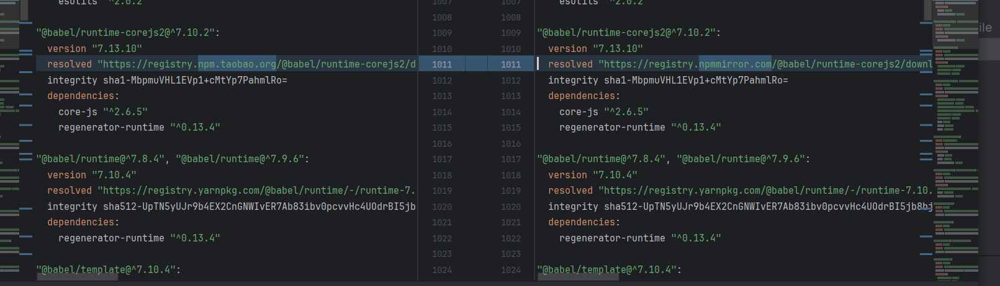

# npm

- 传统共享代码库，依赖的缺点

  - 上传到GitHub上、或者自己的官网其他程序员通过GitHub下载我们的代码手动的引用；

  - 大家必须知道你的代码GitHub的地址，并且从GitHub上手动下载；

  - 需要在自己的项目中手动的引用，并且管理相关的依赖；

  - 不需要使用的时候，需要手动来删除相关的依赖；

  - 当遇到版本升级或者切换时，需要重复上面的操作；

## 1、包管理工具npm

> `Node Package Manager`，也就是`Node`包管理器；

- 目前已经不仅仅是Node包管理器了，在前端项目中我们也在使用它来管理依赖的包

- `npm` 属于 `node` 的一个管理工具，安装Node的过程会自动安装npm工具；并且配置号环境变量

- [安装相关的npm包的官网](https://www.npmjs.com/)

  > 可以在 `npm` 包的官网查看是否存在需要的包

- 包其实是**发布到registry上面的**， 当我们安装一个包其实是也是**从 registry 远程 npm 仓库上面下载的包**；

### 1.1、npm的package.json文件

#### package.json初始化

> 每一个项目都会有一个对应的配置文件，无论是前端项目（Vue、React）还是后端项目（Node）

- 在当前文件夹初始化项目，当前目录下自动生成package.json配置文件

  ~~~shell
  npm init [-y]
  ~~~

- 也可以自己手动创建，或者使用脚手架来自动生成

##### package.json 作用

- 这个配置文件会记录着你项目基础信息的**名称、版本号、项目描述等；**
- 也会记录着你**项目所依赖**的**其他库的信息**和**依赖库的版本号，main文件，运行脚本文件**....

#### package.json属性

> 这里的name，和version 在package.json中式必填的

~~~shell
{
  /* 项目名称 */
  "name": "04_commonjs_03",
  /* 版本 */
  "version": "1.0.0",
  /* 描述 */
  "description": "",
  
  //当值为true时，npm是不能发布它的, 防止私有项目不小心使用npm发布出去的
  "private": "true",
   
  /* 设置当前包的主入口文件 entry point进入点 */
  "main": "index.js",
  /* 测试命令，配置需要npm执行或者调试的js脚本文件 test command*/
  "scripts": {
    "test": "echo \"Error: no test specified\" && exit 1"
  },
  /* npm 远程仓库检索的关键字 */
  "keywords": [],
  /* 作者信息 */
  "author": "",
  /* 开源协议发布的时用到 */
  "license": "ISC"
}
~~~

##### type属性

> node正式支持了ES module规范，在package.json中可以通过type字段来声明npm包遵循的模块化规范。

~~~js
{
   name: "some package",
   //只能选一个模块化
   type: "module"||"commonjs" 
}
~~~

- 不指定type的时候，type的默认值是commonjs
- 当type字段指定时，目录下的所有.js后缀结尾的文件，都遵循type所指定的模块化规范
- 除了type可以指定模块化规范外，通过**文件的后缀**来指定文件所遵循的**模块化规范**，以**`.mjs`结尾的文件就是使用的ESModule规范**，以**`.cjs`结尾的遵循的是commonjs规范**

##### main属性：

> 设置程序的入口。

- `require('axios')` 的查找规则，主模块没有的话就会在 `node_modules` 文件夹下面找对应的`.js/.json/.node||index.js/json/.node`文件或者文件夹
  - 在查找的过程中发现**文件夹当中存在 package.json文件的时候**，会就**根据文件中 main 字段来获取指定的文件**

##### scripts属性

> scripts属性用于配置一些脚本命令，以键值对的形式存在；

- 配置后我们可以通过 `npm run` 配置好命令的 `key` 来执行这个命令；

- `npm start` 和 `npm run start`的区别

  - 它们是相同的，但是并不是所有的 `key` 都可以省略 `run` 命令

  - 对于常用的 `start`、 `test`、`stop`、`restart`  可以<u>省略掉run直接通过 npm start等方式运行；</u>

##### dependencies属性

> dependencies属性是指定无论开发环境还是生成环境都需要依赖的包；

- 通过 `npm install ?  --save` 安装的依赖信息都放到dependencies属性中；
- 通常是我们项目实际开发用到的一些库模块vue、vuex、vue-router、react、react-dom、axios等等；

- 特点：无论在开发阶段还是打包阶段 `dependencies` 中的依赖都会存在

##### devDependencies属性

> 一些包在生成环境是不需要的，比如webpack、babel等；

- 通过 `npm install ? --save-dev`，命令进行安装的依赖放到devDependencies属性中；

##### peerDependencies属性

> peerDependencies主要是用来安装依赖的时候提示，当前库要使用的话必须需要依赖的宿主（其他）库

- 还有一种项目依赖关系是对等依赖，也就是你依赖的一个包，它必须是以另外一个宿主包为前提的；

- 比如element-plus是依赖于vue3的，ant design是依赖于react、react-dom；

##### engines属性

>  engines 属性用于指定Node和NPM的版本号；（提示node不低于那个版本）

- 在安装的过程中，会先检查对应的引擎版本，如果**不符合就会报错**

##### browserslist属性

> 用于配置打包后的JavaScript浏览器的兼容情况

- 否则我们需要手动的添加 `polyfills` 来让支持某些语法；
- 也就是说它是为 `webpack` 等打包工具服务的一个属性

##### exports属性(重点了解下)

> 在包的 package.json 文件中，**有两个字段可以定义包的入口点："main" 和 "exports"**。 所有版本的 Node.js 都支持 "main" 字段，但它的功能有限：它只定义了包的主要入口点。

- "exports" 字段优先于 "main"。但建议同时定义，适配老版本

- **防止**除 "exports" 中**定义的入口点之外的任何其他入口点。**<u>简单理解：防止有未定义的入口点进行访问。</u>

  >  当使用 [`"exports"`](http://nodejs.cn/api/packages.html#exports) 字段时,  将**阻止包的消费者**使用任何**未定义**的入口点。使用其它的子路径会报错

  

- **exports 可以定义多个入口点**，`.` exports的语法糖 将 `.` 视为主入口

  > 对于具有少量导出或导入的包，我们建议显式地列出每个导出子路径条目。 但是对于具有大量子路径的包，这可能会导致 package.json 膨胀和维护问题。
  >
  > - `*` 是用来映射公开嵌套的子路径
  > - `*.js` 限制了暴露的包导出到只有 JS 文件。
  >
  > 

- 还有一个**条件导出** 根据import 和 require 的类型配置导出那个文件，这个了解使用的时候在具体查下文档

~~~json
#简写方式
{
  "exports": "./index.js"
}
#定义多个入口点
{
  "name": "my-mod",
  "exports": {
      #这里要是相对路径
    ".": "./lib/index.js",
    "./lib": "./lib/index.js",
    "./lib/index": "./lib/index.js",
    "./lib/index.js": "./lib/index.js",
    #未来版本会废弃掉
    "./features/": "./features/",
    #这个是最新的子路径的模式。公开包中的每个文件在通过路径获取指定的文件
    "./features/*": "./features/*.js",
    "./submodule": "./src/submodule.js"
  }

~~~

### 1.2、npm的package-lock.json文件

> package-lock.json，会在安装依赖包的时候被创建，用来确定项目中实际依赖包正确的版本，会记录所有包的一个依赖

#### package-lock初始化

> 当前项目安装其他依赖的时候会自动生成，同时记录依赖的配置信息

##### 作用

1. 所以共享代码的时候共享package.js,  可以避免版本混乱的问题

   - 在进行多人开发的时候，仅仅通过 package.json 获取到的依赖会导致版本混乱的问题

     > 这样的话对于哪些没有保持semver版本规范的包，会造成一些逻辑错误.

   - 为了将项目中的版本都固定下来的话，就需要package-lock.json，会记录项目中明确的版本，将版本确定死，

   - 据说去掉 package.json中的 ^ 会直接安装指定的版本

     

2. **记录项目中的所有的依赖信息**

   

3. 通过 `package.lock.json` 中的 `integrity` 加密字符串来**查找缓存的压缩包**

#### package-lock.json属性

- `name`：项目的名称；

- `version`：项目的版本；

- `lockfileVersion`：lock文件的版本；

- `requires`：使用 `requires` 来记录模块的依赖关系；

  > 早期的时候并不是使用 `dependencies` 来记录当前库依赖的其他的库 而是用的是**requires 如果是true的话两个都可以用**

- `dependencies`：项目的依赖

- 例：`package-lick.json` 中 `axios` 依赖的配置信息

  - `version`: 表示实际安装的axios的版本；

  - `resolved`：用来记录下载的地址，`registry`仓库中的位置；

  - `requires/dependencies` :  记 录当前模块的依赖；

  - `integrity`: 用来从**缓存中获取索引**，<u>再通过索引去获取压缩包文件；</u>

    > `integrity`：缓存标识使用`sha512`的算法生成，解析完之后是可以获取到对应的目录结构的，会去目录结构中先拿一下依赖包拿不到在去远程下载，下载之后会优先下载到缓存里之后将对应得 `integrity` 进行更新等待下一次安装直接到缓存中获取

## 2、npm install 的原理

> 当执行 `npm install ？`的时候会在 **npm 的远程仓库**将你需要的源码文件下载到，<u>当前执行命令的路径下</u>的 **`node_modules`文件夹** 当中, **在npm5之后，就有了`缓存的概念，`**

将这个库所依赖得包

- 当执行 `npm install` 命令的时候判断有没有 `package-lock.json` 文件

  - **会构建需要安装的包和其他依赖之间关系**，之后从远程 `registry` 中<u>获取到压缩包</u>**放到缓存里**（<u>从`npm5`开始有的</u>）。

    > 分析依赖关系，这是因为我们可能包会依赖其他的包，并且多个包之间会产生相同依赖的情况， 分析好之后才能知道都需要那些包

  - 同时**生成**对应的 <u>`package.lock.json` 文件</u>

  - 之后**解压到对应的`node_modules` 文件里**

  

- 下一次在执行 npm install 的时候会再次检测依赖关系

  > <u>检测`lock`中包的版本是否和`package.json`中一致</u>（会按照 `semver` 版本规范检测），**不一致重新构建依赖关系,  重新从远程 `registry` 获取**

  - 一致的话会<u>根据 `package-lock` 中获取到</u>**对应包的标识符** 
  - `integrity`: 用来从**缓存文件夹中获取索引**，<u>再通过索引去获取压缩包文件；</u>
  - 优先去缓存里面取查找是否存在这个包

  > 存在的话会将<u>缓存中的**压缩包**直接解压</u> 到**局部`node_modules` 文件夹当中**

#### 环境配置

- 可以进行环境配置类修改，node的缓存和全局模块

  > 管理员权限打开CMD, 配置你存放模块的缓存和包的路径

  ~~~shell
  npm config set prefix "E:\KF\nodejs\node_global"
  npm config set cache "E:\KF\nodejs\node_cache"
  ~~~

  

- 注意配置完之后要重新修改环境变量

  ~~~js
  设置环境变量，打开【系统属性】-【高级】-【环境变量】，在系统变量中新建
  
  变量名：NODE_PATH
  
  变量值：C:\Program Files\nodejs\node_global\node_modules
  ~~~

- 最后要添加到 `path` 里  `%NODE_PATH%`

## 3、依赖的版本管理

### semver版本规范

> `npm`的包通常需要遵从`semver`版本规范

- [semver](https://semver.org/lang/zh-CN/)
- npm semver: 

- `semver` 版本规范是`X.Y.Z`

  - X主版本号（major）：当你做了不兼容的 API 修改（可能不兼容之前的版本）；

  - Y次版本号（minor）：当你做了向下兼容的功能性新增（新功能增加，但是兼容之前的版本）；

  - Z修订号（patch）：当你做了向下兼容的问题修正（没有新功能，修复了之前版本的bug）；

- ^和~的区别
  - x.y.z：表示一个明确的版本号；
  - ^ x.y.z：表示**x是保持不变**的，**y和z永远安装最新的版本**；
  - ~ x.y.z：表示**x和y保持不变**的，**z永远安装最新的版本**；

## 4、npm 常见命令

##### npm root -g

> 查看全局安装依赖的 node_modules 路径

##### npm config ls / where node

> 查看 nodejs 安装路径

##### npm init [-y] :

- -y 的意思全部使用默认的 yes

> 初始化项目，创建配置文件 package.json

##### npm install ? [--save-dev / --save/ -D / ]

> 安装依赖

- 全局安装（global install）： npm install webpack  -g;

  - 简写：`npm i webpack -g`

  > 使用 `-g` 命令会提示一个警告说`--global`, `--local`即将过期，**推荐使用 `--location=global`**

  ~~~shell
  npm WARN config global `--global`, `--local` are deprecated. Use `--location=global` instead.
  npm WARN config global `--global`, `--local` are deprecated. Use `--location=global` instead.
  ~~~

  

- 项目（局部）安装（local install）： npm install webpack

  - 简写：`npm i webpack`

- 根据 package.json中的依赖信息下载： npm install
- 安装开发依赖 npm install webpack --save-dev
  
  - 简写：npm install webpack -D
- 安装生产依赖 npm install webpack --save
  
  - 简写：npm i webpack 省略 --save

##### npm uninstall  卸载

- 卸载某个依赖包：
  - npm uninstall package
  - npm uninstall package --save-dev
  - npm uninstall package -D

##### npm rebuild

> 强制重新build

##### npm update `<name>`

> 对单个包升级

##### 更新npm版本

~~~shell
npm install -g npm
~~~

##### npm cache clean 清除缓存

##### 查看npm镜像

~~~shell
npm config get registry
~~~

##### 设置npm镜像

> 设置淘宝镜像

~~~shell
 //默认镜像
npm config set registry https://registry.npmjs.org
//淘宝镜像
npm config set registry https://registry.npm.taobao.org
~~~

##### 清理npm缓存

~~~shell
npm cache clean --force
npm cache verify
#verify和clean --force的区别在于是否会验证缓存数据的有效性和完整性从而进行有效cache clean.
~~~

##### npm的命令

[npm的命令](https://docs.npmjs.com/cli/v8/commands)

# cnpm

> 由于一些特殊的原因，某些情况下我们没办法很好的从 https://registry.npmjs.org下载下来一些需要的包

- 我们可以修改npm 使用淘宝的镜像服务器，每过一段使用就会在 npm registry 中拷贝一份过来

  

- 但是对有些人来说，并不希望将npm镜像修改了：

  - 第一，不太希望随意修改npm原本从官方下来包的渠道；
  - 第二，担心某天淘宝的镜像挂了或者不维护了，又要改来改去；

- 这个时候，我们**可以使用cnpm，并且将cnpm设置为淘宝的镜像：**

  ~~~js
  npm install -g cnpm --registry=https://registry.npm.taobao.org
  cnpm config get registry # https://r.npm.taobao.org/
  ~~~

  

# npx工具

> npx是npm5.2之后自带的一个命令。用于调用项目中的某个包当中的指令。

- **总结**：用来 **调用项目依赖中 ** 可执行的命令

### 控制台使用命令的过程

1. 在计算机控制台窗口**输入命令**
2. 优先在**当前项目路径** (也就是 `node_modules/bin` 文件夹)中查找是**否有可执行**的程序，<u>有会直接执行</u>
3. 没有的话就会**直接到环境变量中查找**

### npx的使用

> 在本地项目中，下载的依赖都是放在 `node_modules` 文件夹当中的 bin 路径下，所以若要想**调用局部安装的依赖**就要<u>切换到 `.bin` 目录下执行。</u>

- npx工具就是用来**调用局部安装的依赖的**

  ~~~shell
  npx webpack #这里使用的是当前项目中的 webpack
  ~~~

  

- 在 webpack5 以上版本可以在 **项目的 **根路径，可以<u>直接使用 webpack 的命令</u>。但是<u>不能在根路径</u>**下面的路径当中使用**

  - webpack5 应该会在当前目录下找 `node_modules/bin` 的 webpack 命令运行，但在子路径下就不灵喽

  > npx 可以解决这个问题，在**根路径下的所有路径都可以调用** 项目中所安装依赖中的命令
  >
  > 如果使用 webpack 子目录运行 npx webpack 报错的话，是因为webpack默认会在子目录下找 `src/index.js` 入口文件。没有的话可以创建，或者修改入口文件

  

- `npx`原理就是**它会到当前项目的node_modules/.bin目录下查找对应的命令**

### 代码和脚本中执行

> 虽然控制台当中我们需要使用 npx 执行依赖当中的命令，但是在代码使用命令的时候会直接到当前项目的中 `node_modules/.bin` 当中调用

- 可以在 `package.json` 当中配置脚本执行

  > 在这里可以不用加 npx	

  ~~~js
  {
     "scripts": {
         "build": "webpack --version"
      },
  }
  ~~~

  

# npm 发布包

### 发布包package.json的配置

~~~json
{
  //这里的name，确定了包的名字，require 引入的就是这个名字，npm install的包名也是这个
  "name": "02_package_demo",
 //每次上传的时候都要根据semver 的规范修改版本号否则上传会报错
  "version": "1.0.0",
  "description": "",
 //设置好主入口文件
  "main": "index.js",
  "scripts": {
    "test": "echo \"Error: no test specified\" && exit 1"
  },
  "author": "",
 //开源协议一般用的是 MIT 但默认的是 ISO
  "license": "MIT"
}
~~~

- 更新代码的时候要根据 semver 的规范来修改version

  > <u>x: 不向下兼容大版本更新       y:向下兼容，添加新的特性       z：修复bug</u>

  

### 发布流程

> 要先去官网注册下账号

- [注册npm账号](https://www.npmjs.com/)；

- 在使用命令行登录

  ~~~shell
  npm login
  ~~~

  

- 修改package.json,semver上面有提到

  - 更新代码的时候要根据 semver 的规范来修改version

    > <u>x: 不向下兼容大版本更新       y:向下兼容，添加新的特性       z：修复bug</u>

- 发布到npm registry上

  ~~~shell
  #403报权限的问题 ， 注意提示8成应该都是名字重复了
  npm publish
  ~~~

- 更新仓库：

  - 1.修改版本号(最好符合semver规范)
  - 2.重新发布 `npm publish`

- 删除发布的包：

  ~~~shell
  npm unpublish
  #删除错误的话没有报错的话可以使用 --force：暴力，武力，强制 
  #因为有可能刚上传的包还存在引用的话，直接删除的话可能就会报错
  npm unpublish --force
  ~~~

  

- 让发布的包过期：

  ~~~shell
  npm deprecate
  ~~~

### npm上传错误

1. `403` 错误可能是版本的问题
2. `400` 错误可能是包明重复了，产生了冲突

### 配置文件设置源

