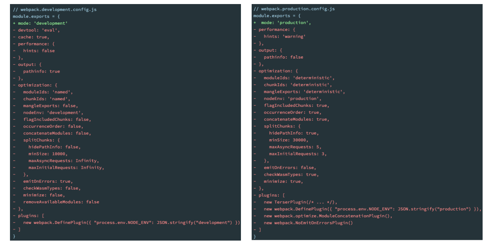

# webpack

### node 内置模块path

> path模块用于对路径和文件进行处理，提供了很多好用的方法。

- 在Mac OS、Linux和window上的路径时不一样的
  - window上会使用 \ 或者 \\ 来作为文件路径的分隔符，当然目前也支持 /；
  - 在Mac OS、Linux的Unix操作系统上使用 / 来作为文件路径的分隔符；
- 问题在window上使用 \ 来作为分隔符开发了一个应用程序，要部署到Linux上面会报错
  - 显示路径会出现一些问题；
  - 所以为了屏蔽他们之间的差异，在开发中对于路径的操作我们可以使用 path 模块；

- 可移植操作系统接口（英语：Portable Operating System Interface，缩写为POSIX）**后面补充**
  Linux和Mac OS都实现了POSIX接口；
  Window部分电脑实现了POSIX接口；

#### path常见的API

##### 获取路径信息

1. `dirname()`：获取文件的父文件夹；区分全局属性 `__dirname 获取当前路径`

   ~~~js
   const path = require("path")
   const pathStr = "e://zhagnsan/lisi/wangwu/text.txt"
   console.log(path.dirname(pathStr));
   //output e://zhagnsan/lisi/wangwu
   ~~~

   

2. `basename()`：获取文件名；区分全局属性 `__filename获取文件名+路径`

   ~~~js
   const path = require("path")
   const pathStr = "e://zhagnsan/lisi/wangwu/text.txt"
   console.log(path.basename(pathStr));
   //output text.txt
   ~~~

   

3. `extname()`：获取文件扩展名；

   ~~~js
   const path = require("path")
   const pathStr = "e://zhagnsan/lisi/wangwu/text.txt"
   console.log(path.extname(pathStr));
   //output txt
   ~~~

   

##### 路径的拼接

> 就是将多个**路径进行拼接**，但是<u>不同的操作系统可能使用的是不同的分隔符</u>，。**这个时候可以使用 `path.join` 函数；**

- `path.join`

  - 特点：会将**不同格式的路径描述符**，统一为 **`\`**。并且进行拼接，**仅仅将传入的路径拼接而已**， 不会像resolve 根据不同的系统添加盘符

    > 只有这个功能，**不会像 resolve 自动去掉 路径末尾的 `\`**

~~~js
const path1 = "\\zhagnsan\\lisi/text.txt\\"
const path2 = "c://profile"
path.join(path1, path2)
//output： c:\profile\zhagnsan\lisi\text.txt
~~~

##### 拼接绝对路径：path.resolve

> `path.resolve()` 方法会把一个**路径** 或 **路径片段**的<u>序列解析为一个绝对路径；</u>

1. 给定的路径的序列是从**右往左被处理** 拼接为一个路径，后面每个 `path` 被依次解析，<u>直到构造完成一个绝对路径</u>；

2. 注意：如果传入的路径是 `/` 开头的则会被认为是绝对路径 例：`/User/ProgramFiles` 

- 如果发现是 **绝对路径的话会直接停止** <u>返回绝对路径的</u>

  > `./` 会是当前路径。可以进行拼接

  ~~~js
  //实例：
  //这里发现了 /why/kobe 是绝对路径后面就不会进行拼接了直接返回
  console.log(path.resolve("./abc/cba", "/why/kobe", "./abc.txt"))
  ~~~

  

3. 如果在处理完所有给定 `path` 之后，**还没有生成绝对路径，则使用当前工作目录；**

   > 从右到左进行拼接，如果还是没有以盘符或者 `/` 开头的路径，则会**获取到当前路径进行与参数路径拼接**返回绝对路径

   ~~~js
   console.log(path.resolve("./abc/cba", "./abc.txt"))
   //这里会返回 ”当前目录的绝对路径“+ /abc/cba/abc.txt
   ~~~

   

4. 生成的路径被规范化并**删除尾部斜杠**，零长度 **path段被忽略；**

   ~~~js
   //这个路径最后面的 "/" 会被删除
   const path2 = "c://profile/"
   //空白参数的会被忽略
   path.resolve(path,,path1,)
   ~~~

   

5. 如果**没有path传递段**，path.resolve()将**返回当前工作目录的绝对路径；**

   > 默认返回该目录的绝对路径 `__dirname`

#### 在webpack中的使用

> 在 `webpack.config.js` 文件当中设置打包 js 出口路径的时候需要填绝对路径否则报错

- 着你也可以使用命令行的方式进行

  ~~~shell
  npx webpack --entry ./src/main.js --output-filename bundle.js
  ~~~
  
- 这里设置 output 可以使用 path.resolve() 方法

  > 在 `webpack.config.js` 中配置出口的时候，必须要使用 绝对路径 整个时候就可以使用`path.resolve(__dirname, "./build")`方法

如果使用 webpack 子目录运行 npx webpack 报错的话，是因为子目录下没有 `src/index.js` 文件 

## 一、认识webpack（了解）

> 事实上随着前端的快速发展，目前前端的开发已经变的越来越复杂了

- 比如开发过程中我们需要通过 **模块化的方式来开发；**
- 比如也会使用一些高级的特性来加快我们的开发效率或者安全性，比如 **通过ES6+、TypeScript开发脚本逻辑，通过sass、less等方式来编写css样式代码；**
- 比如开发过程中，我们还希望**实时的监听文件的变化来并且反映到浏览器上**，提高开发的效率；
- 比如开发完成后我们还需要**将代码进行压缩、合并**<u>以及其他相关的优化</u>；

> 对于很多的前端开发者来说，并不需要思考这些问题，日常的开发中根本就没有面临这些问题：

- 这是因为目前前端开发我们通常都会直接使用三大框架来开发：Vue、React、Angular；
- 但是事实上，这三大框架的创建过程我们都是借助于脚手架（CLI）的；
- 事实上`Vue-CLI`、`create-react-app`、`Angular-CLI `**都是基于webpack来帮助我们支持模块化**、<u>less、TypeScript、打包优化等的；</u>

### webpack作用

> webpack is a static module bundler for modern JavaScript applications. 
>
> webpack是一个静态的模块化打包工具，为现代的JavaScript应用程序；

- 现代的modern：我们前端说过，正是因为现代前端开发面临各种各样的问题，才催生了webpack的出现和发展；

- 静态的static：这样表述的原因是我们最终可以将代码打包成最终的静态资源（部署到静态服务器）；
- 模块化module：webpack默认支持各种模块化开发，ES Module、CommonJS、AMD等；

- 打包bundler：webpack可以将帮助我们进行打包，所以它是一个打包工具

  - JavaScript的打包：

    > 将ES6转换成ES5的语法；

  - TypeScript的处理，

    > 将其转换成JavaScript；

  - Css的处理：

    > CSS文件模块的加载、提取；

  - Less、Sass等预处理器的处理；

    > 将less Sass解析成css

  - 资源文件img、font：

  - 图片img文件的加载；

  - 字体font文件的加载；

  - HTML资源的处理：

    > 打包HTML资源文件；

  - 处理vue项目的SFC文件.vue文件；

  

### Webpack的使用前提

[webpack的官方文档](https://webpack.js.org/); 有中文翻译

- Webpack的运行是依赖Node环境的，所以电脑上必须有Node环境
  - 需要先安装Node.js，并且同时会安装npm；

### Webpack的安装

> 在 webpack4 版本之后 则需要**多安装一个 webpack-cli**

~~~shell
npm install webpack webpack-cli –g # 全局安装
npm install webpack webpack-cli –D # 局部安装
~~~

- webpack在执行时是**依赖webpack-cli**的，如果没有安装就会报错；
- 而 `webpack-cli`中 代码执行时，才是真正利用 `webpack` 进行编译和打包的过程；
- 所以在安装webpack时，我们需要同时安装webpack-cli（<u>第三方的脚手架事实上是没有使用webpack-cli的，而是类似于自己的vue-service-cli的东西</u>）

#### 基本使用

**注意：默认情况下 **在项目路径下打包<u>执行 `webpack | npx webpack` 命令</u> ， **默认是打包当前路径 `./src/index.js`  文件**。找不到的话会报错。

**注意：默认webpack 配置文件名 `webpack.config.js`**

- 执行`webpack`命令，会执行 `node_modules` 下的 `.bin`目录下的 `webpack`；

  > 只能在当前项目的根路径中使用，子路径报错

  - 最好使用npx webpack 进行打包 

- 指定配置文件执行

  > 当配置文件名**被修改**，或者需要**使用别的配置文件**，可以 **指定配置文件 **进行打包

  ~~~shell
  webpack --config wk.config.js
  ~~~

  

- 每次这样执行命令来对源码进行编译，会非常繁琐，可以在 `package.json` 中增加一个新的脚本

  > 在package.json中创建scripts脚本，执行脚本打包即可

  ~~~json
    "scripts": {
      "build": "webpack --config wk.config.js"
    },
  ~~~

  

### Webpack的依赖图(数据结构)

#### webpack打包流程(重点理解)

- 事实上webpack在处理应用程序时，它会根据**命令或者配置文件找到入口文件；**

  > **默认**是 `./src/index.js` 文件当作入口文件

- 从<u>入口开始</u>，会**生成一个 依赖关系图**，这个<u>依赖关系图会包含应用程序中所需的 </u> **所有模块**（比如.js文件、css文件、图片、字体等）；

  > 就是与入口文件 `./src/index.js`  **产生引用**关系或者**间接引用的文件**，<u>都会被放到图结构当中</u> **进行打包**。
  >
  > 就是每个文件的根都会是入口文件

- 然后**遍历图结构**，<u>打包一个个模块</u>（根据文件的不同使用不同的loader来解析）；

### webpack配置文件

- 注意：webpack **默认配置文件名**是 `webpack.config.js` 或者是 `webpackfile.js` 。不能修改
  - 使用其他配置文件的话 `webpack --config config-file.js`

## 二、loaders源文件转换器

> loader 可以用于对<u>模块的**源代码**</u> **进行转换**；

- loader即为**文件加载器**，操作的是文件，将文件A通过loader转换成文件B，是一个**单纯的文件转化过程。**

  > 用于帮助文件转换为指定格式的文件

  

- loader基本配置

  ~~~js
  module.exports = {
  	rules: [
          //在这例配置loader
          {
              test: /\.css$/ //正则
              //使用loaders
              use: [  { loader: "", options:{} }  ]
          }
      ]
  }
  ~~~

  - test属性：用于对 resource（资源）进行匹配的，通常会设置成**正则表达式；**

    > 就是匹配依赖图中指定后缀明文件，之所以叫 test 应该是正则的实例方法也有个test

  - use：使用所需要的 `loader`

    > 可以通过对象的属性来设置一些其他属性

    - loader：必须有一个 loader属性，对应的值是一个字符串；

    - options：可选的属性，值是一个字符串或者对象，值会被传入到 `loader` 中；

- 简写配置一

  - 当配置 use 的不需要配置 options 选项的时候可以直接传入字符串loader

    ~~~js
    use: [ "css-loader", ...  ]
    ~~~

- 简写配置二

  - loader属性： `Rule.use: [ { loader } ]` 的简写。

### loader的加载顺序(重要)

> webpack.config.js 配置文件中的 loader.js是从**后向前执行的。**

例：

~~~js
//这里是先执行 css-loader 进行解析的，之后才通过 style-loader 将css文件转换为 style 样式表添加到html页面当中
use: ["style-loader", "css-loader"]
~~~

### 1、css-loader

> 在webpack中用于帮助我们使用模块化引入的方式解析css文件。

- webpack 是模块化打包工具会将文件以模块的方式进行打包，所以css文件也会被当做一个模块文件

  > <u>css模块文件就不会像link文件那样直接引入了</u>，会使用 `import` 关键字**和主入口文件建立引用关系**。这样的话在 webpack进行打包的时候**就能通过依赖图结构找到 css 文件进行打包了。**

  ~~~js
  //在入口文件下或者主入口间接引用文件下，进行导入建立联系
  import "./css/index.css"
  ~~~

  

- 但是 webpack 默认只能打包 js 模块文件-，如果想要打包 css文件就需要对应的 `loader` 来进行文件转化

- 但**仅仅是解析**，并不将样式添加到页面上

- `css-loader` 是最常用的 loader (废话)

- 其他方式：

  - 内联方式(了解) 在引入的样式前加上使用的loader，**并且使用!分割**

    ~~~js
    import "css-loader!../css/style.css"
    ~~~

- 配置 `webpack.config.js`[查看配置](###2、stryle-loader)

  > 配置 `module` 属性。

  

  

### 2、stryle-loader

> 在 webpack 中**用于将 css-loader 解析的 css 文件** 转化成 `style` 标签 **添加到 `index.html` 页面上**。

- 通常情况下， 是结合 `css-loader` 来使用 ， 注意加载的顺序**，要先加载 css-loader 否则无效**

- 安装：`npm install style-loader -D`

- 配置 `webpack.config.js`

  ~~~~js
      module: {
          rules: [
              {
                  test: /\.css$/,
                  use: ["style-loader", "css-loader"],
                  //排除需要编译的文件夹
                  exclude: /node_module/
              }
          ]
      }
  
  ~~~~

- style-loader查找规则，个人猜测应该会**去找所引用 js 的 html文件**进行插入

### 3、less-loader

> 将项目依赖图结构中的 .less 文件，转换成css文件。

- 通常搭配，`css-loader` 和 `style-loader` 结合使用。

  > 因为转换为css之后还要进行css 模块化打包，之后在插入到html页面上

- 安装：`npm install less-loader -D`

- 其他方式：lessc

  ~~~shell
  npm install less -D
  npx lessc ./src/css/title.less title.css
  ~~~

  

- 配置 `webpack.config.js`

  ~~~js
      module: {
              {
                  test: /\.less$/,
                  use: ["style-loader", "css-loader", "less-loader"]
              }
          ]
      }
  ~~~

### 4、postcss-loader

#### 认识PostCSS工具

> PostCSS是一个通过JavaScript来转换样式的工具；

- 这个工具可以帮助我们进行一些CSS的转换和适配，比如**自动添加浏览器前缀**、css样式的重置；
- 但是实现这些功能，需要借助于PostCSS对应的插件；

#### webpack中使用postcss

> `webpack` 中使用 `postcss` 就是使用 `postcss-loader` 来处理的；

- 第一步：**查找PostCSS在构建工具中的扩展，**比如webpack中的 **postcss-loader**；
- 第二步：选择可以添加你需要的PostCSS相关的插件；

##### 安装postcss-loader：

> 在webpack中使用 postcss-loader 相当与使用postcss，因此**需要postcss对应的插件才可以使用**

- 安装postcss-loader：`npm install postcss-loader -D`
- 安装自动添加前缀的插件：`npm install autoprefixer -D`

##### postcss-preset-env

> 它可以帮助我们**将一些现代的CSS特性**，<u>转成大多数浏览器认识的CSS</u>，并且会根据目标浏览器或者运行时环境添加所需的polyfill；
> 也包括会自动帮助我们添加autoprefixer（所以**相当于已经内置了autoprefixer**）；

- 内置了多个功能插件例如 `autoprefixer`
- 或者 `#33333388` 16进制表示透明度
- ......等等一些功能
- 所以我们可是直接使用 `postcss-preset-env`

##### 配置 `webpack.config.js`

~~~js
   module: {
        rules: [
            {
                test: /\.css$/,
                use: ["style-loader", "css-loader", {
                    loader: "postcss-loader",
                    options: {
                        //配置 loader 插件
                            postcssOptions: {
                                plugins: [
                                    "postcss-preset-env"
                                ]
                            }
                        }
                }]
            },
        ]
    }
~~~

##### 配置postcss.config.js 两个地方配置一个应该就可以了

> 直接在根路径下添加 postcss.config.js 文件，**名字是固定的。**

~~~js
module.exports = {
    plugins: [
        //也可以直接传个字符串
        require("postcss-preset-env")
    ]
}
~~~

#### 注意加载顺序

> 如果项目中引用了 `less-loader`  的话要，先将 `less` 转换成css ，才可以进行添加 `prefixer` 等别的操作

- 所以 `postcss-loader` 要放在 `less-loader` 后面执行

  ~~~js
  //要在 less-loader 后面使用
  use: [ "style-loader", "css-loader", "less-loader", "postcss-loader" ]
  ~~~

### 5、Webpack打包图片

> 在 `webpack5` 之前，加载这些资源我们需要使用一些 `loader`，比如 `raw-loader` 、`url-loader`、`file-loader`；

#### 资源模块类型(asset module type)

> 在webpack5开始，我们可以直接使用**资源模块类型（asset module type）**，来替代上面的这些loader；

- 也就是在 `webpack5` 当中**内置了图片加载的 loader**

1. `asset/resource` 发送一个单独的文件并导出 URL。

   > 之前通过使用 file-loader 实现；

   - 就是将一个图片**以特殊的命名方式发送到打包文件夹**，**并且和打包的js产生引用**

   - 缺点: 多图片加载的两次网络请求

   - 可以配置**通配符别名**

     ~~~js
     /*
     [ext]： 处理文件的扩展名；
     [name]：处理文件的名称；
     [hash]：文件的内容，使用MD4的散列函数处理，生成的一个128位的hash值（32个十六进制）；
     */
     generator: {
         	//8位的hash值
              filename: "static/[name]-[hash:8][ext]",
                },
     ~~~

     

2. `asset/inline` 导出一个资源的 data URI。

   > 之前通过使用 url-loader 实现；

   - 将图片进行base64的编码, 并且直接编码后的源码放到打包的js文件中
   - 优势：**适用与比较小的图片**，可以减少服务器的压力，**减少发送网络请求的次数**，也可以使用精灵图
   - 缺点: 造成js文件非常大, 下载js文件本身消耗时间非常长, 造成js代码的下载和解析/执行时间过长

3. `asset/source` 导出资源的源代码

   > 之前通过使用 raw-loader 实现；

   - 不常用(了解即可)

4. `asset` 在**导出一个 data URI** 和 发送一个单独的**文件之间自动选择资源模块的类型。**

   > 之前通过使用 url-loader，并且配置资源体积限制实现；
   >
   > 合理的规范：
   >
   > - 对于小一点的图片, 可以进行base64编码
   >
   > - 对于大一点的图片, 单独的图片打包, 形成url地址, 单独的请求这个url图片

   - 就是设置一个 limit 超过整个limit 使用 `resource` 否则使用 `inline`
   - 这里 limit 的**单位是字节byte**
   - 可配置**通配符别名**，和 `maxSize`

   ~~~js
            {
                   test: /\.(png|jpe?g|svg|gif)$/i,
                   type: "asset",
                   generator: {
                       filename: "static/[name]-[hash:8][ext]",
                   },
                   parser: {
                       dataUrlCondition: {
                           //超过14kb使用 resource
                           maxSize: 13 * 1024
                       }
                   }
               }
   ~~~

   

### 6、babel-loader

> 在开发中我们很少直接去接触babel，但是babel对于前端开发来说，目前是不可缺少的一部分：

- 开发中，我们想要使用ES6+的语法，想要使用TypeScript，开发React项目，它们都是离不开Babel的；

#### Babel 介绍

- Babel是一个工具链，主要用于**旧浏览器或者环境**中将ECMAScript 2015+代码 **转换为向后兼容版本的JavaScript**；
  包括：语法转换、源代码转换等；
- 注意：Babel本身是一个编译器。如果实现功能的话需要添加对应的 `plugin` 或者 `preset`

#### Babel命令行简单使用

> babel本身可以作为一个独立的工具（和postcss一样），不和webpack等构建工具配置来单独使用。

- 安装：

  - `@babel/core`：**babel的核心代码**，必须安装；

  - `@babel/cli`：可以让我们**在命令行使用babel；**

    ~~~shell
    npm i -D @babel/core @babel/cli
    ~~~

- 使用： `npx babel src --out-dir dist`

#### Babel 插件

> Babel 只是一个工具链，如果需要将js版本转换的话，还需要安装对应的插件

- `plugin-transform-arrow-functions`:  转换箭头函数

  ~~~shell
  npm install @babel/plugin-transform-arrow-functions -D
  npx babel src --out-dir dist --plugins=@babel/plugin-transform-arrow-functions
  ~~~

  

- `plugin-transform-block-scoping`:   转换const 

  ~~~shell
  npm install @babel/plugin-transform-block-scoping -D 
  npx babel src --out-dir dist --plugins=@babel/plugin-transform-block-scoping,@babel/plugin-transform-arrow-functions
  ~~~

- .....

- `webpack.config.js` 配置

  ~~~js
    use: [
           {loader: "babel-loader", options: {
              // presets: ["@babel/preset-env"],
              plugins: ["@babel/plugin-transform-arrow-functions"]
              }}
            ]
  ~~~

  

#### Babel 的预设preset

> 但是如果要转换的内容过多，一个个设置是比较麻烦的，我们可以使用预设（preset）：

- 官网介绍

  > `@babel/preset-env`是一个智能预设，**允许您使用最新的 JavaScript**，而无需微观管理目标环境需要哪些语法转换（以及可选的浏览器 polyfill）。这既让你的生活更轻松，也让 JavaScript 包更小！

- 安装使用

  > 同样使用预设的时候要添加 `@babel/core`

  ~~~js
  npm install@babel/core babel-loader @babel/preset-env -D
  npx babel src --out-dir dist --presets = @babel/preset-env
  ~~~

- 这样就不用一个一个的设置和下载了

  

#### Babel常用预设

- 注意：**理解的时候 `plugin` 和 `preset` 不要搞混**，是两个东西。

  > Babel 预设可以作为 Babel 插件和配置 [选项](https://babel.docschina.org/docs/en/options) 的共享集。

  - plugin 配置的时候Api属性是 `plugins`
  - preset 则是 `presets`

1. **(默认预设)**`@babel/preset-env` 用于编译 ES2015+ 语法
2. `@babel/preset-typescript` 用于 TypeScript
   3. `@babel/preset-react` 用于 React
4. `@babel/preset-flow 用于` Flow

#### babel-loader 的使用和配置

- 这里的 `babel-loader` **默认依赖 Babel的核心库 @babel/core  两个都需要安装**

  ~~~json
    "peerDependencies": {
      "@babel/core": "^7.0.0",
      "webpack": ">=2"
    },
  ~~~

  

- 安装 `babel-loader` 

  ~~~shell
  npm install babel-loader core-js -D
  ~~~

- core-js : 可以让老版本的浏览器提供一个运行环境，可以使用更先进的语法，兼容性配置

- 配置：对于插件安装和 `postcss-preset-env` 的区分 `postcssOptions` --> `plugins` 和 `presets`

  > **注意：默认 `options` 选项会配置默认的 preset(预设) -> `@babel/preset-env`**
  >
  > - 所直接配置 `loader` 就可以了  不用配置 `options`
  
  ~~~js
  module.exports = {
      entry: "./src/main.js",
      path: {
          output: path.resolve(__direname, "/dist"),
          filename: "app.js",
          clean: ture,
          environment: {
              //不使用箭头函数
              arrowFunction: false
          }
      }
  }
  
  {
      test: /\.m?js$/i,
      use: [
        {loader: "babel-loader", 
         // options 是有默认配置 @babel/preset-env的 所以不填，添加个loader就可以
         options: {
           presets: ["@babel/preset-env",{
               targets: {
                   //兼容的浏览器版本
                   "chrome": "88",
                   //指定corejs所用的版本
                   "corejs": "3",
                   //使用corejs的时候按需加载
                   "useBuiltIns": useage
               }
           }]
           },
  	]
  }
  ~~~
  
  
  
- 单独的配置文件 `babel.config.js`

  ~~~js
  module.exports = () => ({
    //也可以直接传入个字符串
    presets: [require("@babel/preset-env")],
    plugins: [
      [require("@babel/plugin-proposal-class-properties"), { loose: true }],
      require("@babel/plugin-proposal-object-rest-spread"),
    ],
  });
  ~~~

  

### vue-loader

> - `vue-loader` 加载和转译 [Vue 组件](https://vuejs.org/v2/guide/components.html)(点击查看详细信息)；

- 安装：`npm install vue-loader -D`

- 配置：这个loader 比较特殊**需要添加一个插件 `vueLoaderPlugin`**

  ~~~js
  
  //需要添加一个插件
  const {VueLoaderPlugin}  = require("vue-loader")
  module.exports = {
  
      module: {
          rules: [
              {
                  test: /\.vue$/i,
                  use: [
                      {loader: "vue-loader"}
                  ]
              }
          ]
      },
  
      plugins: [
          new VueLoaderPlugin()
      ]
  
  }
  ~~~

## 三、resolve模块解析

> resolve用于设置模块如何被解析：
>
> 这些选项能设置模块如何被解析。webpack 提供合理的默认值，但是还是可能会修改一些解析的细节。关于 resolver 具体如何工作的更多解释说明，请查看[模块解析](https://webpack.docschina.org/concepts/module-resolution)。

- 注意：这里**是 `webpack` 打包**的时候查找**图结构的规则**，并 **不是node中的查找规则** 要做区分

- webpack能解析三种文件路径

  1. 绝对路径

     > 由于已经获得文件的绝对路径，因此不需要再做进一步解析。

     

  2. 相对路径

     > 使用 import 或 require 的资源文件所处的目录，被认为是上下文目录；**在 import/require 中给定的相对路径**，会 **拼接此上下文路径**，来 **生成模块的绝对路径**

     

  3. 模块路径

     - 在 resolve.modules中指定的所有目录检索模块；

     - 默认值是 `['node_modules']`，所以**默认会从 `node_modules` 中查找文件**；

       > 当不添加路径的话默认会从 `node_modules` 中查找

  
  
  

### resolve解析规则

- 文件

  > 如果文件具有扩展名，则直接打包文件；

  - <u>没有扩展名的话</u>。**使用 `resolve.extensions`  选项作为文件扩展名解析；**

- 文件夹

  > 会在文件夹中根据 resolve.mainFiles配置选项中指定的文件顺序查找

  - `resolve.mainFiles`的默认值是 ['index']

    > 也就是如果时**文件夹的话 默认会查找文件下index.js**（主文件）

  - **再根据 `resolve.extensions`来解析扩展名；**

### extensions 配置

> 配置默认添加扩展名的规则，自动添加后缀名进行查找。

- **注意(重点)**：**手动配置** `extentsions` 的时候，会**覆盖**原有的设置，如果**其他组件库**有引入**未**配置的后坠名文件名会**引发难以理解报错**

- **默认查找的文件类型和顺序**：`[string] = ['.js', '.json', '.wasm'，".css", ".vue"]`

  > 如果需要其他类型的文件省略扩展名的方式进行查找，需要进行配置
  
  - 文件夹得话，默认找的是index

~~~js
    resolve: {
    //优先添加js后缀名进行查找，按index 先后匹配
        extensions: [".js", ".vue", ".mjs",".json", ".css"],
    },
~~~

### alias配置

> 在项目中查找自定义模块的时候，需要添加相对路径之后 webpack的resolve 又进行拼接成绝对路径。个人理解**别名的方式就是将统一的相对路径来定义一个标识符**。来实现形同路径的复用

- 当我们的结构目录比较深的话，使用 alias 来创建一个标识符来统一相同路径。

~~~js
    resolve: {
        alias: {
            "@": path.resolve(__dirname, "src")
        }
    },
~~~

## 四、插件 plugin  4

> plugin即为插件，是一个扩展器，丰富webpack本身，增强功能 ，针对的是在loader结束之后，webpack打包的整个过程，他并不直接操作文件，而是基于事件机制工作，监听webpack打包过程中的某些节点，执行广泛的任务

- Webpack的**另一个核心是Plugin**

### CleanWebpackPlugin

> 每次重新打包的时候，会先清除之前的包。

- 默认情况下，每次修改了一些配置，重新打包时，**都需要手动删除dist文件夹**

- 在最新的 **webpack5** 官方文档当中已经找不到整个插件了，因为在webpack5中可以手动配置

  ~~~js
  output: {
      //每次打包自动清除上一次
          clean: true
      }
  ~~~

- 插件配置(了解)

  ~~~js
  const {CleanWebpackPlugin} = require("clean-webpack-plugin")
  module.exports = {
      plugins: [
          new CleanWebpackPlugin()
      ]
  }
  ~~~

### HtmlWebpackPlugin

> 我们的HTML文件是编写在根目录下的，而最终打包的dist文件夹中是没有index.html文件的。该插件就是默认在打包的文件夹内创建一个index.html

- 安装插件

  ~~~shell
  npm install html-webpack-plugin -D
  ~~~

- 配置

  - `template`：指定我们要使用的模块所在的路径；

    > 会自动帮忙创建引用打包好js的 Script 标签，

  - `title`：在进行htmlWebpackPlugin.options.title读取时，就会读到该信息；

  

  ~~~js
  //导入插件
  const HtmlWebpackPlugin = require("html-webpack-plugin")
  
  module.exports = {
      plugins: [
          new VueLoaderPlugin(),
          new CleanWebpackPlugin(),
          new HtmlWebpackPlugin({
              //设置title
              title: "电商app",
              //自定义模板，
              template: "./index.html"
          }),
      ]
  
  }
  ~~~

  

- **注意事项**：这里不使用模板，title属性失效，尝试使用 DedinePlugin

### DefinePlugin

> webpack 内置插件，DefinePlugin允许在编译时创建配置的全局常量

- 配置：注意：**定义的属性值会被当作代码执行**，需要填写字符串路径的话需要使用单引号 or 双**引号区分字符串**

  ~~~js
  //从 webpack 中导入插件
  const {DefinePlugin} = require("webpack")
  
  module.exports = {
      plugins: [
          new DefinePlugin({
         		//定义常量
              //注意：这里的值会被当做代码进行执行的，所以要在包含字符串
              BASE_URL: "'./src/img/tu.png'"
          })
      ]
  
  }
  ~~~

  

- 可以在**自定义模板当中使用**全局常量配置 `icon`

~~~
<link rel="icon" href="<%= BASE_URL %>favicon.ico">；
~~~

- **HTML中的 `
~~~~

- **在module 模块js当中可以直接使用**

  ~~~javascript
  console.log(BASE_URL)
  ~~~

  

### webpack-merge

> 用于合并webpack.config.js 配置文件。

~~~js
const baseConfig = require("./webpack.base")
module.exports = merge(baseConfig, {
    devServer: {
        hot: true,
        port: 80
    },
    mode: "development"
})
~~~

## 五、Mode配置

> Mode配置选项，可以告知webpack使用相应模式的内置优化：

| 选项          | 描述                                                         |
| :------------ | :----------------------------------------------------------- |
| `development` | 会**将 `DefinePlugin` 中 `process.env.NODE_ENV` 的值设置为 `development`.** 为模块和 chunk(分包) 启用有效的名。 |
| `production`  | 会将 **`DefinePlugin` 中 `process.env.NODE_ENV` 的值设置为 `production`。**为模块和 chunk(分包) 启用确定性的混淆名称，`FlagDependencyUsagePlugin`，`FlagIncludedChunksPlugin`，`ModuleConcatenationPlugin`，`NoEmitOnErrorsPlugin` 和 `TerserPlugin` 。 |
| `none`        | 不使用任何默认优化选项                                       |

- 注意：在 `production` 模式下打包的单个js文件过大的会报错

- 区分配置

  

## 六、搭建本地服务器

> 开启一个服务，当文件发生变化时，可以自动的完成 编译 和 展示；

- 将打包的js文件放到内存当中。

- #### 搭建本地服务器的几种方式

1.  webpack watch mode；
2. webpack-dev-server（常用）；
3. webpack-dev-middleware；

### 1、webpack-dev-server

- webpack-dev-server 在编译之后不会写入到任何输出文件，而是将 bundle 文件保留在内存中：

  > 原理应该就是通过 webpack 打包到内存当中。启动一个服务进行执行，前提是打包的文件是可以直接运行的。
  >
  > 例：没有 `HtmlWebpackPlugin`  插件的话，**部署包里没有html页面就执行不了**

- 安装：

  ~~~shell
  npm install webpack-dev-server -D
  ~~~

  配置： 使用默认的就好不用配置

  - 有时候需要配置 proxy 代理可以查看 [webpack文档](https://webpack.docschina.org/configuration/dev-server/)；

  ~~~js
  devServer: {
          port: 80,
          //启用 gzip compression：
          compress: true,
      	//监听 0.0.0.0时，在同一个网段下的主机中，通过ip地址是可以访问的
          host: "0.0.0.0",
          open: true,
      }
  ~~~

- 启动 `webpack serve`

### 2、devServer 配置

##### host设置主机地址

localhost 和 0.0.0.0 的区别：

- localhost：本质上是一个域名，通常情况下会被解析成127.0.0.1;
- 127.0.0.1：回环地址(Loop Back Address)，表达的意思其实是我们主机自己发出去的包，直接被自己接收;
  - 正常的数据库包经常 应用层 - 传输层 - 网络层 - 数据链路层 - 物理层 ;
  - 而回环地址，是在网络层直接就被获取到了，是不会经常数据链路层和物理层的;
  - 比如我们监听 127.0.0.1时，在同一个网段下的主机中，通过ip地址是不能访问的;
- 0.0.0.0：监听IPV4上所有的地址，再根据端口找到不同的应用程序;
  - 比如我们监听 0.0.0.0时，在同一个网段下的主机中，通过ip地址是可以访问的

##### open是否自动打开浏览器

- 命令行的方式：`npx webpack --open`

##### compress是否为静态文件开启gzip compression：

> 默认值是false，可以设置为true

##### historyApiFallback配置

> `devServer`.`historyApiFallback`  的意思是当路径匹配的**文件不存在时**不出现404,而是取配置的选项`historyApiFallback`.`index ` 对应的文件。

~~~js
    devServer: {
        historyApiFallback:{
            index:'build/index.html'
            //重定向规则，如果访问路径满足 from 正则时，跳转to 页面
            rewrites: [
                { from: /^\/admin/, to: 'build/admin.html' }
            ],
        },
    },
~~~

### HMR

> HMR的全称是Hot Module Replacement，翻译为模块热替换；

- 模块热替换是指在 应用程序运行过程中，替换、添加、删除模块，而无需重新刷新整个页面；

- 在 devServer 当中是默认开启的 `HMR`

  > 应该控制台会提示  [WDS] Hot Module Replacement enabled  表示已经开启

  ~~~js
      devServer: {
          port: 80,
          hot: true
      }
  ~~~

### HMR的使用

> 开启 HMR 之后需要在js代码**手动设置某个模块需要开启热替换**

- 注意：除了主模块发生了改变，其他配置了 `module.hot.accept("@/conpoment/dome")` 的模块都会进行热替换

  > 如果主文件发生改变了的话会直接刷新页面

  - 如果引入了函数的话，**函数所在的模块发生了变化**也算是主模块修改

    > 就是主**模块直接依赖的模块**<u>发生了改变最后也会导致刷新的</u>，会先**进行热替换之后，发现修改了主模块重新刷新**

  - **建议建立一个和主文件有间关联的文件单独做 热替换**

  

- 配置：只要在依赖图中加载到的模块都可以配置。

~~~js
import {foo} from "@/conpoment/dome"
foo()
if(module.hot) {
    module.hot.accept("@/conpoment/dome", () => {
        console.log("开始替换模块")
    })
}
~~~

### 框架的HMR

> 在常用的前端框架当中，一般是不需要手动去写入 module.hot.accpet相关的API的

- 比如vue开发中，我们使用vue-loader，此loader支持vue组件的HMR，**提供开箱即用的体验；**
  
- 比如react开发中，有React Hot Loader，**实时调整react组件**（目前React官方已经弃用了，改成使用react-refresh）

## 七、webpack如何区分开发环境

> `webpack.config.js`,当配置越来越多时，这个文件会变得越来越不容易维护

- 因此通过区分**开发环境**还是**生产环境**都会使用的配置，来维护和管理；

#### 一、用不同的配置文件启动

- 编写两个不同的配置文件，开发和生产时，**分别加载不同的配置文件即可**；

  ~~~json
    "scripts": {
      "serve": "webpack serve --config ./config/webpack.dev.js",
      "build": "webpack --config ./config/webpack.prod.js"
    },
  ~~~

- 使用 `webpack-marge` 插件将两个对象合并。重复的会替换

  ~~~js
  const {merge} = require("webpack-merge")
  const baseConfig = require("./webpack.base")
  module.exports = merge(baseConfig, {
      devServer: {
          hot: true,
          port: 80
      },
      mode: "development"
  })
  ~~~

  

#### 二、dotenv配置文件的方式

- `.env`、 `.env.production`、  `.env.development` 文件

  > 会自动的读取，相应环境文件，并读取其中的变量

- **命名规则**：vue-cli-service 中必须要使用`VUE_APP_`开头声明变量
- **使用**：`process.env.变量名`

#### 三、cross-env 

> vue2的项目中见过

- 使用相同的一个入口配置文件，通过设置参数来区分它们；

  > 没有具体说，cross-env 工具包

  ~~~json
    "scripts": {
      "serve": "webpack serve --config ./config/webpack.config.js --env production",
      "build": "webpack --config ./config/webpack.config.js"
    },
  ~~~

### vite区分开发环境

#### 一、环境变量的方式

> 在vite中，提供了 `import.mate.env.MODE` 的环境变量，当开发模式的的话 `import.mate.env.MODE` 的值就等于 `delelopment` 生产 就会等于 `production `

- `import.mate.env.MODE` ：字符串类型

- `import.mate.env.DEV`: `boolean` 类型

  > 是否是开发环境

- `import.mate.env.PROD`: `boolean` 类型

  > 是否是生产环境

- `import.mate.env.SSR`: 是否是服务端渲染

- `import.mate.env.BASE_URL`

####  二、dotenv配置文件的方式

> dot就是点的意思 翻译后就是`.env` 

- 同样 `.env` `.env.development`  `.env` `.env.production` 文件分别读取

  > 注意：必须要使用 VITE_  开头的方式声明变量

  - **注意**：可以在加一个 `.env.development.local` 后缀、这样的话 `git commit` 会**自动忽略**这个文件

##### 2.1 使用

> 配置文件有固定的写法，必须要以`VITE_`开头声明变量

- 通过 `import.mate.env.` 进行获取

### 入口文件解析

> `webpack.config.js` 中入口文件的设置规则

- 入口文件是**相对于 `context` 属性**来进行路径配置的；

  > `context` 的作用是用于**解析入口（`entry point`）**和**加载器（loader）**：

  ~~~js
  module.exports = {
      entry: "./src/main.js",
      context: path.resolve(__dirname, "./"), 
  }
  ~~~

  

- `context` 的默认值是`webpack` 的 **启动时的当前路径**

  > 所以 `webpack` 只能在当前项目的根路径使用。

  - 个人理解，由于<u>是在 `package.json` 中启动的脚本</u>，所以默认的 `context` 都会值根路径

    > 注意： **package.json 只能在根路径下**

  - 一般不会修改 `context` 属性

- 结论：所以当修改了**配置文件的路径**时**不会影响到 `loader` 和 `entry point` 的**，

- 注意：`context` 属性只是影响 `entry point`  和 `loader` 但并不会影响到 `output`。
  - 所以当 `webpack.config.js` 被修改的时候需要修改 **output** 的路径

~~~js
module.exports = {
  entry: "./src/main.js",
  output: {
    filename: "bundle.js",
    path: path.resolve(__dirname, "../build")
  },
 }
~~~

# 8、webpack跨域处理 proxy

~~~js
let BASE_URL = '/api'

devServer: {
    proxy: {
        //访问url(这里注意是基础 url 不是url 访问路径)凡是/api开头的url请求都会替换目标url进行替换
        '^/api': {
            target: 'http://152.136.185.210:5000',
            //默认会将/api 拼接到 target 的后面，不希望传递/api，则需要重写路径，替换为空串  
            pathRewrite: {
             '^/api': ''
            },
            //允许同源
            changeOrigin: true
        }
    }
},
~~~

