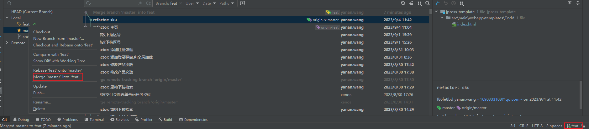

# 第一节、版本控制(Version control)

> 是维护工程蓝图的标准作法，能追踪工程蓝图从诞生一直到定案的过程；

- 版本控制在软件开发中，可以帮助程序员进行代码的追踪、维护、控制等等一系列的操作。

- coder 构建的gitlab：http://152.136.185.210:7888/users/sign_in

## 1、版本控制的作用 （4个）

> 一个项目会**不断进行版本的迭代**，来<u>修复之前的一些问题</u>、增加新的功能、需求，甚至包括**项目的重构**；


1. 重大版本的备份维护

   > 对于很多重大的版本，我们会进行备份管理

   

2. 版本恢复

   > 开发过程中发生一些严重的问题时，想要恢复之前的操作或者回到之前某个版本

   

3. bug 修复记录

   > 每一个功能的修改、bug的修复、新的需求更改都需要记录下来，版本控制可以很好的解决

   

4. 多人开发的代码合并

   > 项目中通常都是多人开发，将多人代码进行合并，并且在出现冲突时更好的进行处理；


## 2、版本控制的历史

- 在早期的时候是没有版本控制的

  > 人们通常通过文件备份的方式来进行管理，再通过diff命令来对比两个文件的差异

  

- CVS（Concurrent Versions System）

  - 第一个被大规模使用的版本控制工具，诞生于1985年；

  - 由荷兰阿姆斯特丹VU大学的Dick Grune教授实现的，也算是SVN的前身（SVN的出现就是为了取代CVS的）。

    

- SVN（Subversion）

  - 因其命令行工具名为svn因此通常被简称为SVN；

  - SVN由CollabNet公司于2000年资助并发起开发，目的是取代CVS，对CVS进行了很多的优化；

  - SVN和CVS一样，也属于集中式版本控制工具；

  - SVN在早期公司开发中使用率非常高，但是目前已经被Git取代

    

- Git（Linus的作品）

  - 早期的时候，Linux社区使用的是BitKeeper来进行版本控制；
  - 但是因为一些原因，BitKeeper想要收回对Linux社区的免费授权；
  - 于是Linus用了大概一周的时间，开发了Git用来取代BitKeeper；
  - Linus完成了Git的核心设计，在之后Linus功成身退，将Git交由另外一个Git的主要贡献者Junio C Hamano来维护；


## 3、集中式版本控制

> CVS和SVN都是是属于集中式版本控制系统（Centralized Version Control Systems，简称 CVCS）

### 特点

- 单一的集中管理的服务器，保存所有文件的修订版本
- 协同开发人员通过客户端连接到这台服务器，取出最新的文件或者提交更新；


### 优势

- 每个人都可以在一定程度上看到项目中的其他人正在做些什么。


### 缺点

> 但是集中式版本控制也有一个核心的问题：中央服务器不能出现故障：

- 如果宕机一小时，那么在这一小时内，谁都无法提交更新，也就无法协同工作；
- 如果中心数据库所在的磁盘发生损坏，又没有做恰当备份，毫无疑问你将丢失所有数据；


## 4、分布式版本控制

> Git是属于分布式版本控制系统（Distributed Version Control System，简称 DVCS）


### 特点

- 客户端并**不是只提取最新版本的文件快照**， 而是**把代码仓库完整地镜像下来，包括完整的历史记录**

  > 这么一来，任何一处协同工作用的服务器发生故障，事后都可以用任何一个镜像出来的本地仓库恢复；

  - 每 `clone` 下来的都是一个**完整的仓库镜像**， 实际上都是一次**对代码仓库的完整备份**，可以通过 `pull` **推送到任何一台与其建立联系的 `git` 服务器**
  - 镜像（Mirroring）是一种文件存储形式，是冗余的一种类型，**一个磁盘上的数据在另一个磁盘上存在一个完全相同的副本**即为镜像


# 第二节、git 安装配置


## 1、Git Bash工具 （了解）

> Git Bash 就是一个 shell，是 Windows 下的命令行工具，可以执行 Linux 命令；

- Git Bash 是基于 CMD 的，在 **CMD 的基础上增添一些新的命令与功能**

  > 简单说，就是可以让window 电脑上能使用linux上的 shell。方便一点主要看个人习惯


- Git CMD

  > 命令行提示符（CMD）是 Windows 操作系统上的命令行解释程序；

  

- Git GUI

  - 基本上针对那些不喜欢黑屏（即命令行）编码的人；
  - 它提供了一个图形用户界面来运行 git 命令；

## 2、Git 安装

> `CentOS 8` 上安装 `Git`

- 我们将使用开源包管理器工具 `DNF`，它代表 `Dandified YUM` 是 `Yellowdog Updater` 的下一代版本，`Modified`（即 `yum`）。`DNF` 是一个包管理器，现在是 `CentOS` 等基于 `Red Hat` 的 `Linux` 系统的默认包管理器。它将允许您在服务器上安装、更新和删除软件包。

~~~shell
#更新dnf
sudo dnf update -y
#安装
sudo dnf install git -y
git --version
~~~


## 3、Git的配置

> 每台计算机上**只需要配置一次**，程序升级时**会保留配置信息**，你可以在**任何时候**再次通过运行命令来修改它们


### git config 

> Git 自带一个 git config 的工具来帮助设置控制 Git 外观和行为的配置变量


- `/etc/gitconfig` 文件: 管理员
  - 如果在执行 git config 时带上 --system 选项，那么它就会读写该文件中的配置变量；
  - 由于它是**系统配置文件**，因此你需要**管理员** 或 超级用户权限来修改它。（开发中通常不修改）
  - 相当于该这台计算机所有用户都会用同一个配置，所以一般不会修改


- `/.gitconfig` 或 `C://用户/yanan.wang/.gitconfig` 文件：**只针对当前用户**
  - 你可以传递 --global 选项让 Git 读写此文件，这会对你系统上 所有 的仓库生效；


- 当前使用**仓库的 Git 目录中的** config 文件（即 `.git/config`）：**针对该仓库**
  - 你可以传递 --local 选项让 Git 强制读写此文件，虽然默认情况下用的就是它；


### git config选项

> 安装Git后，要做的第一件事就是设置你的用户名和邮件地址。

- 作用：提交代码会**写入到每一次提交**，**会根据用户名和邮箱地址区分提交记录**。<u>提交之后不能修改</u>

- `git config --list` ：查看当前配置

  > 个人觉得就是查看当前的账户信息是否需要修改

- 修改用户名和邮箱地址

  ~~~shell
  #这里的字符串主要用于有的用户名中间会有空格
  git config --global user.name "levill"
  git config --global user.email "邮箱"
  ~~~

  - 也可以直接找到 .gitconfig 配置文件进行修改


### Git的别名（alias）

> Git 并不会在你输入部分命令时自动推断出你想要的命令：

- 可以通过 git config 文件来轻松地**为每一个命令设置一个别名。**来提高工作效率(我一般不会改) 

~~~bash
git config --global alias.co checkout
git config --global alias.br branck
git config --global alias.ci commit
git config --global alias.st status
~~~

- `git st` ： 查看当前仓库状态


# 第三节、git 使用

> Git来管理源代码，那么我们本地也需要有一个Git仓库。

1. 修改配置文件确认用户名邮箱
2. 初始化仓库

- **注意(重要)**：git 后续升级

  1. `master`**主分支名称**将要有可能变成`main`分支

  2. 将要使用 `switch` **代替** `checkout` 命令

     > 命令现在就可以使用


## 一、初始化本地仓库

1. git init 初始化本地仓库

2. git clone 克隆一个远程仓库到本地

   > `git clone https://github.com/coderwhy/hy-react-web-music.git`
   
   - `git clone -o booyah` 克隆地址的时候可以又该远程仓库链接的名字
   
     > 这样的话 远程地址就不会是默认的 origin 而是 booyah


- 将整个远程仓库clone下来
- 

### 1、工作区

就是你在电脑里能看到的目录。

### 2、暂存区

英文叫 stage 或 index。一般存放在 **.git** 目录下的 index 文件（.git/index）中，所以我们把暂存区有时也叫作索引（index）。

### 3、版本库

工作区有一个隐藏目录 **.git**，这个不算工作区，而是 Git 的版本库。

## 二、仓库中文件的状态


### 1、未跟踪

> 当初始化一个仓库的时候，所有 **新添加的文件** 都是未跟踪状态。

- Git 不会将未跟踪的文件添加到本地 `git` 仓库

- Git 也不会自动将之纳入跟踪范围

- 可以通过 `git add` 命令来指定所需的文件来进行追踪，然后执行 `git commit` ：

  

### 2、以跟踪

> 将新添加的文件 `git add newFile` 交由 `git` 管理，这样的话 `git` 会记录当前跟踪文件的，修改。

- 以下都是以跟踪状态


#### 2.1、添加staged 暂存区

> `git add` 其实是将文件添加到暂存区。**这时还没有提交到本地仓库**

- 如果已经跟踪了某一个文件，这个时候**修改了文件也需要 git add重新添加到暂存区中**；

- 问什么会有暂存区，如果没有暂存区的话每次修改都会直接提交到仓库

  > 如果修改了一段代码还不完善，这样的话可以先不放入暂存区。这样的话可以减少提交的次数，提高性能


- 命令；
  - `git add .`  :件文件夹下所有的文件进行跟踪放入暂存区
  - `git add newFile` ：添加指定文件到暂存器


#### 2.2、Unmodified：未修改状态

> `commit`命令，可以将 `staged` 中文件提交到本地Git仓库


- `git commit  -m [message]`  "每次提交的信息"

  > 会将暂存区中的所有文件提交到本地git仓库

  

- `git commit -a -m [message]` || `git commit -am [message]`"修改了bbb文件"

  - 如果修改文件的add操作，加上commit的操作有点繁琐，那么可以将两个命令结合来使用：

  > **修改文件之后，直接提交到git仓库**


#### 2.3、Modified：修改状态

> 修改了某个文件后，会处于Modified状态，需要重新添加到暂存区

- 最后**提交所有已暂存的修改**


### 3、检测文件的状态 - git status

> git status 可以用来查看当前仓库中所有文件的状态，跟踪，未跟踪修改。

- `git status`

  ~~~shell
  #当前分支为 master
  On branch master
  #没有将暂存修改为commit
  Changes not staged for commit:
  #使用 "git add <file>..." 更新，之后在commit
    (use "git add <file>..." to update what will be committed)
  #使用 "git restore <file>..." 抛弃这个文件
    (use "git restore <file>..." to discard changes in working directory)
          modified:   src/index.js
  
  no changes added to commit (use "git add" and/or "git commit -a")
  
  ~~~

- `git restore <file>...`：取消跟踪，从暂存区中抛弃

- `git status --short/-s`

  > 可以查看更加简洁的状态信息：

  ~~~shell
  #标识src/index.js 文件状态为 修改状态
  $ git status -s
   M src/index.js
  ~~~

  - 左栏指明了暂存区的状态，右栏指明了工作区的状态；


## 三、git忽略文件

> 有些文件不需要纳入 Git 的管理，也不希望它们总出现在未跟踪文件列表。 


- 通常会直接使用  `git add .` 命令将所有文件进行跟踪，不会一个一个的跟踪添加到暂存区里，这个时候很难忽略某一个文件
-  `.gitignore` 文件，列出要忽略的文件的模式，**Git会根据 `.gitignore` 忽略配置的文件**
- 在实际开发中，这个文件通常不需要手动创建，在必须的时候添加自己的忽略内容即可；
- 获取 `.gitignore` 。脚手架或者 `gitee` ，`github`上获取对应的模板


## 四、查看提交的历史 – git log

> 在提交了若干更新，又或者克隆了某个项目之后，有时候我们想要查看一下所有的历史提交记录。

- 会打印当前文件的 **提交时间**、 **校验和(commitId)**，**作者的名字和电子邮件地址以及提交说明**、 和当前所在版本和的分支，


### Git的校验和

> 这是一个由 40 个十六进制字符（0-9 和 a-f）组成的字符串，基于 Git 中文件的内容或目录结构计算出来

- Git 用以计算校验和的机制叫做 SHA-1 散列（hash，哈希）

  > 简单理解: **就是当前提交记录的一个 40位16进制的 id**

- Git 中所有的数据在存储前都计算校验和，然后以 校验和 来引用


### 打印日志

- `git log`

  > 不传入任何参数的默认情况下，git log 会按时间先后顺序列出所有的提交，**最近的更新排在最上面**


- `git log --pretty=oneline`

  > 该命令用来美化输出的日志 只会显示 commitId 和 comment(备注)

  ~~~shell
  $ git log --pretty=oneline
  0b0937b580a1497ae1875f1f744499c383b87a91 (HEAD -> master) 第一次提交
  ~~~

  

- `git log --pretty=oneline --graph` **(graph 是图的意思)**

  > 也是美化输出日志，在有多个分支或者 tag 的时候以图结构的形式来展示日志

  ~~~
  
  ~~~


## 五、版本回退 – git reset/revert

> 用于回退到，以前的某一个提交记录的节点。

- ***(重点记下)*** Git是通过HEAD指针记录***当前***版本。它**总是指向该分支**上的**最后一次提交**；
- 可以理解为，总是指向该分支上的**最后一次提交的快照；**


### 1、回退状态

- 没有add文件的情况下

1. 当你不需要保留当前工作区修改文件的时候直接hard
2. 保留则 `mixed`

|             | 本地版本库 | 暂存区                | 工作区                                                       |
| ----------- | ---------- | --------------------- | ------------------------------------------------------------ |
| soft        | 回退       | 保持                  | 保持所有，**仅仅移动版本库HEAD指针**，上次的提交还在，当你在次提交的时候容易出现提示`marge`的问题，所以通常用 `mixed` 或者 `hard` |
| mixed(常用) | 回退       | 回退(add的文件会清空) | 将提交之后的代码，回退到暂存区，本地提交之后的修改也会清空   |
| hard        | 回退       | 回退(add的文件会清空) | 完全回退，提交的代码**和**本地提交之后的修改也会清空         |
| keep        | 回退       | 保持                  | 仅回退提交的代码，本地提交之后的修改会保留                   |


### 2、git reset

>  **可以修改 head 来指向其他的快照**，来实现版本回退， **这里 head (注意这是头的意思，不是hard) 不区分大小写**


- `git reset --hard HEAD^`  ：表示回退到上一次提交记录

  - `HEAD^^`：表示回退到上上一次的提交记录，进行累加 `^`

  

- `git reset --hard HEAD~1000`

  - 也可以回退到当前指向的版本前**指定第几次提交的记录快照**、

  

- `git reset --hard 2d44982`

  - 可以以通过 `commitId` 回退到指定的记录版本，**注意：这里不指定head head**
  - 这里取前7为也可以。


- `git reflog`

  > 记录了所有的日志，包括修改，回退，

  - 可以使用 `git reflog` 查看 `commitId` 载使用 `git reset` 来恢复，已经被回退的版本
  
  - 会恢复，该记录下所有节点记录
  
    > 当`commit` 对象被 reset 之后就不会显示到 `log` 当中了,这样的话就获取不到 `commitId` 也就无法恢复
    >
    > - 但是在 `reflog` 中有 `reset` 的记录, 可以在`reflog` 记录当中获取 reset 的 `commitId`


### 3、git revert

- `git reset`是将HEAD 指针指向要回退的`commit`对象，**之前对应的提交记录是看不见的；**
- `git revert` ，会提交一个新的版本，将需要**revert的指定版本的内容再反向修改回去**，**版本会递增**，**不会影响**在你提交之后**其他人的提交**的内容，只撤销当前`commit`.


- ##### 命令：
  
  - `git revert commitId ` 返回版本库中已经存在的提交记录，默认情况下反做某条记录后会**产生一条新的记录。** 不影响上一次的提交
  
  - `git revert commitId -n`       通过`-n`参数可以避免再次产生一条提交记录
  
  - 撤销多个commit：如果你想撤销多个commit，你可以使用以下命令
  
    ~~~shell
    git revert <commit_hash1>..<commit_hash2>
    git revert 131b7a916560c549e598ca9c66c2a3d28c7508e9..7a5b4709656e614deab37eb19e355ba9e724eb
    ~~~
  
  - 使用交互式revert：如果你想在撤销多个commits时选择性地进行，你可以使用`-i`选项进入交互式模式
  
    ~~~shell
    git revert -i
    ~~~
  
    


# 第四节、git远程仓库

> 原始的代码是保存在**一个本地仓库中**，所以只是**在进行本地操作**。如果需要共享代码的话，**需要将本地代码共享到远程仓库**。


## 一、Git服务器

> 常见第三方Git服务器：比如`GitHub`、`Gitee`、`Gitlab`等等，或者自己在本地搭建一个`Gitlab` 服务器。**也是目前使用比较流行的 git 服务器**


- 远程仓库通常是搭建在某一个服务器上的（当然本地也可以，但是本地很难共享）
- 所以需要在Git服务器上搭建一个远程仓库；

- **提示：**一般公司的话，会在自己的云服务器上安装一个 `gitlab` 软件。来搭建 `git` 服务器
  - 据了解，gitlab 访问比较困难因为在国外所以采用这种方式
  - github，访问的话效果也不是很好。另外一般用于开源的软件
  - gitee，需要收费应该

  
  
- 安装gitlab服务器：**git官网 book 书中有安装流程**


## 二、远程仓库的验证

> 对于私有的仓库如果要进行操作，远程仓库会对我们的身份进行验证


- Git服务器验证手段主要有两种
  - 方式一：基于`HTTP`的凭证存储（Credential Storage）；
  - 方式二：基于`SSH`的密钥；


### 1、远程仓库的验证 – 凭证 http

> HTTP协议是无状态的连接，所以每一个连接都需要用户名和密码：


- 每次都这样操作，那么会非常麻烦，Git 拥有一个凭证系统可以解决这个问题

- `Git Crediential` 的选项

  - 选项一：**默认所有都不缓存**。 每一次连接都会询问你的用户名和密码；

  - 选项二：“cache” 模式会将凭证存放在内存中一段时间。 <u>密码永远不会被存储在磁盘中</u>，并且在**15分钟后从内存中清除**；

  - 选项三：“store” 模式会将凭证用**明文的形式**存放在磁盘中，并且永不过期（不推荐）；

  - 选项四：如果你使用的是 Mac，Git 还有一种 “osxkeychain” 模式，它会将凭证缓存到你系统用户的钥匙串中（加密的）；

  - 选项五：如果你使用的是 Windows，你可以安装一个叫做 “Git Credential Manager for Windows” 的辅助工具；

    > 可以在 https://github.com/Microsoft/Git-Credential-Manager-for-Windows 下载。
    >
    > 可以帮助存储指定账户密码不用每次验证。**该管理器存储密码是加密的**

- 删除凭证

  - 控制面板\用户帐户\凭据管理器 里进行查看删除。密码是加密的


### 2、远程仓库的验证 – SSH密钥

> Secure Shell（安全外壳协议，简称SSH）**是一种加密的网络传输协议**，<u>可在不安全的网络中为网络服务提供安全的传输环境。</u>

- window安装 Git 的时候会自动安装 ssh 工具，该程序包含于 MSysGit 软件包中。
- 在 Linux/macOS 系统中，ssh-keygen 随 SSH 软件包提供


- SSH以非对称加密实现身份验证。

  > 非对称加密其实就是，通过私钥和公钥的方式进行验证。

  - 其中一种方法是使用**自动生成的公钥-私钥**对来**简单地加密网络连接**，随后**使用密码认证进行登录；**
  - 另一种方法是人工生成一对公钥和私钥，通过生成的密钥进行认证，这样就**可以在不输入密码的情况下登录；**
  - 公钥需要**放在待访问的电脑之中(就是git服务器)**，而对应的**私钥需要由用户自行保管；**


- 创建对应的的私钥和公钥

  - `ssh-keygen -t ed25519 -C “your email"`
  - 早期经常时间的加密方式：`ssh-keygen -t rsa -b 2048 -C “your email"`

  

- 生成的密钥会放在**当前用户下 `.ssh` 文件夹下**

  - `.pub` 是公钥，个人理解应该是 `public` 的缩写


- **最后在git服务器上 ssh 配置对应的公钥**这样就可以不用每次访问都需要提供密码

  - **添加的 url 就是仓库克隆的url**

  


### 3. (重点)注意事项-远程分支(仔细阅读)

- **注意**：远程分支是也是一种分支结构：以 `<remoteOrigin>/<branch>` 的形式命名的

- **注意**：<u>以下所做的设置</u> **只会设置当前分支**，如果<u>新键分支的话需要重新设置</u>
- **注意**：使用 clone 的话默认的本地 branch 和远程 branch **名字是一至的，并且历史记录也是一至的，同时自动关联上流分支**
  - 因此 clone 的仓库不需要进行一下操作


#### 3.1、pull 首次拉取注意事项


##### pull 

> **pull 命令会默认在上流分支，进行拉取代码**。<u>git remote add origin 的时候只是关联了远程地址</u>，**需要手动的建立上流分支**


- **没有设置上流分支**：当**首次** `pull` 拉去远程代码的时候**由于没有对应的上流分支**， 因此需要添加完整的命令

  - 这里的**分支名要和远程分支一致。**

  ~~~shell
  git pull origin main  #拉取 origin 地址的 main分支 并且合并到当前的本地分支
  ~~~


- 要将这个**`origin/master` 分支设置为本地 `master` 主分支的上流分支**之后，在执行pull 会默认在上流分支进行获取，否则 `merge` 的时候本地没有远程分支的话，便**无法确认要将那个分支合并到 `master`。**

  > 由于每次都需要打完整的命令比较麻烦，可以通过设置上流分支的方式来进行拉取

  - 在设置远程分支为当前分支的上游分支时，确定fetch 将远程分支获取到了

  ~~~shell
  git branch --set-upstream-to=origin/main
  ~~~

  

- 错误信息

  - > There is no tracking information for the current branch.

    - > fatal: The current branch master has no upstream branch.
      > To push the current branch and set the remote as upstream, use

  > 报错提示：**没有将本地的分支与远程仓库的分支进行关联**


##### fetch：的流程


- 需要先将远程分支**进行 `fetch`** 或者 **完整的 `pull`** 命令 **将远程分支获取下来**，这样在输入完整的命令进行合并的时候 `merge` 就可以指定合并那个分支了

  ~~~shell
  git fetch
  git merge origin/master
  ~~~

  

- **注意**：通过 `fetch` 将远程分支获取下来，**会根据 `origin/master` 的格式命名**，在 `push` 之后 `git log --pretty=oneline` **是可见的**

  > 可以通过 git checkout master 检出的，**是一个真实的分支**

  - 所以拉取下来的远程分支 origin/main **分支和本地是不相交的，没有相同的base**
  - 因此需要执行 `--allow-unrelated-histories`

  

- 当 `git fetch` 在本地**创建好了和远程对应的分支。才可以进行 `merge` 合并**


##### merge 注意事项 2个

> merge 单独使用的时候需要手动指定需要合并的分支，但如果使用**pull合并的情况下merge 默认和并的时上流分支**

- **注意：merge完整的命令** =》因为 merge 的完整命令和 push 的完整命令是**有区别的**

  > 将fetch 下来的 origin/main 分支合并到当前 `git branch` 的分支， `origin/main` 是一个对应的名称

  ~~~
  git merge origin/main
  ~~~


- **注意：在首次执行的pull的时候** `merge` 合并代码且本地有提交记录的情况下，**git 2. 版本之后不允许合并与远程仓库无关的历史**

  > git 2.版本之后，**限制没有共同的 base(就是两个不相关的) 没有办法合并**。--allow-unrelated-histories

  - `fatal: refusing to merge unrelated histories` 
  
    > 拒绝与历史无关的合并
    
  - 需要手动设置，**允许(allow) 不相关(unrelated) 的历史(histories)**只需要执行一次
  
    ~~~shell
    git pull origin master --allow-unrelated-histories
    ~~~


#### 3.1、push


- **(重点注意-错误排查：)**：`git push origin master` **会被认为是 `git push origin master:master`。**

  > 因此当**远程分支和本地分支的名字不一致**的时候执行`git push origin master`会报错，**要使用完整写法**

  ~~~shell
   git push origin master:main
  ~~~

  

- (默认值) `simple: 2.0` 之后的默认值simple 没有对应得 分支得话会报错

  > 会默认推送到**和本地分支相同的名字**的 `origin` 远程上的 分支，**如果 origin 没有master分支会报错**

  ~~~shell
  git push origin master:master
  ~~~

  - 也可以 `git push origin master:main` (查下命令的意思，或者回看下视频)


- `upstream` 如果**本地的分支名 和 远程分支名不匹配**的话，可以**设置为上流分支**

  

  - 由于`push` 的 默认类型是 `simple` ，所以**只会推送到和本地分支名匹配的**远程分支，所以需要修改下 `push` 的类型
  
    
  
  ~~~shell
  #设置上流分支：git branch 表示的本地master(重点理解)，如果没有进行fetch 的话本地不会存在 origin/main 的远程代码
  git branch --set-upstream-to=origin/main
  
  #设置push 的默认值 为upstream
  git config push.default upstream
  ~~~
  
  
  
  - **注意设置的方式**：如果这样使用的 `--set-upstream` 会又创建一个新的 `origin/master` 分支
  
    ~~~shell
    git push --set-upstream origin master
    ~~~


- `current`

  > 会默认推送到**和本地分支相同的名字**的 origin 远程上的 分支，如果没有相同名字的分支会直接创建一个

  

- **设置方法**

  ~~~~shell
  git config push.default upstream/current
  ~~~~


## 三、管理远程服务器

> 当在**远程服务器上 clone 下来的项目，都会有自己关联的远程仓库。** 

- 所以也可以采用先创建远程仓库，在clone 下来的方式进行链接


### 1、查看远程仓库

- `git remote`

  > **返回关联 <u>远程地址(不是远程仓库的)</u> 的名字**，一般都叫 origin(源)，**用来确定是否有关联远程长裤**

- `git remote –v`

  > -v是—verbose的缩写(冗长的)**返回关联远程仓库的symbol 和 地址**，用来**查看仓库地址**

- **会列出所有的远程地址**


### 2、关联远程仓库

> 添加远程地址：我们也可以继续添加远程服务器（让本地的仓库和远程服务器仓库建立连接）：

- `git remote add  <shortname> <url>`

  - 例: `git remote add gitlab http://152.136.185.210:7888/coderwhy/gitremotedemo.git`

  - 可以指定远程链接的名字，**一般 `<shortname>` 默认叫 origin**

  - 这里不能省略  `<shortname> <url>`，之有 `clone` 的时候会 `<shotname>` 有默认值 origin

    

- **注意(重点下面还会提一边)：**这里如果添加多个远程地址的话需要手动指定 `<shortname>` **否则默认从origin中获取代码**；

  - `git fetch`
  - `git fetch origin`


### 3、移除修改远程仓库

- 重命名远程地址:  `git remote rename gitlab glab`
- 移除远程地址:  `git remote remove gitlab`


## 四、远程仓库的交互

- **关键字：origin ——这是 Git 给你克隆的仓库服务器的默认名字：**
  - 个人理解；可以将它当作为远程地址的标识
  - <u>因为 origin 可以代表整个地址的字符串</u>
  - `git remote` 查看


### 4.1、clone仓库

> 从远程仓库clone代码：**将存储库克隆到新创建的目录中**，会将.git文件克隆下来，**也就意味着建立了本地仓库**

- 如果使用 clone 命令克隆了一个仓库，**命令会自动将其添加为远程仓库并默认以 “origin” 为简写。**
- 例：git clone http://152.136.185.210:7888/coderwhy/gitremotedemo.git 


#### clone的流程

- 将整个仓库 clone 下来包括仓库文件夹
- 注意：克隆下来的项目是可以修改名字的。个人觉得关联的之后 .git 文件


### 4.2、推送到远程

> 将代码push到远程仓库：**将本地仓库的代码推送到远程仓库中；**

- 注意：默认情况下是将当前分支（比如master）push到origin远程仓库的

  > 就是默认会将**当前代码推送到 origin 远程地址的 master 主分支上**

  - `git push` ：默认
  - `git push origin master` ：指定**远程地址**和**分支 branch**


### 4.3、更新本地仓库

> 将远程仓库最新的代码，拉取到本地并进行合并。来实现更新本地仓库的代码


#### git fetch 获取远程代码

> 这个命令会访问远程仓库，从中拉取所有你还没有的数据。 执行完成后，你将会拥有那个远程仓库中所有分支的引用，可以随时合并或查看。

- 必须注意 **`git fetch` 命令只会将最新的数据下载到你的本地仓库**——它并**不会**自动合并或修改你当前的工作。
- **(重点)需要通过 `git merge` 来合并**


#### git pull 获取远程代码

> 运行 git pull 通常会从最初克隆的服务器上抓取数据并自动尝试合并到当前所在的分支。

- 简单来说：上面的两次操作有点繁琐，我们可以**通过一个命令来进行获取和 merge 操作**
- `git pull`  = `git fetch + git merge(rebase)`


# 第五节、Git标签（tag）

> 由于提交的记录会不断的增加，很难区分那个是稳定，重要的版本。可以使用tag 打上一个标签 做一个备份方便以后回退。

- 对于**重大、重要性的版本**通常会打上一个标签，进行记录、备份，
- 比较有代表性的，会使用这个功能来标记发布结点（ v1.0 、 v2.0 等等）；
- **(tag 和 brancj 的区别) **: 就是，brach会**根据每次的提交向后移动**，而 tag 不会


### 1、创建tag（7）

> Git 支持两种标签：轻量标签（lightweight）与附注标签（annotated）


#### 轻量标签（lightweight）

~~~shell
git tag v1.0.0
~~~


#### 附注标签（annotated）

> 附注标签：主要用来给标签添加一些注释，通过-a选项，并且通过-m添加额外信息。

~~~shell
git tag -a v1.0.1 -m "备注信息"
~~~


#### tag 上传

> 默认情况下，git push 命令并**不会传送标签到远程仓库服务器上**

- 在创建完标签后你必须显式地推送标签到共享服务器上，当其他人从仓库中克隆或拉取，他们也能得到你的那些标签；

  ~~~shell
  #推送指定标签
  git push orgin v1.0.0
  #推送全部标签
  git push orgin --tags
  ~~~

  

### 2、删除tag

#### 删除本地tag：

~~~shell
 git tag -d <tagname>
~~~


#### 删除远程tag：

~~~shell
git push <remote> –delete <tagname>
~~~


### 3、检出tag：

> 使用 git checkout 命令,查看某个标签所指向的文件版本。

~~~shell
git checkout v1.0.0
~~~

- 注意：这里只是一个标签不能在上面修改。如果修改的话要建立一个分支进行修改。

> 通常我们在检出tag的时候还会创建一个对应的分支（分支后续了解）；


# 第六节、git 提交原理


1. 当执行 `git add .` 的时候会进行 会将所有文件添加到本地仓库 .git 中的 objects 文件中通过40位的16进制hash算法生成的key前两位作为文件夹名称，剩下的添加到文件夹里面用做文件名生成一个文件。

   > 这个文件保存的就是使用add.添加的某一个以二进制保存的文件。 

   ~~~shell
   #可以使用cat-file 命令进行查看，这个命令只能查看 .git/object文件夹中的文件
   #465815 是包括文件夹名称的前6位的key，
   git cat-file -p 465815
   ~~~

   

2. 执行 `git commit -m ""`  的时候会新生成两个文件，一个是`commt`文件

   - 也是以key文件名的方式存储

   > 这个文件保存了，一个 `tree` 文件的`id`，作者信息 和邮箱信息

~~~
   

   
- 还有一个就是tree文件
   
> 而这个`tree`文件里记录着 当前 `commit` 命令提交的暂存区中 `add .` 添加的文件所有的 `key`
   
   ~~~shell

~~~

   

## 总结

### git保存文件的原理和结构

- **为什么叫暂缓区**：因为当执行 add 操作只会将文件**作为2进制文件添加到 本地仓库git当中**，这个时候 **没有**一个**体系或者机制来管理 **add添加的文件，所以是找不到这些文件的，**需要 `commit` 对象来将这些文件索引关联起来。**

  > 所以 add 添加文件到 .git 本地仓库的操作，叫做暂缓区。

  

- 通过这种方式<u>也实现了 commit 的提交的文件记录</u>，**通过 commit 对象 中 tree 保存的key，在找到tree文件里所有add添加的文件**，<u>这样就可以看到都提交了哪些文件</u>


[](https://imgtu.com/i/jsicM6)


### 提交记录的实现原理

> 就是通过最后一次提交对象中的 parent 来一步一步，找到所有之前提交的 `commit` 对象
>
> - 可以理解为每一个 `commit` 都是一个快照


- 在进行提交操作时，Git 会保存一个提交对象（commit object）

  > 该提交对象会包含一个指向暂存内容快照的指针；

  

- 该提交对象还包含了作者的**姓名**和**邮箱**、**提交时输入的信息、tree 的key**以及指向它的**父对象的指针；**


- **首次提交**产生的提交对象**没有父对象**，普通提交操作产生的提交对象有一个父对象；

  > **每一个父对象都指向上一次提交。**

  

- 而由**多个分支合并**产生的提交对象有**多个**父对象；


[](https://imgtu.com/i/jsiWZD)


# 第七节、git 分支

> `Git` 的分支，其实本质上**仅仅是**指向**提交对象的可变指针**

- `.git/logs/refs/heads/master`

  > 这个文件仅仅保存着最近提交对象的 `key` 索引，和邮箱、作者、备注。

- 就是搞了一个文件，指向最后的一次提交

  > 分支除非 `rebase` ，否则会永远执行最后一个 commit


### 分支的作用

> 在一个项目当中 **用于保存不同的代码，进行代码的隔离**，<u>以业务代码结构清晰的方式进行开发。</u>
>
> **不影响其他人的开发工作。**
>
> 且安全的


### 使用场景

- 在一个大的版本完成时，发布版本，打上一个`tag v1.0.0`；

  > 当一个发行版本完成的时候，**出现的bug。**但此时主分支正在开发新的功能，

  - 这个时候可以在 tag 上**新建一个修复分支 hotfix** ，来专门解决这个问题。

  - 修复之后在**合并到主分支上**，在打上一个标签 v1.0.1;

  - 已经合并的分支我们不再需要了，那么可以将其移除掉

    ~~~shell
    - git branch –d hotfix # 删除当前分支
    ~~~

    

- 或者在使用工作流的方式进行开发的情况下，使用不同的分支分别来记录不同的阶段的代码。


## 一、Git master分支


> Git 的 `master` 分支 **并不是**一个特殊分支,跟其它分支**完全没有区别**；
>
> - 之所以几乎每一个仓库都有 master 分支，是因为 `git init` 命令默认创建它，并且大多数人都懒得去改动它；


- Git 的默认分支名字是 `master`，在进行提交操作的时候，其实已经有一个**指向**最后**那个提交对象的 master 分支；**
- 注意：master 分支会在 **每次提交** 时<u>自动移动</u>到 **最新的 commit**；


[](https://imgtu.com/i/jsihIH)


## 二、Git创建分支

> 新建分支只是创建了一个可以移动的新的指针；


- (**注意**)：通过一个名为 **`HEAD` 的特殊指针**，来**决定**当前是在**哪个分支。**

  > head指向那个，就在那个分支

  - **初始化 git 本地仓库**的时候，是**没有 `master`** 分支的，需要 `commit` 之后会默认**根据`commit` 对象进行创建**

- 创建一个分支

  > 可以通过 **git checkout 检出到 testing 分支**，2.2x版本之后 可以使用swich -c 代替checkout -b

  ~~~shell
  git branch testing
  ~~~

  

  [](https://imgtu.com/i/jsiIJA)

  

- 切换分支

  ~~~shell
  git checkout testing
  ~~~

  

- 创建分支**同时切换**

  ~~~shell
  git checkout -b <new-branch-name> 
  ~~~

  


## 三、Git分支提交


- 当新建的了一个分支之后，在新建的分支开发提交的代码不会影响其他分支。

  > 相当于在原有代码的基础上、复制了一份代码，两份代码开发不同的功能不会相互影响


- 也可以切换回到 `master` 分支，继续开发


[](https://imgtu.com/i/jsiTzt)


## 四、分支的管理

### 4.1、查看和删除分支

- **(重点)删除分支的原理**：在删除分支的情况下 `reflog` 不会记录删除操作。

  - 并且也不会还原到删除分支之前

  > 原理：删除分支就是将该指针删除掉，删除之后，之前带该分支提交的 `commit` 对象就无法找到了，只能通过git自动回收。

  - 如果该分支合并的情况下，就不一样了，删除之后还有主分支的指针指向最新的 `commit` 对象，

  > 因此，合并分支之后，删除该分支，commit对象还是可见的


- 命令

  - git branch # 查看当前所有的分支

  - git branch –v # 同时查看最后一次提交

  - git branch --merged # 查看所有合并到当前分支的分支

  - git branch --no-merged # 查看所有没有合并到当前分支的分支

  - git branch –d hotfix # 删除当前分支

  - git branch –D hotfix # 强制删除某一个分支


### 4.2、远程分支的管理

> 当设置一个上流分支，其实就是将本地的master分支可以跟踪远程分支，这样git pull的时候默认拉取得就是上游分支


#### 操作一：推送分支到远程


> 公开分享一个分支时，需要将其 **推送** 到有写入权限的 **远程仓库**上；

- 就是共享分支的时候，需要将本地建好的分支推到远程上

  ~~~shell
  git push origin <branch>
  ~~~

- **注意：区分** `git push origin master:main` 命令

  > 这命令时 push 到指定的分支


#### 操作二(*)：跟踪远程分支

- 当**克隆一个仓库时**，它通常会**自动地创建**一个**跟踪  `origin/master` 的** `master` 分支；

  > 这样的话就pull的时候就会自动的，拉去当前所跟踪的远程分支，

  

- 也可以手动设置其他的跟踪分支

  > 执行之后如果本地分支名字和远程分支的名字不一致的情况下，会本地新建一个 branch ，这个分支会跟踪远程分支
  >
  > - 确认需不需要执行fetch获取远程分支

  ~~~shell
  git checkout --track origin/main
  ~~~

  

  

- 如果你尝试检出的分支 (a) 不存在且 (b) 刚好只有一个名字与之匹配的远程分支，**那么 Git 就会为你创建一个跟踪分支，对指定分支进行跟踪**；、

  ~~~shell
  git checkout --track <remote>/<branch>
  git checkout <branch>
  ~~~

  

- **重点注意事项**：这里要跟踪指定分支的话要确保，本地有这个分支。

  > 跟踪远程分支的话要，**先将远程分支fetch获取下来**之后才能跟踪。


#### 操作三：删除远程分支

> 可以运行带有 --delete 选项的 git push 命令来删除一个远程分支。

- `git push origin --delete <branch>`
- 其实就是移除了分支文件的指针而已。


## 五、Git 合并分支


### 1、Git merge

- `git mrege hotfix`

  > 将 `hotfix` 分支合并到当前所在的分支

  

- 分支合并解决冲突之后，**需要再次执行提交**

  > `git commit -m` "合并分支"，**提交之后**在当前分支上**会存在一个合并的提交记录**

  - **合并提交之后的 commit 对象会有两个 parent 对象**，分别指向两个分支

  

- 合并本地分支没有冲突的的话，也**会有一个合并记录，默认备注  Merge branch “合并的分支”**

  > **重点：会合并为一个新的提交对象**

- `webstorm` 也是同样，当前处于那个分支，就合并那个分支。

  > 当前所在分支在 `feat` ，将 `master` 合并到 `feat`



#### merge 提交的特点


1. 分支合并之后会有一个新的 commit 对象

2. 会以**图结构的方式保存 ** 两个分支**各自提交的历史记录**

   > 这个也是一个特点，通过 merge 合并的之后的**图结构分支记录**。会一直保持这个结构状态。

   

~~~js
* f6ef810fd2cf268c559ba2bed1fcd8f377b04f16 (tag: v1.0.0) 333
* 8ff2f736a7565c59bbbf769928a8e78e0c303483 222
* 8ca3da0cbe86b6f73f8dc9438f2c37381451765e (HEAD -> master) 666
*   3a43d08ef4b3d2e245fabd2399a9fbc7b7955f0f 合并hotfix分支
|\
| * dc51246d510071ab1dd557d5deadabe728fce4f9 (tag: v1.0.1) hot_fix_02
| * bcc1bdf0630aaebb5ba0178ac512fc4939aed29f hot_fix_01
* | e020887bc598661e2fd60bb09d5ad6165715613c 555  //这里*代表着主分支标记、意思就是当前分支也修改了主分支的文件
* | 09d5f4ca8a27240ff41eafc85a1c742a1956fd6d 444
|/
* f6ef810fd2cf268c559ba2bed1fcd8f377b04f16 (tag: v1.0.0) 333
* a5d93c1831ee481484ce6d70b3b31368a969f557 111
* f618a8a4b3774a80465d5b822938872236d44a45 初始化项目
~~~


[](https://imgtu.com/i/jsiXdg)


### 2、Git rebase(改变分支的base)

> 区别 merge 合并的分支，**rebase( 理解重新/重复设置 repeat base )** 会将合并之后的记录 **以线性结构来展示**

- 你可以使用 rebase 命令将提交到某一分支上的所有修改都移至另一分支上，就好像“重新播放”一样

- 就是将需要**合并的分支移到最前面**，rebase之后的结构

  > feature 是新建的分支，feature_01是提交对象，多个的话都会按照之前的commit 像后排

  
  
- 比如在**分支 feature 上执行rebase master**，那么**可以改变 feature 的base为master**,

  > 解释就是，将 feature 的基线修改为 master

[](https://imgtu.com/i/jsFpzq)


#### rebase的原理


- **总结：**重新rebase 就是将 **(需要合并的分支)feature分支剪掉**，**让(主分支)`master`分支当作自己的base。剪切到主分支的前面(上面)为最新的commit对象。每一个commit 对象都只有一个parent**

  - 要合并到主分支上的分支里**存在多条提交记录，会依序应用。**

  - **(重点理解)rebase之后master指针还是在 foo 需要再次 merge**

    > 这样合并分支的结构不在是图结构的而是线性的，这样历史记录会比较简洁


- **rebase有一条黄金法则**：**永远不要在主分支上使用rebase**。

  > 主分支使用 rebase 的话，会以 sub-branch(子分支) 为 base ，将该节点的主分支粘贴到 sub-branch分支的前面为最新的commit对象
  >
  > 会导致后面所有commit对象发生改变，在协同开发的时候容易出现问题。

  - **相当于将master 分支 重新设置基线到 feature 分支上**，等于在中间插入了

  

  [](https://imgtu.com/i/jsFkeU)


### 3、merge 和 rebase的区别


- rebase和merge是对Git历史的不同处理方法：

  - merge用于记录git的所有历史，那么分支的**历史错综复杂**，也全部记录下来；

    > 其实就是合并出来的结构不一样

  - rebase用于简化历史记录，将两个分支的历史简化，整个历史更加简洁；

    > commit对象提交记录结构为线性的，rebase完之后记得merge 将主线程指针移动到最前面


### 4、merge 指定的文件夹

```shell
# 只将feature/cherrby分支的 dist_origin 文件目录，合并到当前分支
git checkout feature/cherrby -- dist_origin/cherrby
```


### 5、解决冲突

1. merge 解决完冲突之后 **使用 add 在commit**
2. rebase 解决冲突之后
   - **`git rebase --abort` 会放弃合并**，回到rebase操作之前的状态，之前的提交的不会丢弃；
   - git rebase --skip 则会将引起冲突的commits丢弃掉（慎用！！）；
   - **`git rebase --continue` 合并冲突，结合"`git add` 文件"命令一起用与修复冲突**，提示开发者，一步一步地有没有解决冲突。（fix conflicts and then run “git rebase --continue”）


## 六、git的工作流 (git flow)


### 常见的工作流

- **master 作为主分支；**

  > 相当于 master 主分支当中，只有稳定的版本，相当于全部是tag

- **develop 作为开发分支**，并且**有稳定版本时**，<u>合并到master分支中</u>；

  > 负责提交一些小的功能。

- **topic 作为某一个**主题或者**尝试功能**或者**新特性**的**分支进行开发**，开发**完成后合并到develop分支中；**

  > 一些尝试开发的功能，**就是还不一能够实现的**。因为会不停的测试会有很多杂乱的提交记录，新建一个分支这样就不会和develop分支中的commit记录混入，不会有很乱的提交记录

  - 开发好直接合并到主分支当中，**这个分支如果没有意义的话是可以迅速移除掉的**。
  - 这里**不合并的话主分支当中**，是**看不见其他分支的提交记录**的。


[](https://imgtu.com/i/jsFEo4)


### 工作流2(了解)


- master：记录稳定版本

- hotfix：修复版本的分支

  > <u>修复之后</u>要**合并到 主分支之后更新版本**，还要**合并到 develop 分支**，因为还有进行后续的其他开发

- develop：开发分支

  > 稳定版本要**合并到 主分支** 创建标签

- feater：尝试功能，新特性功能

  > 和 [topic](####常见的工作流) 分支相同效果

- release：上线部署的版本的分支

  > 同样**合并**到**主分支记录稳定版本**，之后在**合并develop 进行后续的开发**


[](https://imgtu.com/i/jsFKQx)


# 第八节、常见的开源协议

- 一般使用的是开源协议是 MIT 麻省理工

  - 使用了框架原代码之后，加以修改进行开发的项目，可以当作闭源的项目。
  - 例如使用的vue框架 ，可以使用vue的名字进行促销

  

[](https://imgtu.com/i/jsFQOK)


# 第九节、常见命令总结

### 1、创建版本库

- `git clone <url>`
- `git init`


### 2、修改和提交

1. `git status`

   > 查看所有文件状态， `git status -s/short` 输出的信息比较简洁

2. `git diff`

   > 显示暂存区和上一次提交(commit)的差异:

   ~~~shell
   #这两个命令是相同的
   $ git diff --cached [file]
   #或
   $ git diff --staged [file]
   ~~~

   

3. `git add .`

4. `git add file`

5. `git restore <file>...`：

   > 取消跟踪，从暂存区中抛弃

6. `git mv <file>`

   > 文件名修改

7. `git rm <file>`

   > 删除文件

8. `git rm --cached <file>`

   > 停止文件跟踪但不删除

9. `git commit -m "commit message"`

10. `git commit --amend`

    > 修改最后一次提交，的commit ，通常用来修改commit 提交备

### 3、查看提交历史

- `git log`

- `git log -p <file>`

  > 查看指定文件的提交历史

- `git blame <file>`

  > **以列表的方式**查看文件指定的提交历史

### 4、撤销

1. `git reset --hard HEAD^`

   > 撤销提交，到上一个版本，也可以指定回退的提交对象。

2. `git checkout HEAD <file>`

   > 撤销为提交文件的修改内容

3. `git revert <commit>`

   > 撤销提交

### 5、分支与标签

1. `git branch`

   > 查看分支

2. `git checkout <branch/tag>`:  后面git升级之后可能要**使用 `switch` 代替 checkout**

   > 切换分支或者标签。

3. `git branch <new-branch>`

   > 创建分支

4. `git branch -d <branch>`

   > 删除分支

5. `git tag`

   > 查看所有标签

6. `git tag <tagname>`

   > 添加标签

7. `git tag -a <tagname> -m "tag message"`

   > 创建附注标签

8. `git tag -d <tagname>`

   > 删除标签
   
9. `git -m main`

   > 修改分支的名字

### 6、合并于rebase

- `git merge <branch-name>`

  > 将目标分支合并到当前分支

  

- `git rebase <branch-name>`

  > 重置 base，合并到最上面

  

### 7、远程操作

1. `git remote -v`

   > 查看远程分支

2. `git remote show <remote>`

   > 查看指定远程版本库(就是仓库)信息

3. `git remote add <remote-coustomName> <url>`

   > 添加远程仓库地址，进行关联

4.  `git remote rename gitlab glab`

   > 重命名远程地址: 

5.  `git remote remove gitlab`

   > 移除远程地址: 

6. `git fetch  <remote>`

   > **获取远程分支**，和**最新的代码**。

7. `git pull <remote> <branch>`

   > 拉取指定远程指定的分支

8. `git push <remote> <remote-branch>` 

   >默认为：**`git push origin master:master`**，远程分支不一致的时候需要完整命令

9. `git push --tags`

   > 上传全部标签
   
10. `git tag origin v1.0.0`

    > 上传指定标签

11. `git push <remote> –delete/-d <tagname>`

    > 删除指定分支，包括tags


### 8、git branch -M main

> 将 `git` 默认的 `master` 分支名字改为 `main` 分支，在 `github` 和 `gitlab` 上默认的远程分支就是 `main`


### 9、git stash 命令

1. `git stash`：保存

   > `git stash save` "备注信息"

2. `git stash list` : 查看储藏记录

3. `git status`：查看工作区

4. `git stash pop`: 取出并应用到工作区

   > n 弹出指定版本，不加n 弹出最近的版本

5. `git stash apply n`：指定版本

   > 先查看储藏记录，`git stash list` 查看储藏记录 n 表示 stash@{n}

   ~~~shell
   stash@{0}: WIP on design: f2c0c72... Adjust Password Recover Email
   stash@{1}: WIP on design: f2c0c72... Adjust Password Recover Email
   stash@{2}: WIP on design: eb65635... Email Adjust
   stash@{3}: WIP on design: eb65635... Email Adjust
   ~~~

6. `git *stash* drop` 命令可以清除指定的`*stash*`

7. `git *stash* clear` 命令可以清除所有的`*stash*`。


### 10、git cherry-pick 命令

> `git cherry-pick` 命令的作用，就是将指定的提交（commit）应用于其他分支。

[阮一峰](https://www.ruanyifeng.com/blog/2020/04/git-cherry-pick.html)

> ```bash
> $ git cherry-pick <commitHash>
> ```

上面命令就会将指定的提交`commitHash`，应用于当前分支。这会在当前分支产生一个新的提交，当然它们的哈希值会不一样。

举例来说，代码仓库有`master`和`feature`两个分支。

> ```bash
>     a - b - c - d   Master
>          \
>            e - f - g Feature
> ```

现在将提交`f`应用到`master`分支。

> ```bash
> # 切换到 master 分支
> $ git checkout master
> 
> # Cherry pick 操作
> $ git cherry-pick f
> ```

上面的操作完成以后，代码库就变成了下面的样子。

> ```bash
>     a - b - c - d - f   Master
>          \
>            e - f - g Feature
> ```

从上面可以看到，`master`分支的末尾增加了一个提交`f`。

`git cherry-pick`命令的参数，不一定是提交的哈希值，分支名也是可以的，表示转移该分支的最新提交。

> ```bash
> $ git cherry-pick feature
> ```

上面代码表示将`feature`分支的最近一次提交，转移到当前分支。
