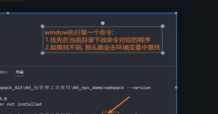

硬链接只能操作文件

path.resolve（）返回一个绝对路径 / 会被直接当成绝对路径 ./是相对路径 末尾的/会被移除，忽略稀疏参数

默认只对于.js文件做处理

ues中 调用顺序是从后向前的

~~~
module: {
test: //,
use: [
{loader: "css-loader"}
]
}
~~~

webpack5版本内置了图片处理的功能

webpack-cli 的作用

puglin ： 处理loader之外的所有功能，贯穿整个声命周期

304 缓存

devserve默认访问的时src中的index

修改笔记：webpack命令，context默认值 启动路径

merge

"C:\\ProgramData\\Microsoft\\Windows\\Start Menu\\Programs\\Git\\Git Bash"

记录中文乱码git

删除凭证 修改 控制面便用户账户

fetch 在仓库中没有合并到代码中昂

http://www.freenom.com/zh/index.html

1. git add
2. git add .
3. git add newFile
4. git commit -m'
5. gti commit -a -m
6. git log
7. git log --pretty=oneline --graph
8. git reflog
9. git reset --hard head^^
10. git reset --haed commitId
11. git remote add origin url
12. git remote 
13. git remote -v
14. git pull orgin master
15. git push origin master

问题：当函数隐式和显示原型都有对应的属性，会优先取那个

