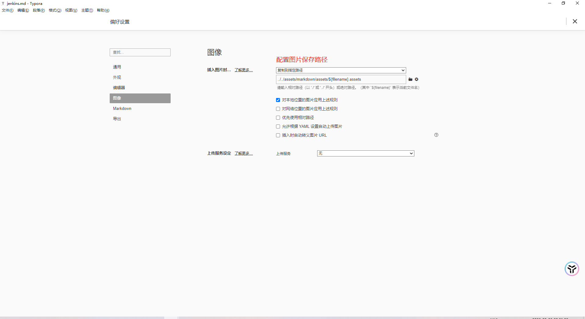

# vitepress规范

1. 如果使用 `{}`、`
`一律使用 `` 标记为代码块，否则不报错不显示
2. `{{}}` 尽量不要使用双括号，会被当作vue语法执行
3. 当 `vitepress` 使用 `miniSearch` 的时候不要出现 `node` 的全局变量 例如: "进程对象"
4. `vitepress` 使用 `miniSearch` 数据多先构建一次就可以正常使用了。

# Typora设置

- 项目图片路径配置，平时会用 `typora` 来修改，这样图片就能直接保存到项目中了

`*/assets/markdown/assets/${filename}.assets`

