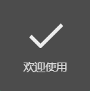
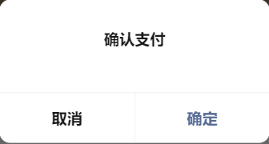
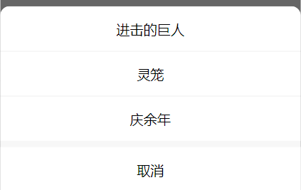
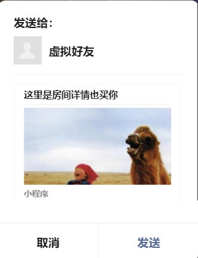

# 案例
::LabCard{title="Rocket" description="A super fast rocket animation" :showUsageTab=false :showCreditTab=true}

#preview
::Rocket
::

#codebase
::CodeView
```html
<template>
  <div
    class="py-12 relative overflow-hidden flex items-center justify-center"
    @mouseover="fast = true"
    @mouseleave="fast = false"
    :style="{ '--streak-speed': streakSpeed }"
  >
    <span class="rocket" :class="{ shake: fast, move: !fast }">
      <Icon name="ph:rocket-duotone" class="h-12 w-12 -rotate-90" />
    </span>
    <span
      v-for="n in 5"
      :key="n"
      :style="{
        top: Math.random() * 100 + '%',
        animationDelay: Math.random() * 1 + 's',
        animationDuration: streakSpeed,
      }"
      class="streak absolute left-0 w-1/5 h-0.5 bg-gradient-to-r from-transparent to-black/60"
    ></span>
  </div>
</template>

<script setup>
  import { ref, computed } from "vue";
  const fast = ref(false);
  const streakSpeed = computed(() => (fast.value ? "0.5s" : "2s"));
</script>

<style scoped>
  .rocket.move {
    animation: move 1s linear infinite;
  }

  .rocket.shake {
    animation: shake 0.5s linear infinite;
  }

  .streak {
    animation: streaks linear infinite;
    animation-duration: var(--streak-speed);
  }

  @keyframes move {
    0% {
      transform: translateY(0);
    }
    50% {
      transform: translateY(-10px);
    }
    100% {
      transform: translateY(0);
    }
  }

  @keyframes streaks {
    to {
      left: 100%;
    }
  }

  @keyframes shake {
    2% {
      transform: translate(2.5px, 1.5px) rotate(-0.5deg);
    }

    4% {
      transform: translate(2.5px, 0.5px) rotate(-0.5deg);
    }
    6% {
      transform: translate(2.5px, 0.5px) rotate(0.5deg);
    }
    8% {
      transform: translate(2.5px, 2.5px) rotate(1.5deg);
    }
    10% {
      transform: translate(1.5px, -1.5px) rotate(-0.5deg);
    }
    12% {
      transform: translate(-1.5px, 0.5px) rotate(0.5deg);
    }
    14% {
      transform: translate(0.5px, 1.5px) rotate(-0.5deg);
    }
    16% {
      transform: translate(-1.5px, 0.5px) rotate(0.5deg);
    }
    18% {
      transform: translate(1.5px, -1.5px) rotate(0.5deg);
    }
    20% {
      transform: translate(2.5px, 1.5px) rotate(-0.5deg);
    }
    22% {
      transform: translate(0.5px, -1.5px) rotate(1.5deg);
    }
    24% {
      transform: translate(0.5px, -0.5px) rotate(-0.5deg);
    }
    26% {
      transform: translate(0.5px, -1.5px) rotate(1.5deg);
    }
    28% {
      transform: translate(0.5px, 0.5px) rotate(0.5deg);
    }
    30% {
      transform: translate(2.5px, 0.5px) rotate(0.5deg);
    }
    32% {
      transform: translate(-0.5px, 0.5px) rotate(0.5deg);
    }
    34% {
      transform: translate(2.5px, 0.5px) rotate(-0.5deg);
    }
    36% {
      transform: translate(0.5px, 2.5px) rotate(0.5deg);
    }
    38% {
      transform: translate(-0.5px, 0.5px) rotate(-0.5deg);
    }
    40% {
      transform: translate(-1.5px, 1.5px) rotate(-0.5deg);
    }
    42% {
      transform: translate(1.5px, 2.5px) rotate(-0.5deg);
    }
    44% {
      transform: translate(-0.5px, 0.5px) rotate(-0.5deg);
    }
    46% {
      transform: translate(2.5px, 1.5px) rotate(-0.5deg);
    }
    48% {
      transform: translate(-1.5px, 2.5px) rotate(1.5deg);
    }
    50% {
      transform: translate(-0.5px, -1.5px) rotate(-0.5deg);
    }
    52% {
      transform: translate(-1.5px, 1.5px) rotate(1.5deg);
    }
    54% {
      transform: translate(-1.5px, -1.5px) rotate(-0.5deg);
    }
    56% {
      transform: translate(2.5px, 1.5px) rotate(0.5deg);
    }
    58% {
      transform: translate(-1.5px, -1.5px) rotate(0.5deg);
    }
    60% {
      transform: translate(1.5px, 0.5px) rotate(0.5deg);
    }
    62% {
      transform: translate(-0.5px, -1.5px) rotate(1.5deg);
    }
    64% {
      transform: translate(0.5px, 1.5px) rotate(-0.5deg);
    }
    66% {
      transform: translate(-0.5px, 2.5px) rotate(0.5deg);
    }
    68% {
      transform: translate(2.5px, 2.5px) rotate(1.5deg);
    }
    70% {
      transform: translate(1.5px, -1.5px) rotate(0.5deg);
    }
    72% {
      transform: translate(0.5px, 2.5px) rotate(-0.5deg);
    }
    74% {
      transform: translate(0.5px, -1.5px) rotate(1.5deg);
    }
    76% {
      transform: translate(-0.5px, 0.5px) rotate(0.5deg);
    }
    78% {
      transform: translate(1.5px, -0.5px) rotate(0.5deg);
    }
    80% {
      transform: translate(-0.5px, 2.5px) rotate(-0.5deg);
    }
    82% {
      transform: translate(-1.5px, 0.5px) rotate(1.5deg);
    }
    84% {
      transform: translate(-1.5px, 2.5px) rotate(-0.5deg);
    }
    86% {
      transform: translate(1.5px, -0.5px) rotate(0.5deg);
    }
    88% {
      transform: translate(-1.5px, 0.5px) rotate(0.5deg);
    }
    90% {
      transform: translate(0.5px, 0.5px) rotate(0.5deg);
    }
    92% {
      transform: translate(0.5px, -1.5px) rotate(-0.5deg);
    }
    94% {
      transform: translate(0.5px, 0.5px) rotate(-0.5deg);
    }
    96% {
      transform: translate(2.5px, 2.5px) rotate(1.5deg);
    }
    98% {
      transform: translate(1.5px, 2.5px) rotate(0.5deg);
    }
    0%,
    100% {
      transform: translate(0, 0) rotate(0);
    }
  }
</style>
```
::

#credit
::Credit{link="https://loops.so?ref=fayazahmed.com" label="The hover animation on loops.so"}
::
::


# 第一节、小程序介绍

> 小程序（Mini Program）是一种不需要下载安装即可使用的应用，它实现了“触手可及”的梦想，使用起来方便快捷，用完即走。

- 常见的小程序

  > 微信小程序、支付宝小程序、淘宝小程序、抖音小程序、头条小程序、QQ小程序、美团小程序等等


## 一、小程序核心技术

- 页面布局：WXML，类似HTML；

- 页面样式：WXSS，几乎就是CSS(某些不支持，某些进行了增强，但是基本是一致的) ；
- 页面脚本：JavaScript+WXS(WeixinScript) ；
- wxs


## 二、各个平台小程序的时间线

- 2017年1月 微信小程序上线，依附于微信App；
- 2018年7月 百度小程序上线，依附于百度App；
- 2018年9月 支付宝程序线，依附于支付宝App；
- 2018年10月 抖音小程序上线，依附于抖音App；
- 2018年11月 头条小程序上线，依附于头条App；
- 2019年5月 QQ小程序上线，依附于QQApp；
- 2019年10月 美团小程序上线，依附于美团App；


## 三、开发小程序的技术选型

- 微信小程序：https://developers.weixin.qq.com/miniprogram/dev/framework/
  主要技术包括：WXML、WXSS、JavaScript；
- 支付宝小程序：https://opendocs.alipay.com/mini/developer
  主要技术包括：AXML、ACSS、JavaScript；


- 小程序开发框架

    - mpvue：18年就不在维护了
    - wepy：腾讯开发的，用的也比较少


- `uni-app`、

  > 由DCloud团队开发和维护,使用vue开发的多端适配的方案

- `taro`

  > 京东团队开发和维护的，Taro3.x之后，支持Vue3、React Hook写法等，也是可以多端适配的

    - 但是适配移动端的时候，只能转换为 RN，之后在转换为原生的，

# 第二节、小程序的配置文件(重点)

- [project.config.json](https://developers.weixin.qq.com/miniprogram/dev/devtools/projectconfig.html)：项目配置文件, 比如项目名称、appid等；

  > 在文档的工具页面，记录项目信息，appid、也可以直接在开发工具中进行配置，只不过应该是配置到private 中

- [sitemap.json](https://developers.weixin.qq.com/miniprogram/dev/framework/sitemap.html)：小程序搜索相关的；


### 1、**app.json：全局配置(重点记配置项)；**

| **属性**                                                     | **类型** | **必填** | **描述**            |
| ------------------------------------------------------------ | -------- | -------- | ------------------- |
| [pages](https://developers.weixin.qq.com/miniprogram/dev/reference/configuration/app.html) | String[] | 是       | 页面路径列表        |
| [window](https://developers.weixin.qq.com/miniprogram/dev/reference/configuration/app.html) | Object   | 否       | 全局的默认窗口表现  |
| [tabBar](https://developers.weixin.qq.com/miniprogram/dev/reference/configuration/app.html) | Object   | 否       | 底部 tab   栏的表现 |

- `pages`: 页面路径列表

  > 用于指定小程序由哪些页面组成，每一项都对应一个页面的 路径（含文件名） 信息。
  > 小程序中所有的页面都是必须在pages中进行注册的。
  >
  > 出现在**第一个索引位置**的页面路径对应的页面会**优先显示**

- `window`: 全局的默认窗口展示

  > 用户指定窗口如何展示, 其中还包含了很多其他的属性

```json
  "window": {
      "navigationBarTitleText": "Demo"
    }
```


- `tabBar`: 顶部tab栏的展示

  > 具体属性稍后我们进行演示


### 2、page.json：页面配置；

~~~js
{
    //注册将要使用的组件
  "usingComponents": {},
      //当前页面的标题
  "navigationBarTitleText": "zhangsan",
      //下拉刷新开启
  "enablePullDownRefresh": true, //onPullDownRefresh 对应事件
      //下拉刷新的loading背景
  "backgroundTextStyle": "dark"，
  	  //默认值是50，默认开启距离底部距离50 的时候会触发回调
  "onReachBottomDistance": 50  //对应事件onReachBottom

  
}
~~~


- 指定事件关闭下拉刷新

```js
    onPullDownRefresh() {
      console.log("刷新完成");
      setTimeout(() => {
        wx.stopPullDownRefresh()
      }, 200)
    }
```


### 3、url 资源导入总结

- ##### 不已 `/` 开头的配置：

    - `app.json` 中的 `pages`

    - `tabbar list` 中定义的 url，开头不添加 `/` ,

    - 模块化导入

      > 不支持 `/` 要使用相对路径导入，也不会自动找 `index.js` 文件


- ##### `/`开头的配置：

    - 路径进行**跳转页面**路径必须要使用 `/`
    - **引入Component** 的时候可以使用开头 `/`
    - **图片**可以用 `/` 开头
    - **`wxs` 资源**都可以使用 `/` 开头的方式在，根路径查找资源

# 第三节、和 vue 架构快速对比进行使用

- 提示：在小程序中，大多数Api 都是传入一个 options 对象
- 架构的不同，vue中使用的是**模块化和路由 `history` 进行异步模块的切换**，而小程序**同web页面相似**，<u>页面和组件是区分开的</u>

## 一、运行流程机制

1. 注册小程序，app实例 App({})，
2. 路径页面**跳转开头需要添加 `/`**，中文路径会报错，但是在 `app.json` 中配置的路径开头就不需要在开头添加 /
3. **默认tabbar切换 是有缓存的**，但是其他页面则不会默认缓存，这个是机制，其他页面同 web **页面history 表现相同**，默认导航栏的返回的表现像是直接web 页面直接关闭了一样，不会back()


### 小程序的双线程模型

> 当小程序**基于 WebView 环境**下时，WebView 的 JS 逻辑、DOM 树创建、CSS 解析、样式计算、Layout、Paint (Composite) 都发生在同一线程，**简单来说：在 WebView 上执行过多的 JS 逻辑可能阻塞渲染，导致界面卡顿。**

- 以此为前提，小程序同时**考虑了性能与安全**，采用了目前称为**「双线程模型」**的架构。
- 渲染线程：WXML模块和**WXSS样式运行于 渲染层**，渲染层使用WebView线程渲染（一个程序有**多个页面**，会使用**多个WebView的线程**）
- JS脚本（app.js/home.js等）运行于 逻辑层，**逻辑层使用JsCore运行JS脚本。**
- 这两个线程都会经由微信客户端（Native）进行中转交互。
- 目前添加了新的渲染引擎 skyline 但是目前还处于beta 阶段

## 二、注册小程序和Page

> 注册小程序。**接受一个 Object 参数**，其指定小程序的生命周期回调等

- `App()` **必须在 app.js 中调用**，必须调用且**只能调用一次**。不然会出现无法预期的后果。

### 1、App 函数

> 不同于vue ，在微信的sdk 中包含了全局注册 App 的函数，

- 小程序，会有**全局的api 和 对象**

- **特点**：开发者可以添**加任意的函数或数据变量**到 Object 参数中，**用 this 可以访问**

  > 小程序提供了一个全局的api 方法 **`getApp`，可以直接获取App实例对象**，之后可以直接访问实例中的属性和方法。
  >
  > 注意：通过 getApp() 获取实例之后，**不要私自调用生命周期函数。**

- 由于App()实例只有一个，并且是全局共享的（单例对象），所以我们可以将一些共享数据放在这里；

  > 注意：这里app实例中的数据属性**并不是响应式的。**

    - 通常定义全局属性定义的规范就是 `globalData` 对象


#### App生命周期和全局变量
App[生命周期](https://developers.weixin.qq.com/miniprogram/dev/reference/api/App.html)和全局变量
1. onLaunch

   > 小程序初始化的时候进行回调，**只会在创建的时候调用一次**

- 在**事件对象**当中，可以通过 `sence` 编号进行**判断小程序的[进入场景](https://developers.weixin.qq.com/miniprogram/dev/reference/scene-list.html
  )**，由于 `onlaunch` 方法只会调用一次，可以根据需取，也可以选择在 `onshow` 程序切换到前台的时候进行处理。

  > 例：是扫码进入的还是，转发进入的

- 通常会在这个生命周期函数当中**进行登录操作**，或者**读取本地数据(storage) token**，在或者**请求数据**

2. onShow

   > 小程序切换到前台(打开小程序)的时候进行回调，


3. onHide

   > 小程序切换到后台(小程序关闭但是**还处于热重载阶段**)的时候进行回调。

4. 其他生命周期，未处理Promise rejected状态的事件回调，监听系统主题(微信主题)


~~~js
// app.js
App({
  onLaunch (options) {
    // Do something initial when launch.
  },
  onShow (options) {
    // Do something when show.
  },
  onHide () {
    // Do something when hide.
  },
  onError (msg) {
    console.log(msg)
  },
  globalData: 'I am global data'
})
// 使用的时候，const app = getApp()
const appInstance = getApp()
console.log(appInstance.globalData) // I am global data
~~~

### 2、Page 函数

> 小程序当中，创建页面实例，使用过全局Api Page 函数进行创建

- 参数也同样是 options 对象

- page 创建之后常见的操作
    1. 在生命周期函数中**发送网络请**求，从服务器获取数据；
    2. **初始化一些数据**，以方便被wxml引用展示；
    3. **监听wxml中的事件**，绑定对应的事件函数；
    4. 其他一些监听（比如**页面滚动、上拉刷新、下拉加载**更多等）；


#### Page生命周期(重点理解下)

> 小程序采用的是双线程模型

1. 在创建Page 的时候，view Thread 和 appServe 会进行初始化创建**相互进行等待**

2. appServe 也会**等待 viewThread 通知**，view Thread 初始化会通知 appServe 发送数据，**等待数据的返回，同时**

   > 这时 onLoad 和 onShow 会在 appServe 响应数据前进行执行

3. 之后在 view Thread **首次进行渲染之后**会通知 appServe 进行调用 onReady 函数。

- 之后就是数据的交互，appServe 发送需要渲染的数据给 view Thread 进行渲染
- 剩下的就是后台 onhide 和 onshow onUnload


#### Page 的生命周期回调

> 按照调用的先后顺序排列

- ##### onLoad

  > 页面进行加载的时候进行调用，**仅调用一次。**

- ##### onShow

  > 页面进行切换的时候就会调用，可以调用多次，**会在页面渲染前调用**

- ##### onReady

  > 页面首次渲染的时候进行调用，**仅在首次渲染的时候调用一次**

- ##### onHide

  > 页面切换其他页面的时候会进行调用，会**在卸载前进行调用**

- ##### onUnload

  > 页面卸载的时候会进行调用

- ##### onResize

  > 页面大小改变的时候被调用


#### Page option 其他Api

- 上拉和下拉的监听

    - 默认下拉在 json 文件中手动开启，`enablePullDownRefresh：true`，**下拉时会自动回调`onPullDownRefresh()`**


- 上拉默认是开启的距离的50；可以**手动设置下拉距离底部的距离 number类型** 在json 文件配置 `onReachBottomDistance`，**到达指定距离的时候会自动调用`onReachBottom()`** 事件

## 三、内置组件

> 小程序中显示元素的标签称之为组件

- 且大小写敏感


1. ##### div 对应 view

   > view 会有 `hover-class` 属性 ，点击的时候会触发，松开的时候会取消


2. ##### span 对应 text

   > - text 组件 显示的文本**默认是不能选中的**，需要被选中，需要添加 **`user-selec`t 布尔属性**
   > - 默认也是**不能显示字符实体**的，需要单独设置 **`decode` 布尔属性**


3. ##### block 对应 template

   > 同样不会渲染标签


4. ##### img 对应 image

   > **默认宽度 320x240**，<u>由于不能设置 auto，所以会有对应的 mode 可以配置</u>


- `widthFix`：会固定width为默认大小(320px)，**height自适应**

  > 同理 heightFix 一样，高度默认大小(240px)，**宽度自适应**


- `aspectFill`  等比例，屏幕比例

  > 等比例填充，水平方向会等比例填充，垂直方向会进行裁剪 同**背景cover相似效果 不过cover 是纵向和水平都会填充，并且超出部分裁剪**


- `aspectFit`

  > 合适填充，在**保证等比例的情况下进行缩放**，图片会变小，知道全部显示到固定大小的image 当中。**同背景 contain 相似等比例缩放	**


- `bindload` 事件

  > 该事件会在**图片加载完成**之后会进行调用


5. ##### scroll-view

- 注意：`scroll-view`要有高度**不能**被内容撑起来，宽度默认占满整行的

- **要设置 scroll-x 属性**

- 新版本设置flex 的话 ，要手**动开启一下添加 `enable-flex` 属性**, 才可以使用 flex 布局

- 常见事件

  > 具体看官方文档 [组件]

    1. 滚动事件 scrollTop 存在event 对象当中
    2. 滚动到边界的事件
    3. 设置上拉阈值，下拉开启

  ```html
    <!--关键是enable-flex 和 scroll-x 这两个布尔属性-->
    <scroll-view class="box" enable-flex scroll-x>
      <view class="item"></view>
      <view class="item"></view>
      <view class="item"></view>
      <view class="item"></view>
    </scroll-view>
  ```


- **注意**：`refresher-enabled` 开启下拉刷新，的时候一定要 将监听函数`bindrefresherrefresh="bindrefresherrefresh"` 放到后面


6. ##### button

   > 默认是 block ,设置了 size 之后就是 inlin-block 了

- **获取手机号**：`open-type: "getPhoneNumber"` 属性可以获取手机号，但是要是企业的小程序个人的获取不了

  > 获取用户手机号，**可以从 `bindgetphonenumber` 回调中获取到用户信息**，具体说明 （*小程序插件中不能使用*）

- **转发**：可以进行转发 share 具体查看官方文档

- **获取用户信息**：之前的 getUserInfo 已经被调整了 获取不到用户的信息了，这里**使用 `wx.getUserProfile` Api 进行获取**

  > 参数同样也是 options 对象，有个**必填选项，desc**：传入获取用户信息的用途，**支持Promise**

- 经过测试，应该不能在生命周期函数中进行调用


7. ##### model:value 对应 v-model

   > 自定义组件 和 input组件，也支持了双向绑定，**简易双向绑定。**

- 为什么说是简易绑定呢，因为不同于vue小程序**不存在单项数据流**，直接在子组件改即可。

 ```html
     <input model:value="{{val}}" />
     <view class="box">
       <text>{{val}}</text>
     </view>
 ```

- **注意**：

    - 小程序当中的 `input`，很小很容看不清(**应该说不点根本看不清**)

    - 在 <u>input 组件中使用简易双向绑定</u>的时候，**一定绑定 `bindinput` 事件**

      > **否则会报错** `Do not have userInput handler in component`

## 四、模板语法


### 1、列表渲染

- `v-for` 对应 `wx:for = {{list}}` ，**会将 list 中的元素自动塞到子组件的 `item` 里**，不需要 `item in list`。


- 如果**循环的是对象的话 item 保存的就是 value，index 保存的就是 key**


- **必须要添加 key 值** ，这里想要在 `key` 表示 `item` 需要 `wx:key="*this"` 这样写，绑定 index 就需要使用 `mustache`了

```html
  <view wx:for="{{50}}" wx:key="*this">{{item}}-{{index}}</view>
```


- 设置 `key` 的时候 **`item` 是对象的情况下**，绑定 `*this` 会将 `item` 转换成字符串 `[Object Object]` 这样就不是唯一的了，


- `wx:key` **不需要**使用 `mustache` 语法进行绑定，**直接声明 item 当中变量的标识符即可**，语法如此


- **元素变量重命名**，`wx:for-item="book"` , `wx:for-index="idx"`


### 2、数据绑定mustache

- **除了 wx:key 和 事件绑定函数**，小程序的**绑定数据都只能使用 `mustache` 语法**。

- ##### 双向绑定警告

  > `input` 双向绑定的时候会报警告

    - 给 `input` **绑定**一个 `input` **事件**即可


### 3、条件渲染

- **`wx:if` ：**对应  `v-if` , `wx:else` 对应 `v-else` ，主要记下 **`v-else-if` 对应的时 `wx:elif`** 且绑定方式是 `mustache` 语法绑定

```html
  <block wx:if="{{ownSongMenu.length}}" wx:for="{{ownSongMenu}}" wx:key="_id">
```


- **v-show：**没有 `v-show` 对应的指令，可以**使用 `hidden` 进行代替**

```html
  <view hidden={{true}}></view>
```

## 五、事件绑定

- 点击事件 v-on 对应 bind:tap 可以省略 : bindtap = ""

- ##### 特殊事件

    - 比如 `input` 有 `bindinput`/ `bindblur` / `bindfocus`等
    - 比如 `scroll-view` 有 `bindscrolltowpper` / `bindscrolltolower` 等


### 1、小程序中获取参数及事件对象

> 小程序进行**事件绑定**的时候，**不可以传入参数**，只能使用 `data-*` 或者 `mark` ，**配合事件对象进行获取**

- `data-*` 就不多解释了，直接在事件对象当中的 `dataSet` 中进行获取

  > **注意**： 这里 `data_*`  如果是大写的，也会**自动转换为小**写的变量，可能是 `Html` 不区分大小写


- `mark`：基础库 `2.7.1` 新增的

  > 当一个元素发生事件的时候，会将事件传播的路径中所经过的元素集合中 mark 属性，
  >
  > 都会**封装到 event 对象当中的 mark 属性，以对象的形式保存**

```html
    <view mark:bar="lisi" class="bar">
      <!--事件发生之后 bar 和 item 都会封装到 trigger的event.mark对象中-->
      <view mark:item="zhangsan" class="item" bindtap="trigger"></view>
    </view>
```


- 其他 `event` 事件属性

    - `timeStamp`: integer 生成事件的事件
    - `type`：事件类型
    - `target`：点击的元素
    - `currentTarget`：绑定的元素


### 2、小程序中事件流-捕获and冒泡

> 在程序中，事件的冒泡和捕获是通过，**不同**的组件方法进行**事件绑定**决定的。

- **默认事件冒泡**：使用 `bind*` 进行事件绑定

  > 这样绑定的事件发出的事件流，就是以冒泡的形式

- **事件捕获**：使用 `capture-bind*` 进行事件绑定

  > 同理这样产生的事件流，就是以捕获的形式


### 3、阻止冒泡和阻止事件传递

- `capture-catch` ：阻止事件传递，

  > `capture-catch` 进行绑定的事件**不会向内部进行传递**

```html
    <!--这样的话，btn 发生事件的时候 '直接捕获了'，这样只会触发 btn 函数-->
    <view capture-catch:tap="btn" mark:bar="lisi" class="bar">
      <view mark:item="zhangsan" class="item" bindtap="trigger"></view>
    </view>
```


- `catchtap` ：阻止事件冒泡

  > `catchtap` 绑定的事件**不会进行冒泡**

```html
    <view class="main" bindtap="btn" data-main="main">
      <view class="center" data-center="center">
          <!--在绑定sss事件触发时候进行阻止事件冒泡，这样只会触发sss，不会触发btn-->
        <view class="tirget" data-triget="triget" catchtap="sss">
        </view>
      </view>
    </view>
```


### 4、touches和changedTouches的区别

> 这两个 `event` 事件属性，只是在**多手指触摸时会显示不同**

- `touches` 保存的是**触摸的元素集合**。
- `changedTouches` 保存的是**触摸发生变化或者改动的元素集合**

[](https://imgtu.com/i/vQvJPA)

## 五、小程序基本语法及响应式对比

1. 小程序运行的时候会最先**调用根路径的 app.js 进行创建 app实例**，初始化一些数据。之后在创建一些**页面实例**


2. 小程序中，每一个页面都会是一个单独的页面，不会像组件一样，传入一个单实例的组件对象，**每创建一个页面都需要调用 Page 函数进行注册实例。**


3. *****小程序中 **`data` 对应的是对象**


4. *****`data` 对象也并**不会绑定到当前 vm实例 上面** 只能是 `this.data.attrbute` 获取属性。


5. *****如果需要是响应式修改的话，需要**通过 `this.setData({})` 方法进行响应式修改**

   > 因此在数组元素或对象属性被修改的情况下需要，**全部进行替换。**

- 小程序中 this.setData() 方法是**同步**的
- react 中是异步的


6. **方法**不用放到 `methods` 中，直接写在 `options` 选项中，同其他生命周期一起


7. **生命周期方法**也是直接写到，`Page({})` 的 `options` 选项内的。


8. #### 响应式区别

   > vue中的响应式编程是深度的，对象**属性**及数组**元素**进行改变之后，同样**相应的元素**也会随之改变，数组的添加删除的响应式有对应的 push.... 方法，小程序不能需要this.setDate({})替换
   >
   >
   >
   > 1. 小程序中的响应式系统是浅层，由于this.setData 方法是直接替换，这里的 `observers` ，只有**数据完全替换的时候才会触发**，对象属性和数组元素被修改之后并不会触发
   >
   >
   >
   > 2. 不支持在`mastche`中直接使用方法或者表达式接收并计算包含**的**响应式数据，只能通过 `wxs es5`语法 var
>
>

## 六、wxs

> `wsx` 的主要作用就是可以通过小程序的模板语法直接绑定调用一个函数并且将返回的结果进行渲染

- 由于，小程序采用的**双线程模型**，**通过**微信客户端进行交互的，mustache 语法**不能直接使用模板语法调用 appServer 中的函数**

  > 为了解决这个问题，因该是考虑到直接绑定 `appServer` 中的数据会比较繁琐，耗费性能，就直接让wxs跑在webview 线程中

    - `wxs`是直接跑在 `webview` 线程进行实现的

    - 官方称wxs不是js，但是和 **es5 语法几乎一样（不能使用es6的语法）**

      > 提示：据说由于运行环境的原因，在 iphone 的微信上运行速度是 android 2~20倍

- 因此，不在同一个线程中也是**不能和 `js` 进行相互调用**，同理也**不能调用小程序的 `api`**

- **WXS 不依赖于运行时的基础库版本，可以在所有版本的小程序中运行；**


### wxs 的使用

- 在 `wxs` 标签中进行定义，通过 `Commonjs` 进行导出

- `wxs` 标签要添加 `module` 属性，声明模块的标识符

- **注意**：

    - 最好**只进行简单的运算**，否则会影响页面的渲染进程的，而且**不能使用`debugger`**，复杂的逻辑也容易排查。

    - **只能使用 es5 语法**，在函数中使用 es6 语法不会报错要注意这个坑，不好排查，**变量要用var声明**

    - **只能使用 Commonjs 模块化**

      > 每个模块都**有自己独立的作用域**。即在一个模块里面定义的变量与函数，**默认为私有的**，对其他模块不可见；
      > 一个模块要想对外暴露其内部的私有变量与函数，只能通过 `module.exports` 实现；
      >
      > - 不支持 exports.varable = "zhangsan"

    - 在使用**基本数据类型构造函数**进行类型转化的时候**只能转化形参**，自定义变量**不能进行转换**


- ##### 在 `wxml` 中使用

  > 直接wxml中声明函数

```html
  <wxs module="format">
  
    function foo(num) {
      var total = 1000
      num = num * 1
      if(num > 100000000) {
        total = parseInt(num / 100000000).toFixed(1) + "亿"
      } else if(num > 10000) {
        total = parseInt(num / 10000).toFixed(1) + "万"
      } else {
        total = num + "次"
      }
      return total
    }
  
    module.exports = {
      foo: foo,
    }
      
  </wxs>
```


- ##### 在 `wxs` 文件中使用

  > 直接在 `wxs` 文件中定义函数即可，重点是导入到 wxml

```js
  //导入： <wxs module="foo" src="/utils/format.wxs"></wxs>
  //定义：
  function foo (str) {
    
    var minutes = Math.floor(str / 60) + ""
    var millisecond = Math.floor(str % 60) + ""
    var minTemp = "00" + minutes
    var millTemp = "00" + millisecond
    return minTemp.slice(minutes.length) + ":" + millTemp.slice(millisecond.length)
  
  }
  
  //这里记得导出
  module.exports = {
    foo: foo
  }
```

## 七、wxss

> 大部分同css 相同

- 官方文档表示 **支持的选择器，比较少**，有些可能不支持
- 同样也支持 **内联样式**
- 权重相同
- `@import` 导入相同


### 1、对比vue

- **class绑定不支持对象绑定**，由于绑定只能是 `mustache` **只能使用三元运算符。**


### 2、全局样式与局部样式

- 定义在 `app.wxss` 中的样式为**全局样式**，作用于每一个页面。在 `page` 的 `wxss` 文件中定义的样式为**局部样式，只作用在对应的页面**，并会**覆盖 app.wxss 中相同的选择器**。


### 3、尺寸单位

> `rpx`（responsive pixel）: 可以根据屏幕宽度进行自适应。规定屏幕宽为750rpx。如在 iPhone6 上，屏幕宽度为375px，共有750个物理像素，则750rpx = 375px = 750物理像素，1rpx = 0.5px = 1物理像素。

- 在 iphone6 375px 屏幕上 rpx 和 px 的比例是 2:1
- **建议**： 开发微信小程序时设计师可以用 iPhone6 作为视觉稿的标准。


### 4、图片

> `wxss` 不能用本地图片做背景图

## 八、组件化

> 组件和页面的**配置区别**在于，json 文件中会多一个 `"component": true` 配置

- **定义组件之后不使用会报错**
- 通过 **`Component` 构造器**进行创建组件实例


### 1、组件中的定义属性和方法

> 在 `Component` 函数中传入一个对象，**在对象中声明 `options` 可选项**

- 在组件中**初始化属性的方式和 `Page` 相同**，都是以**`data`对象**的方式，`vue`中 `data` 是一个函数

- 在组件中**声明方法**和 `vue` 相同，**都是在 `methods` 可选项中进行声明**


### 2、父子组件之间的通信

> 和 `vue` 的大致流程相同，只是调用的方法不一致

- **父传子**：在子组件中通过 `properties` options 可选项进行接收，`vue` 使用的是 `props` 可选项进行接收

  > **注意：**
  >
  > - **这里的默认值是value，不是default**，默认值是对象的时候，也**不在需要返回一个函数**
  > - 对象使用 `mustache` 绑定到页面上会直接显示 `[Object Object]` 字符串

```js
    properties: {
      title: {
        type: Object,
        value: {name: "zhansan", address: "天津"}
      }
    },
```


- **子传父**：

    - 是**通过 `this.triggerEvent()` 进行传值的**，`vue` 使用的是 `this.$emit（）`

    - 会将传入的值，**赋值给事件对象 `event` 中的 `detail` 属性**

  ```js
    this.triggerEvent("trigger", {message: "emitsfasldfj"})
  ```


### 4、组件中的样式

> **默认**组件中的 `class` 样式会**进行隔离**，不会和页面或者其他组件相互影响

- #### 课题一：组件内的样式 对 外部样式 的影响

    - 结论一：组件内的 `class` 样式，只对组件 `wxml` 内的节点生效, 对于引用组件的 `Page` 页面不生效。

    - 结论二：组件内不能使用id选择器、属性选择器、标签选择器

    - ##### 总结

        - 简单说就是**组件内的 class选择器样式”不会“**和 `page` 或者 其他组件**相互影响**
        - **但是，使用其他的选择器就会相互影响了**，所以尽量要使用 `class` 选择器


- #### 课题二：外部样式 对 组件内样式 的影响

    - 结论一：外部使用class的样式，只对外部wxml的class生效，对组件内是不生效的

    - 结论二：外部使用了id选择器、属性选择器不会对组件内产生影响

    - 结论三：外部使用了标签选择器，会对组件内产生影响

    - ##### 总结

        - page 的 **id 和 class 选择器”不会“**和组件样式相互影响
        - 但是**标签选择器** ”会“ **影响**组件的样式


- #### 课题三：如何让class可以相互影响

  > 在 Component 对象中，可以传入一个 options 属性，其中 **`options` 属性(额外的配置项)**中有一个 styleIsolation（隔离）属性。
  > styleIsolation有三个取值：


- ##### 选项 `styleIsolation`

    - `isolated` ：**默认值**

      > 表示启用样式隔离，在自定义组件内外，使用 class 指定的样式将不会相互影响；

    - `apply-shared`

      > 表示页面 wxss 样式将影响到自定义组件，但自定义组件 wxss 中指定的样式不会影响页面；

    - `shared`

      > 表示页面 wxss 样式将影响到自定义组件，自定义组件 wxss 中指定的样式也会影响页面和其他设置 了


### 5、向组件传递样式 - externalClasses

> 在小程序中接收class 是通过 `externalClasses` 可选项，进行接收的

- ##### 使用方法

  > 直接给组件添加一个**属性**，**属性绑定** class 的name ，这里**不用** `mustache` 绑定

    - 子组件使用  `externalClasses` 可选项接收之后，可以直接在页面使用

    - **例：**

        - ##### 注意：绑定的属性不能使用驼峰标记

  ```html
    <!--绑定class-->
    <slotCpn bgc="info"></slotCpn>
    
    <!--
    .info {
      background-color: #f5f5f5;
    }
    -->
  ```


  ```js
    //组件使用
    Component({
      externalClasses: ["bgc"],
    })
  ```


### 6、获取组件实例

> 通过组件的实例可以调用，组件中的方法，和属性

- `this.selectComponent`

```js
      trigger(event) {
        //获取组件实例
        const el = this.selectComponent(".section")
        //获取多个组件
        const els = this.selectAllComponents(".section")
        console.log(el , els);
      },
```


### 7、插槽


- ##### 默认插槽

  > 小程序中的插槽是**不能设置默认值**的。


- 可以**使用 `empty` 伪类**进行实现

```css
  <view class="box">
    <view class="bgc section">
      <slot></slot>
    </view>
    <view class="default">
      这里是默认值
    </view>
  </view>
  
  <style>
      .default {
        display: none;
      }
  
      .section:empty {
        display: none;
      }
  
      .section:empty + .default {
        display: block;
      }
  </style>
```


- ##### 具名插槽

  > 区别就是，在小程序中**使用多插槽**的时候**需要配置可选项**

    - 小程序中`Component` 函数的可选项中会有，`options` 的一个额外的配置，可选项

  ```js
    Component({
       options: {
           multipleSlots: true
       }
    }）
  ```


- ##### 使用绑定

    - 具名插槽的**声明和 ** `vue` 类似，在 `slot` 组件上设置 `name` 属性

  > 绑定使用的是 `vue` 以前的语法 `slot=”default“`

```html
      <view slot="right">
        right
      </view>
```


- ##### 没有作用域插槽


### 8、behaviors

> 就是 vue 中的 `mixin` 混入，**页面 **和 **组件**当中**都可以使用**

- 不同于 `mixin` 的方式，需要**使用 `Behavior()` 全局函数创建  `behavior` 对象**。

```js
  export const counter = Behavior({
    data: {
      counter: 0
    },
  })
```


- 之后才能将 `behavior` 对象导入到，**`behaviors` 可选项** 当中

- **不支持**全局的 `behavior`

```js
  import {counter} from "../../behaviors/behavior-test.js"
  behaviors: [counter],
```


### 9、组件的生命周期回调

> 自小程序基础库版本 **2.2.3 起**，组件的的生命周期也可以在**`lifetimes` 可选项内进行声明**（这是推荐的方式，其优先级最高）

- ##### `created`

  > 组件实例刚刚被创建

- ##### `attached`

  > 在组件实例进入页面节点树时执行，但是没有渲染

- ##### `ready`

  > 组件在视图层布局完成之后执行

- ##### `movd`

  > 在组件实例被移动到节点树另一个位置时执行

- ##### `detached`

  > 组件实例从页面节点树移除时执行

- ##### `error`

  > 当之间抛出错误的时候进行执行


### 10、监听页面的生命周期回调

> 在组中也可以监听，页面中的声明周期函数

- ##### 通过 `pageLifetimes` 可选项 进行声明

- ##### `show`

- ##### `hide`

- ##### `resize`

  > 页面大小发生变化的时候


### 11、监听器 observers

> 数据监听器 `observers` 可以用来监听数据被 setData 操作，对应`watch`

- 使用上和 `watch` 相似，**只能在组件当中使用**，如果要在页面使用的，可以使用`watch`

```js
  Component({
    observers: {
      '**': function() {
        // 每次 setData 都触发
      },
    },
  })
```


### 12、小程序中使用计算属性

- **注意**：**需要通过this.setData改变值**，computed的计算属性的值才会因为对应的值发生改变而改变

1. `npm init -y`
2. `npm install`
3. `npm install --save miniprogram-computed`
4. 工具>构建npm

- **不能监听复杂数据类型**的数据改变，一定要监听需要**替换整个内存地址不同的对象**

~~~js
// component.js
const computedBehavior = require('miniprogram-computed').behavior

Component({
  behaviors: [computedBehavior],
  data: {
    a: 1,
    b: 1,
  },
  computed: {
    sum(data) {
      // 注意： computed 函数中不能访问 this ，只有 data 对象可供访问
      // 这个函数的返回值会被设置到 this.data.sum 字段中
      return data.a + data.b + data.c // data.c 为自定义 behavior 数据段
    },
  },
})
~~~


### 13、watch

> watch 和小程序基础库本身的 observers 有什么区别？
> 无论字段是否真的改变， observers 都会被触发，而 watch 只在字段值改变了的时候触发，并且触发时带有参数。

- 具体使用查文档吧，可以在 `pages` 中使用，
- **需要监听复杂类型的话**，需要**替换整个内存地址不同的对象**
- 同 `observers` 的**区别**呢就是，如果前后**改变**的是**相同数据**，`observers`**会调用**，`watch` **不会**，另外`observers` 不能在页面使用

~~~js
  watch: {
    detail(val, oldVal) {
      console.log("detail发生了变化");
    }
  },
~~~

## 九、模块化 和 文档阅读

- 小程序中**推荐支持的是 `commonjs`**，但是也**可以**和 `ES Module` **混用**

1. 框架-》

   > 记录了整个页面或者 **app 结构所需要的基本 api 方法 和 配置方式**。

- **页面的 api 例**：`onReachBottom` 事件，`data` 对象，生命周期的方法，获取当前页面，获取当前页面
- app 的配置 page 的配置。


2. 组件

# 第四节、小程序系统Api

### 一、通用接口

1. `wx.chooseMedia`

   > 获取本地图片或者视频文件，支持promise

 ```js
    wx.chooseMedia({
        //注意：这里的类型不要写错 image、video、mix
         mediaType: "mix",
         success: data => this.setData({
           imageUrl: data.tempFiles[0].tempFilePath
         })
       })
 ```

2. `getUserProfile`

   > 获取用户信息，新的接口，支持promise

 ```js
     async trigger() {
       console.log("trigger");
      const userinfo = await wx.getUserProfile({ desc: 'desc' })
      this.setData({
       avatarUrl: userinfo.userInfo.avatarUrl
      })
     },
 ```

3. 获取元素信息

   > 获取元素接口，但是只能获取指定的元素，

 ```js
   //组件中使用this 进行调用，wx.createSelectorQuery() 会返回一个选择器
   wx.createSelectorQuery().selectAll('.a-class').boundingClientRect(function(rects){
      rects.forEach(function(rect){
           rect.id      // 节点的ID
           rect.dataset // 节点的dataset
           rect.left    // 节点的左边界坐标
           rect.right   // 节点的右边界坐标
           rect.top     // 节点的上边界坐标
           rect.bottom  // 节点的下边界坐标
           rect.width   // 节点的宽度
           rect.height  // 节点的高度
         })
       }).exec()
 ```


### 二、网络请求Api

~~~js
class Repuest{
  constructor(baseUrl) {
    this.baseUrl = baseUrl
  }
  request(options) {
   return new Promise((resolve, reject) => {
       
    //小程序网络请求 Api
    wx.request({
      ...options,
      url: this.baseUrl + options.url,
      success: data => resolve(data),
      fail: err => reject(err),
    })

   }) 
  }
  get(options) {
    return this.request({
      ...options,
      method: "get"
    })
  }
  post(options) {
    return this.request({
      ...options,
      method: "post"
    })
  }
}
const req = new Repuest("http://codercba.com:1888/api")
wx.req = req
module.exports = req
~~~


#### 网络请求域名配置

> 「小程序后台 - 开发 - 开发设置 - 服务器域名」

- 如果不配置端口。如 `https://myserver.com`，那么请求的 URL 中也不能包含端口，甚至是默认的 443 端口也不可以。如果向 `https://myserver.com:443` 请求则会失败。
- 域名必须经过 ICP 备案；
- 不支持配置父域名，使用子域名。
- 出于安全考虑，api.weixin.qq.com 不能被配置为服务器域名，相关 API 也不能在小程序内调用。
- 开发者应**将 `AppSecret` 保存到后台服务器中**，通过服务器使用 getAccessToken 接口获取 access_token，并调用相关 API；


### 三、弹窗和页面

> 常用的弹窗

##### 1、showToast

> **多用于提示**，在指定的时间内会**自动消失**

- 默认延时 1500

- **`mask` 防止触摸穿透**， 布尔类型

- 有对应的 `hideToast`

```js
        wx.showToast({
          title: '欢迎使用',
          icon: "success",
          duration: 500,
          //记得添加mask
          mask: true
        })
```

- 图示

  


##### 2、showModal

> **多用于让用户确认信息**，确认取消后消失

- 确认和取消都会回调 success 函数

  > cancel: true: 已取消
  > confirm: true：已确认

    - 其他配置查看文档，`api` 界面

```js
        wx.showModal({
          title: "确认支付",
          cancelColor: 'cancelColor',
          success(res) {
            console.log(res);
          },
          //成功失败都会调用
          complete(err) {
            console.log(err);
          }
        })
```


- 图示

  

##### 3、showLoading

> 用于页面loading使用，需要其他事件中断，或者**手动调用 hideLoading停止 loading**。

- 同样有 `mask` 属性

- 回调 `success`、 `fail`、 `complete`

- 有对应的 `hideLoading`

```js
        wx.showLoading({
          title: '加载中',
        })
```


##### 4、showActionSheet

> 底部弹出多列表，多**用于批量选中**

- 会返回**选中**列表的 `tapIndex` **索引**。

```js
        wx.showActionSheet({
          itemList: ["进击的巨人", "灵笼", "庆余年"],
        }).then(res => console.log(res)).catch(err => console.log(err))
```

- 图示

  


### 四、分享功能

> 分享是小程序扩散的一种重要方式，小程序中有两种分享方式：

- 方式一：点击**右上角**的菜单按钮，之后点击转发

- 方式二：点击某一个**按钮，直接转发**

```html
  <button class="btn" type="primary" size="mini" open-type="share">shareBtn</button>
```


- 创建页面的时候都会自动生成 `onShareAppMessage` 函数

```js
      onShareAppMessage() {
        //主要配置在 return 对象中
        return {
          //链接信息标题
          title: "这里是房间详情也买你",
          //点击分享链接跳转的页面
          path: "/pages/houseDetail",
          //自定义图片
          imageUrl: "../..//assets/nhlt.jpg"
        }
      }
```


- 图示

  


### 五、获取设备信息

> **获取当前设备的信息**，用于手机信息或者进行一些适配工作

- `wx.getSystemInfo(Object object)`:  同步获取(**常用**)

  > 支持`promise`，有三个回调函数
  >
  > - `success`、`fail`，`complete`(执行成功或失败都会调用)


- `wx.getSystemInfoAsync`：异步获取

- `screenHeight`: **屏幕**高度

- `statusBarHeight`: **状态栏**高度

- `windowHeight`: **页面**高度，**不包括**导航栏


#### 获取胶囊信息

> 胶囊是不能自定义的

- `wx.getMenuButtonBoundingClientRect()`
- **不支持 `Promise`**


### 六、获取位置信息

> 支持`promise`

- 调用接口前需要在 `app.json` 中进行配置

```js
   //和pages 项 同级
   "permission": {
      "scope.userLocation": {
        "desc": "需要获取您的位置信息"
      }
    },
```


- 调用  `wx.getLocation` 接口在 `success callback` 中参数中获取

```js
      wx.getLocation({
        success(res) {
          console.log(res);
        }
      })
```


- 绑定 `map`  组件经纬度属性


### 七、Storage存储

> 小程序中的 `Storeage` 对比浏览器，可以存储10M，

- 小程序中可以直接**保存复杂类型**
- 也可以进行**加密**，`encrypt`，但是 `2.21.3` 版本往上才可以。

- 同步本地数据量较小时的场景，而异步存储则适用于本地数据量较大或临时数据的存储场景


#### 同步存储

1. `wx.setStorageSync(string key, any data)`
2. `wx.getStorageSync(string key)`
3. `wx.removeStorageSync(string key)`
4. `wx.clearStorageSync()`


#### 异步存储

1. `wx.setStorage(Object object)`
2. `wx.getStorage(Object object)`
3. `wx.removeStorage(Object object)`
4. `wx.clearStorage(Object object)`


### 八、页面跳转 - 数据传递


#### 1、常见的跳转api

1. `wx.switchTab(Object object)`

   > 自定义tabbar 要使用该方法进行切换


2. `wx.reLaunch(Object object)`

   > 关闭所有页面，重新打开某个页面，相当于重新启动


3. `wx.redirectTo(Object object)`

   > 跳转到某个**非 `tabbar` 页面**，关闭当前页面


4. `wx.navigateTo(Object object)`

   > 保留当前页面，打开一个新的页面，但是不能跳回 `tabbar` ，**最多1-0层**


5. `wx.navigateBack(Object object)`

   > 关闭当前页面，返回上级

- `delta `: `number` 类型，默认值1

  >  **如果 `delta` 大于现有页面数，则返回到首页。**

- 返回主页面

  ```js
        backMain() {
          wx.navigateBack({
            //最多保存 10 页面
            delta: 10
          })
        },
  ```


#### 2、页面之间的通信(一)

> 早期返回数据是通过获取当前页面实例，来直接进行修改数据

- 这个方便一点

~~~js
  btn2() {
    wx.navigateBack()
    //获取当前跳转线上的所有页面实例
    const pages = getCurrentPages()
    //固定方法,拿上一层pages 实例对象
    const page = pages[pages.length - 2]
    page.setData({
      address: "北京电影学院"
    })
    console.log(pages);
  }
~~~


#### 3、页面之间的通信(二)

> 小程序中默认实现了事件总线，**基础库 2.7.3 开始支持**，使用的方式和自定的方法一致


- ##### EventChannel： 翻译过来就是事件通道

- **注意**：只能是 `navigatorTo` **跳转**的页面**才能**通过 `getOpenerEventChannel` **获取**到。

  > 也可以说，在 **`tabbar` 页面获取不到该对象**，调用之后返回 `undefined`


- `tabbar` 页面**只能通过** `navigatorTo` 的 **`events` 参数选项来监听事件**

```js
  //父页面进行跳转并监听
  
      wx.navigateTo({
        url: '/pages/channel/channel',
        // 通过events 选项声明监听的对象
        events: {
            //这里要使用箭头函数，否则获取不到this.setData()
          backTo: (val) =>{
            this.setData({address: val})
          }
        }
      })
  
  // 子页面返回发起事件
    btn() {
      wx.navigateBack()
      const bus = this.getOpenerEventChannel()
      bus.emit("backTo", "上海戏剧学院")
    }
```


##### 常见api

- 使用通过**this.getOpenerEventChannel()** 方法获取 `EventChannel` 对象

- [EventChannel.emit(string eventName, any args)](https://developers.weixin.qq.com/miniprogram/dev/api/route/EventChannel.emit.html);

  > 触发一个事件


- [EventChannel.on(string eventName, EventCallback fn)](https://developers.weixin.qq.com/miniprogram/dev/api/route/EventChannel.on.html);

  > 持续监听一个事件


- [EventChannel.once(string eventName, EventCallback fn)](https://developers.weixin.qq.com/miniprogram/dev/api/route/EventChannel.once.html).

  > 监听一个事件一次，触发后失效


- [EventChannel.off(string eventName, EventCallback fn)](https://developers.weixin.qq.com/miniprogram/dev/api/route/EventChannel.off.html).

  > 取消监听一个事件。给出第二个参数时，只取消给出的监听函数，否则取消所有监听函数


## 小程序登录流程

1. wx.login()  **获取 `code`**

 ```js
    wx.login({
           timeout: 60000,
           success(code) { resolve(code) },
         })
 ```


2. 后台拿到当前用户的 `code` 之后**传到后台, 就可以配合 `密钥` 和 `小程序id` 调微信的接口，获取`openid`**

   > 后台根据 openid 保存用户表示,看是否需要获取用户信息,之后在 调用 `getUserProfile`


3. 剩下的操作就是，保存`token`，访问后台验证登录状态。

   > 其实不太用验证接口,redis 超时之后,  查不到直接返回异常错误码, 前台判断之后重新获取

# 第五节、分包

> 查看[官方文档](https://developers.weixin.qq.com/miniprogram/dev/framework/subpackages/basic.html)，建议在做页面的时候就分好包**否则路径不能同步**，需要手动修改


- ### 注意点

1. 导航栏>详情>基本信息>本地代码

   > 在本地代码查看项目大小，不能超过20M，单个包不能超过2M，**包括预加载的页面**

2. 点击**本地代码右侧**的 **代码依赖分析**，手动分析进行 `node` 包的优化删除无用的js包

3. 分好包之后，**本地代码**旁边会显示子包的大小

4. 修改之后可以在此查看**主包**和**分包**的代码大小

- 主包：`pages` 中的页面就是主包，在`appjs` 中 `pages` 选项配置
- 子包：在 `subpackages` 字段进行配置，具体查看官方文档

5. 重点：分包和分包之间的资源不能相互引用，分包只能引用主包的js或者template


- 分包跳转主包

  > 正常跳转

- 主包跳转分包

  > 路径需要是全路径包括分包的路径

- 分包和分包之间也可以正常跳转

  > 路径需要携带包的路径

# 第六节、小程序bug


回顾props 和 data 冲突 和vuex moudle getter 冲突

> props 和 data 后面的会覆盖前面的值,但是回报警告

`module`会和 root 的state 产生冲突会报错

getter 默认冲突之后,会全部进行调用

复习calc css函数


#### 1、小程序在自定义组件样式bug

> 小程序自定义组件中的根元素设置**样式会混乱**，

- 建议在自定义组件**在父组件使用**的时候在**外层**包裹一个view


#### 2、小程序 `flex` 布局 `margin-right` 的 `bug`

> 小程序在进行 flex 布局的时候，**`flex-item` 的 `margin-right` 吞掉**， `margin-left` 不会


#### 小程序在 mastche 语法注意事项

- 在 `mastche` 语法当中不能使用**非 wxs 的函数**直接处理其包裹的变量，例：`Object.key()`，`JSON.stringfiy` 等函数。

- 解决方案：使用 wxs 进行处理

  > **使用 wxs 函数接收 mastche 包裹的变量**，在wxs函数内判断对象是否为null


#### 3、scroll-view 下拉刷新

> 当使用 `scroll-view` 动态设置高度**初始值为null**的时候，下拉卡住导致下拉失败

- 解决方案

1. 设置默认值，初始化 `scroll-view` 的大小，通常情况下设置100%，不要用vh，因为编译成h5的时候视口是包含tabbar的，而小程序是不包含的
2. 在有 `height` 有变量的时候进行渲染，`wx:if`


#### 4、scroll-view 超出元素隐藏

- `scroll-view` 不能**不允许**元素超出
- 注意：如果需要 `margin` **负值**的情况下，`scroll-view` 最好在**最外层进行包裹**


#### 5、真机样式bug

> 小程序模拟器，中样式正常，真机下样式混乱又高有低，**出现布局混乱的问题。**

- 通常原因是 `vartical-align`
- 如果 image 设置**无效**的话，直接给**元素添加该属性**


#### 6、真机不能播放音频bug

`InnerAudioContext` 中使用 **`onWaiting` 事件**在小程序17~25版本会**导致**音频在**真机**上面的**播放失败**


#### 7、云函数bug

- 使用**云函数中使用 `axios` 请求数据**，的时候由于格式的原因不**能直接获取返回的数据**
- 建议：直接“点属性名"，返回请求数据中的关键集合就不会报错了


#### 8、云数据库在删除数据的时候会警告，添加索引


- 原因是，数据权限配置了仅创建者可读写，因此**不仅**需要读取 `_id` **还要**读取 `_openid`

- 因此需要创建**联合索引**，`_id` 和 `_openid`

- 数据权限**仅创建者可读写**，非常有利于用户关联数据分类

  > 这样的话，每个用户保存的数据之后自己可见，**不需要自己来划分关联用户数据**

# 第七节 、微信小程序的优劣势


优势：

- 用户使用起来方便，不需要下载应用程序，即用即走，不占手机内存空间
- 可以调用比原生H5更多的手机系统功能
- 开发成本比APP低

劣势：

- 无法开发大型的应用程序
- 微信平台的封闭性
- 需要像app一样审核上架，比H5这种即时发布要慢一些

# 第八节、小程序模板的使用

> 用 template 标签包裹起来的内容，都属于模板内容，整个结构就叫模板

1. 先定义一个模板，它是默认不显示的

 ```html
   <template name="tw">
       <view>
           {{msg}}
       </view>
   </template>
 ```

2. 通过import标签导入

 ```html
   <import src="../template/one.wxml" />
 ```

3. 再导入页面通过template标签进行使用，结构中要用到的时候 **用 is 来渲染**

   > data属性接收的数据可以通过mastch语法直接使用

 ```html
   <template is="tw" data="{{msg}}"></template> <!-- msg请自行在js文件中的data定义内容 -->
 ```

4. 三、include，import 的 **区别**

   > **mport** 就是用来引入 模板，
   > **include** 是引入普通的 wxml 内容，但 **不会** 引入 模板。

